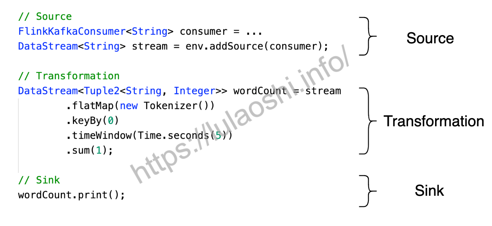
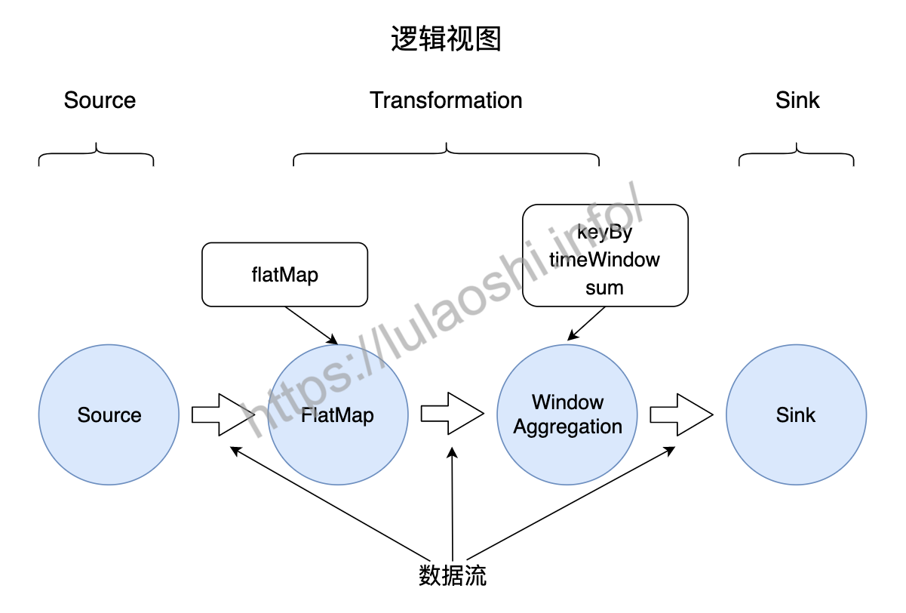
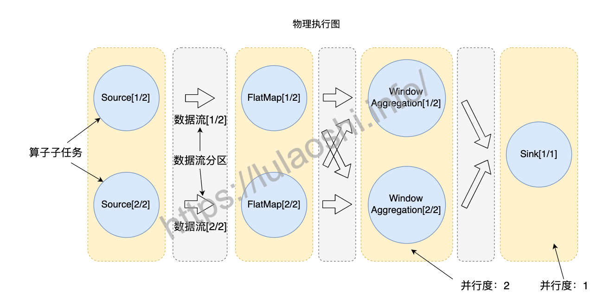

import { Typography, Grid } from "@material-ui/core";
import Image from 'material-ui-image'
import { FontAwesomeIcon } from "@fortawesome/react-fontawesome";
import { faGithub } from "@fortawesome/free-brands-svg-icons";

<Grid container className="upper-note" spacing={1} direction="row" justifyContent="center" alignItems="center">
    <Grid item md={1} lg={1} />
    <Grid item xs={3} md={2} lg={2}>
        <Image src="/img/flink-book.jpeg" aspectRatio={0.71} /> 
    </Grid>
    <Grid item xs={8} md={8} lg={8}>
        本教程已出版为《Flink原理与实践》，感兴趣的读者请在各大电商平台购买，谢谢支持！
        配套源码👉<a target="_blank" href="https://github.com/luweizheng/flink-tutorials"><FontAwesomeIcon icon={faGithub} size={"1x"} /></a>
    </Grid>
    <Grid item md={2} lg={2} />
</Grid>

## WordCount程序和数据流图

上一章的案例中，我们尝试构建了一个文本数据流管道，这个Flink程序可以计算数据流中单词出现的频次。如果输入数据流是“Hello Flink Hello World“，这个程序将统计出“Hello”的频次为2，“Flink”和“World”的频次为1。在大数据领域，WordCount程序就像是一个编程语言的HelloWorld程序，它展示了一个大数据引擎的基本规范。麻雀虽小，五脏俱全，从这个样例中，我们可以一窥Flink设计和运行原理。

如下图所示，程序分为三大部分，第一部分读取数据源（Source），第二部分对数据做转换操作（Transformation），最后将转换结果输出到一个目的地（Sink）。

代码中的方法被称为函数（Function）,是Flink提供给程序员的接口，程序员需要调用并实现这些函数，对数据进行操作，进而完成特定的业务逻辑。通常一到多个函数会组成一个算子（Operator）, 算子执行对数据的操作（Operation）。在WordCount的例子中，有三类算子：Source算子读取数据源中的数据，数据源可以是数据流、也可以存储在文件系统中的文件。Transformation算子对数据进行必要的计算处理。Sink算子将处理结果输出，数据一般被输出到数据库、文件系统或下一个数据流程序。

我们可以把算子理解为1 + 2 运算中的加号，加号（+）是这个算子的一个符号表示，它表示对数字1和数字2做加法运算。同样，在Flink或Spark这样的大数据引擎中，算子对数据进行某种操作，程序员可以根据自己的需求调用合适的算子，完成所需计算任务。Flink常用的算子有`map()`、`flatMap()`、`keyBy()`、`timeWindow()`等，它们分别对数据流执行不同类型的操作。

我们先对这个样例程序中各个算子做一个简单的介绍，关于这些算子的具体使用方式将在后续章节中详细说明。

* flatMap

`flatMap()`对输入进行处理，生成零到多个输出。本例中它执行一个简单的分词过程，对一行字符串按照空格切分，生成一个(word, 1)的二元组。

* keyBy

`keyBy()`根据某个Key对数据重新分组。本例中是将二元组(word, 1)中第一项作为Key进行分组，相同的单词会被分到同一组。

* timeWindow

`timeWindow()`是时间窗口函数，用来界定对多长时间之内的数据做统计。

* sum

`sum()`为求和函数。`sum(1)`表示对二元组中第二个元素求和，因为经过前面的keyBy，所有相同的单词都被分到了一组，因此，在这个分组内，将单词出现次数做加和，就得到出现的总次数。

在程序实际运行前，Flink会将用户编写的代码做一个简单处理，生成一个如下图所示的逻辑视图。下图展示了WordCount程序中，数据从不同算子间流动的情况。图中，圆圈代表算子，圆圈间的箭头代表数据流，数据流在Flink程序中经过不同算子的计算，最终生成结果。其中，`keyBy()`、`timeWindow()`和`sum()`共同组成了一个时间窗口上的聚合操作，被归结为一个算子。我们可以在Flink的Web UI中，点击一个作业，查看这个作业的逻辑视图。

对于词频统计这个案例，逻辑上来讲无非是对数据流中的单词做提取，然后使用一个Key-Value结构对单词做词频计数，最后输出结果即可，这样的逻辑本可以用几行代码完成，改成使用算子形式，反而让新人看着一头雾水，为什么一定要用算子的形式来写程序呢？实际上，算子进化成当前这个形态，就像人类从石块计数，到手指计数，到算盘计数，再到计算机计数这样的进化过程一样，尽管更低级的方式可以完成一定的计算任务，但是随着计算规模的增长，古老的计数方式存在着低效的弊端，无法完成更高级别和更大规模的计算需求。试想，如果我们不使用大数据框架提供的算子，而是自己实现一套上述的计算逻辑，尽管我们可以快速完成当前的词频统计的任务，但是当面临一个新计算任务时，我们需要重新编写程序，完成一整套计算任务。我们自己编写代码的横向扩展性可能很低，当输入数据暴增时，我们需要做很大改动，以部署在更多机器上。

大数据引擎的算子对计算做了一些抽象，对于新人来说有一定学习成本，而一旦掌握这门技术，人们所能处理的数据规模将成倍增加。算子的出现，正是针对大数据场景下，人们需要一种统一的计算描述语言来对数据做计算而进化出的新计算形态。基于Flink的算子，我们可以定义一个数据流的逻辑视图，以此完成对大数据的计算。剩下那些数据交换、横向扩展、故障恢复等问题全交由大数据引擎来解决。

## 从逻辑视图到物理执行

在绝大多数的大数据处理场景下，一台机器节点无法处理所有数据，数据被切分到多台节点上。在大数据领域，当数据量大到超过单台机器处理能力时，需要将一份数据切分到多个分区（Partition）上，每个分区分布在一台虚拟机或物理机上。

前一小节已经提到，大数据引擎的算子提供了编程接口，我们可以使用算子构建数据流的逻辑视图。考虑到数据分布在多个节点的情况，逻辑视图只是一种抽象，需要将逻辑视图转化为物理执行图，才能在分布式环境下执行。

下图为WordCount程序的物理执行示意图，数据流分布在2个分区上。箭头部分表示数据流分区，圆圈部分表示算子在分区上的算子子任务（Operator Subtask）。从逻辑视图变为物理执行图后，FlatMap算子在每个分区都有一个算子子任务，以处理该分区上的数据：FlatMap[1/2]算子子任务处理第一个数据流分区上的数据，以此类推。

在分布式计算环境下，执行计算的单个节点（物理机或虚拟机）被称为实例，一个算子在并行执行时，算子子任务会分布到多个节点上，所以算子子任务又被称为算子实例（Instance）。即使输入数据增多，我们也可以通过部署更多的算子实例来进行横向扩展。从图 3‑3中可以看到，除去Sink外的算子都被分成了2个算子实例，他们的并行度（Parallelism）为2，Sink算子的并行度为1。并行度是可以被设置的，当设置某个算子的并行度为2时，也就意味着这个算子有2个算子子任务（或者说2个算子实例）并行执行。实际应用中一般根据输入数据量的大小，计算资源的多少等多方面的因素来设置并行度。

:::info
在本例中，为了演示，我们把所有算子的并行度设置为了2：`env.setParallelism(2);`，把Sink的并行度设置成了1：`wordCount.print().setParallelism(1);`。如果不单独设置print的并行度的话，它的并行度也是2。
:::

算子子任务是Flink物理执行的基本单元，算子子任务之间是相互独立的，某个算子子任务有自己的线程，不同算子子任务可能分布在不同的机器节点上。后文在Flink的资源分配部分我们还会重点介绍算子子任务。

在本书后文的描述中，算子子任务、分区、实例都是指对算子的并行切分。

##  数据交换策略

下图中出现了数据流动的现象，即数据在不同的算子子任务上进行着数据交换。无论是Hadoop、Spark还是Flink，都会涉及到数据交换策略。常见的据交换策略有4种，如下图所示。

* 前向传播（Forward）：前一个算子子任务将数据直接传递给后一个算子子任务，数据不存在跨分区的交换，也避免了因数据交换产生的各类开销，图 3‑3中Source和和FlatMap之间就是这样的情形。

* 按Key分组（Key-Based）：数据以(Key, Value)形式存在，该策略将所有数据按照Key进行分组，相同Key的数据会被分到一组，发送到同一个分区上。WordCount程序中，keyBy将单词作为Key，把相同单词都发送到同一分区，以方便后续算子的聚合统计。

* 广播（Broadcast）:将某份数据发送到所有分区上，这种策略涉及到了数据在全局的拷贝，因此非常消耗资源。

* 随机策略（Random）：该策略将所有数据随机均匀地发送到多个分区上，以保证数据平均分配到不同分区上。该策略通常为了防止数据倾斜到某些分区，导致部分分区数据稀疏，另外一些分区数据拥堵。