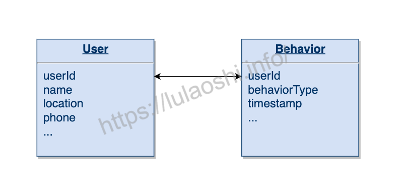
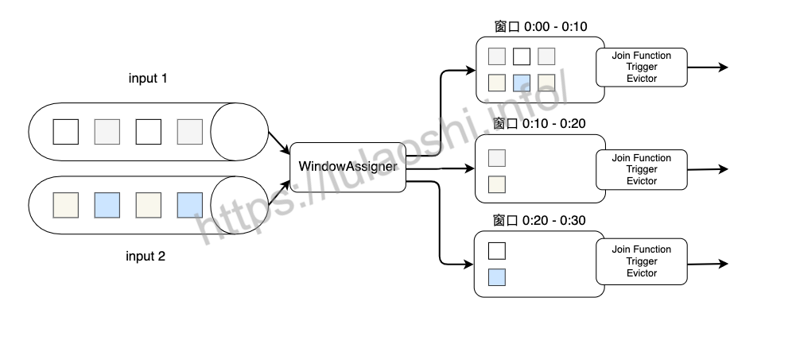
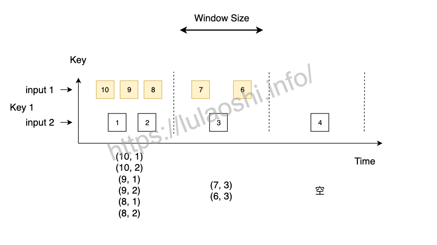
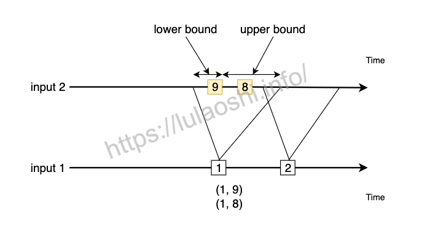

import FlinkBook from '@site/src/components/FlinkBook'

<FlinkBook />

批处理经常要解决的问题是将两个数据源做关联，或者称为Join。例如，很多手机APP都有一个用户数据源User，同时APP会记录用户的行为，我们称之为Behavior，两个表按照userId来进行Join，如下图所示。Flink支持流处理上的Join，只不过Flink是在一个时间窗口上来进行两个流的Join。



目前，Flink支持了两种Join：Window Join（窗口连接）和Interval Join（时间间隔连接）。

## Window Join

从名字中能猜到，Window Join主要在Flink的窗口上进行操作，它将两个流中落在相同窗口的元素按照某个Key进行Join。一个Window Join的大致骨架结构为：

```scala
input1.join(input2)
    .where(<KeySelector>)      <- input1使用哪个字段作为Key
    .equalTo(<KeySelector>)    <- input2使用哪个字段作为Key
    .window(<WindowAssigner>)  <- 指定WindowAssigner
    [.trigger(<Trigger>)]      <- 指定Trigger（可选）
    [.evictor(<Evictor>)]      <- 指定Evictor（可选）
    .apply(<JoinFunction>)     <- 指定JoinFunction
```

下图展示了Join的大致过程。两个输入数据流先分别按Key进行分组，然后将元素划分到窗口中。窗口的划分需要使用`WindowAssigner`来定义，这里可以使用Flink提供的滚动窗口、滑动窗口或会话窗口等默认的`WindowAssigner`。随后两个数据流中的元素会被分配到各个窗口上，也就是说一个窗口会包含来自两个数据流的元素。相同窗口内的数据会以内连接（Inner Join）的语义来相互关联，形成一个数据对。当窗口的时间结束，Flink会调用`JoinFunction`来对窗口内的数据对进行处理。当然，我们也可以使用`Trigger`或`Evictor`做一些自定义优化，他们的使用方法和普通窗口的使用方法一样。



接下来我们重点分析一下两个数据流是如何进行Inner Join的。

一般滴，Inner Join只对两个数据源同时出现的元素做连接，形成一个数据对，即数据源input1中的某个元素与数据源input2中的所有元素逐个配对。当数据源某个窗口内没数据时，比如图中的第三个窗口，Join的结果也是空的。



下面的代码自定义了`JoinFunction`，并将Join结果打印出来。无论代码中演示的滚动窗口，还是滑动窗口或会话窗口，其原理都是一样的。

```java
public static class MyJoinFunction 
  implements JoinFunction<Tuple2<String, Integer>, Tuple2<String, Integer>, String> {

    @Override
    public String join(Tuple2<String, Integer> input1, Tuple2<String, Integer> input2) {
        return "input 1 :" + input1.f1 + ", input 2 :" + input2.f1;
    }
}

DataStream<Tuple2<String, Integer>> input1 = ...
DataStream<Tuple2<String, Integer>> input2 = ...

DataStream<String> joinResult = input1.join(input2)
    .where(i1 -> i1.f0)
    .equalTo(i2 -> i2.f0)
    .window(TumblingProcessingTimeWindows.of(Time.seconds(60)))
    .apply(new MyJoinFunction());
```

除了`JoinFunction`，Flink还提供了`FlatJoinFunction`，其功能是输出零到多个结果。

如果Inner Join不能满足我们的需求，`CoGroupFunction`提供了更多可自定义的功能，我们可以获得两个数据流中的所有元素，元素以`Iterable<T>`的形式供开发者使用。如果第一个数据流中的某些Key是空的，`CoGroupFunction`被触发时，这个Key上的元素为空，开发者自己决定如何处理两个流里的数据。

```java
public static class MyCoGroupFunction 
  implements CoGroupFunction<Tuple2<String, Integer>, Tuple2<String, Integer>, String> {
    @Override
    public void coGroup(Iterable<Tuple2<String, Integer>> input1, Iterable<Tuple2<String, Integer>> input2, Collector<String> out) {
        input1.forEach(element -> System.out.println("input1 :" + element.f1));
        input2.forEach(element -> System.out.println("input2 :" + element.f1));
    }
}
```

在主逻辑调用时，要写成`input1.coGroup(input2).where(<KeySelector>).equalTo(<KeySelecotr>)`。

```java
DataStream<Tuple2<String, Integer>> input1 = ...
DataStream<Tuple2<String, Integer>> input2 = ...

DataStream<String> coGroupResult = input1.coGroup(input2)
      .where(i1 -> i1.f0)
      .equalTo(i2 -> i2.f0)
      .window(TumblingProcessingTimeWindows.of(Time.seconds(10)))
      .apply(new MyCoGroupFunction());
```

## Interval Join

与Window Join不同，Interval Join不依赖Flink的`WindowAssigner`，而是根据一个时间间隔（Interval）界定时间。Interval需要一个时间下界（Lower Bound）和上界（Upper Bound），如果我们将input1和input2进行Interval Join，input1中的某个元素为input1.element1，时间戳为input1.element1.ts，那么一个Interval就是[input1.element1.ts + lowerBound, input1.element1.ts + upperBound]，input2中落在这个时间段内的元素将会和input1.element1组成一个数据对。用数学公式表达为，凡是符合下面公式的元素，会两两组合在一起。
$$
input1.element1.ts + lowerBound \le input2.elementX.ts \le input1.element1.ts + upperBound
$$
上下界可以是正数也可以是负数。

:::info
Flink（1.10）的Interval Join只支持Event Time语义。
:::



下面的代码展示了如何对两个数据流进行Interval Join：

```java
public static class MyProcessFunction extends ProcessJoinFunction<Tuple3<String, Long, Integer>, Tuple3<String, Long, Integer>, String> {
    @Override
    public void processElement(Tuple3<String, Long, Integer> input1,
                               Tuple3<String, Long, Integer> input2,
                               Context context,
                               Collector<String> out) {
      	out.collect("input 1: " + input1.toString() + ", input 2: " + input2.toString());
    }
}

// 使用EventTime时间语义
env.setStreamTimeCharacteristic(TimeCharacteristic.EventTime);
// 数据流有三个字段：（key, 时间戳, 数值）
DataStream<Tuple3<String, Long, Integer>> input1 = ...
DataStream<Tuple3<String, Long, Integer>> input2 = ...

DataStream<String> intervalJoinResult = input1.keyBy(i -> i.f0)
      .intervalJoin(input2.keyBy(i -> i.f0))
      .between(Time.milliseconds(-5), Time.milliseconds(10))
      .process(new MyProcessFunction());
```

默认的时间间隔是包含上下界的，我们可以使用`.lowerBoundExclusive()` 和`.upperBoundExclusive`来确定是否需要包含上下界。

```java
DataStream<String> intervalJoinResult = input1.keyBy(i -> i.f0)
      .intervalJoin(input2.keyBy(i -> i.f0))
      .between(Time.milliseconds(-5), Time.milliseconds(10))
      .upperBoundExclusive()
      .lowerBoundExclusive()
      .process(new MyProcessFunction());
```

Interval Join内部是用缓存来存储所有数据的，因此需要注意缓存数据不能太大，以免对内存造成太大压力。