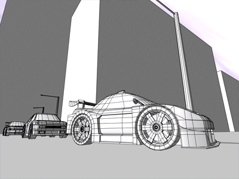
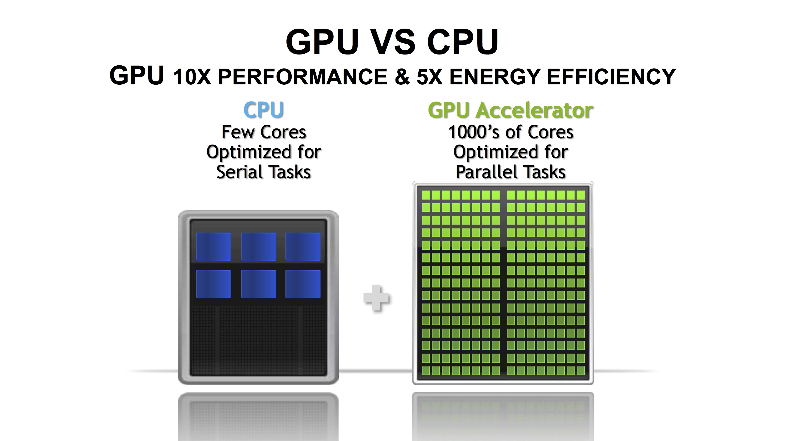
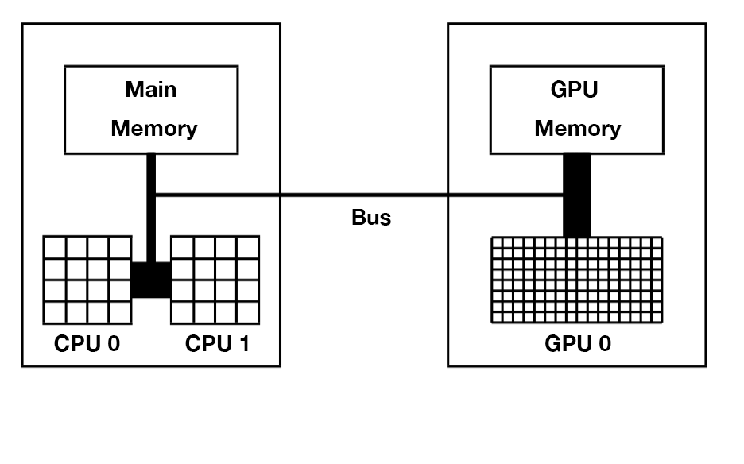
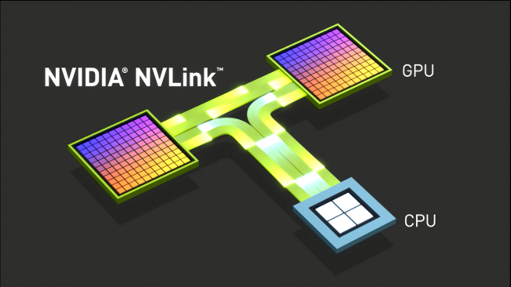
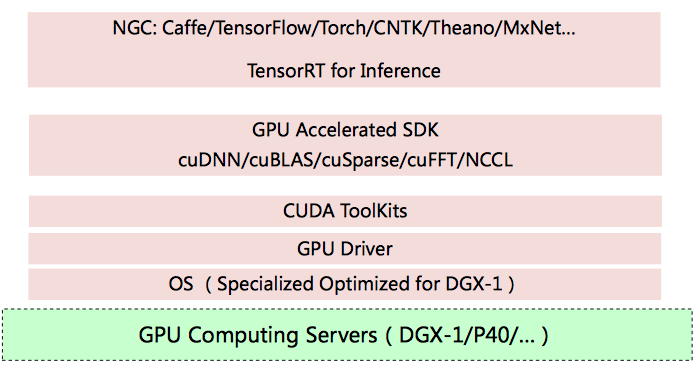

金融建模、自动驾驶、智能机器人、新材料发现、脑神经科学、医学影像分析...人工智能时代的科学研究极度依赖算力的支持。提供算力的各家硬件芯片厂商中，最抢镜的当属英伟达（NVIDIA）了。这家做显卡起家的芯片公司在深度学习兴起后可谓红得发紫，如果不聊几句GPU和英伟达，都不好意思跟别人说自己是做人工智能的。那么，英伟达的GPU是如何加速计算呢？

## 什么是GPU

GPU全名为Graphics Processing Unit，又称视觉处理器、图形显示卡。GPU负责渲染出2D、3D、VR效果，主要专注于计算机图形图像领域。后来人们发现，GPU非常适合并行计算，可以加速现代科学计算，GPU也因此不再局限于游戏和视频领域。

*GPU原本用于游戏等图形图像的计算*

现代CPU处理数据的速度在纳秒级别，为何还要使用GPU来加速？CPU能被GPU替代吗？

在上一节中我们回顾了计算机体系结构，并解释了单核和多核、进程和线程的概念。我们都知道，CPU的主频自21世纪初进入GHz级别之后就再也没有数量级上的提升，因为单纯提升主频将带来功耗灾难，反而陷入高耗低能的陷阱。之后的CPU普遍使用多核架构以提升计算性能，单核的频率基本停留在2-3GHz的量级上。

但是，我们写的程序绝大多数是顺序执行。也就是说，不经过优化，程序只能在单核上顺序执行。那么，同样的源代码，在十几年前的单核CPU上运行与现在的单核CPU上运行，执行速度没有质的差别。但另一方面，十几年来，数据量爆炸式增长，大数据和人工智能对算力要求越来越高。一方面，单核主频无法持续提升，另一方面，算力需求却在飞速增长。因此，多核计算势在必行。

无论是CPU还是GPU，在进行计算时，都需要用核心（Core）来做算术逻辑运算，比如加减乘与或非等。核心中有ALU（逻辑运算单元）和寄存器等电路。在进行计算时，一个核心只能顺序执行某项任务。不可能“吃着火锅唱着歌”，因为吃饭唱歌都占着嘴呢。所以为了同时并行地处理更多任务，芯片公司开发出了多核架构，只要相互之间没有依赖，每个核心做自己的事情，多核之间互不干扰，就可以达到**并行计算**的效果，极大缩短计算时间。

*CPU和GPU之间的对比*

个人桌面电脑CPU只有2到8个CPU核心，数据中心的服务器上也只有20到40个左右CPU核心，GPU却有上千个核心。与CPU的核心不同，GPU的核心只能专注于某些特定的任务。知乎上有人把CPU比作大学数学教授，把GPU比作一个学校几千个小学生：同样是做加减法，几千个小学生所能做的计算，远比几十个大学教授要多得多。俗话说，三个臭皮匠，顶一个诸葛亮。另一方面，大学教授的知识结构和个人能力远强于小学生，能独立解决复杂问题，小学生的知识有限，只能进行简单的计算。目前来看GPU在处理简单计算任务上有更大的优势，但是主要还是靠人海战术，并不能像CPU那样可以独当一面，短时间内也无法替换掉CPU。如下图所示，在整个计算机系统中，CPU起到协调管理的作用，管理计算机的主存、硬盘、网络以及GPU等各类元件。

*计算机体系结构示意图*

如果只关注CPU和GPU，那么计算结构将如下图所示。CPU主要从主存（Main Memory）中读写数据，并通过总线（Bus）与GPU交互。GPU除了有超多计算核心外，也有自己独立的存储，被称之为显存。一台服务器上可以安装多块GPU卡，但GPU卡的发热量极大，普通的空调系统难以给大量GPU卡降温，所以大型数据中心通常使用水冷散热，并且选址在温度较低的地方。

*CPU与GPU*

GPU核心在做计算时，只能直接从显存中读写数据，程序员需要在代码中指明哪些数据需要从主存和显存之间相互拷贝。这些数据传输都是在总线上，因此总线的传输速度和带宽成了部分计算任务的瓶颈。也因为这个瓶颈，很多计算任务并不适合放在GPU上，比如笔者前两年一直关注的推荐系统虽然也在使用深度学习，但因为模型输入是大规模稀疏特征，GPU加速获得的收益小于数据互相拷贝的时间损失。

CPU和GPU之间的数据通信必须依托总线。当前传输速度最快的总线技术是NVLink，IBM的Power CPU和英伟达的高端显卡可以通过NVLink直接通信。同时，单台机器上的多张英伟达显卡也可以使用NVLink相互通信。Intel的CPU目前不支持NVLink，只能使用PCI-E技术。NVLink和PCI-E都是总线技术的一种，NVLink的传输速度远高于PCI-E。

*高性能计算场景硬件设计拓扑图：单台机器共有8张英伟达显卡，每张显卡之间通过NVLink互联，显卡和Intel CPU之间使用PCI-E总线相连，多台机器之间通过InfiniBand高速互联网络互联。*

由于CPU和GPU是分开的，在英伟达的设计理念里，CPU和主存被称为**主机（Host）**，GPU被称为**设备（Device）**。Host和Device概念会贯穿整个英伟达GPU编程，甚至包括OpenCL等其他平台。

以上结构也被称为**异构计算**：使用CPU+GPU组合来加速计算。绝大多数的高性能计算中心会使用上图所示的结构，比如一台服务器上有2至4块Intel Xeon CPU和1至8块英伟达GPU显卡，多台机器之间通过InfiniBand高速网络互联。

异构计算对于人工智能和超级计算机至关重要。几乎主流的高性能和超级计算中心均使用了异构计算来提升算力。2018年建成，超越天河2号成为世界第一的超级计算机Summit总共使用了9216个IBM POWER9 CPU和27648个英伟达Tesla GPU。IBM的造价相对较高，一个折中的方案是使用Intel的Xeon系列CPU。

## 英伟达GPU硬件架构 {#nvidia-gpu-arch}

在英伟达的设计里，多个核心组成一个Streaming Multiprocessor（**SM**），一张GPU卡有多个SM。从“Multiprocessor”这个名字上也可以看出SM包含了多个处理器。实际上，英伟达主要以SM为运算和调度的基本单元。

*Pascal微架构示意图：一个GPU中有多个SM，每个SM里有计算核心、Shared Memory和L1 Cache*

英伟达不同时代产品的芯片设计不同，每代产品背后有一个微架构代号，微架构均以著名的物理学家为名，以向先贤致敬。当前比较火热的架构有：

* Ampere 安培
  * 2020年5月发布
  * 专业显卡：Telsa A100

* Turing 图灵
  * 2018年发布
  * 消费显卡：GeForce RTX 2080 Ti、Titan RTX

* Volta 伏特 
	* 2017年末发布
	* 专业显卡：Telsa V100 (16或32GB显存 5120个CUDA核心)

* Pascal 帕斯卡
  * 2016年发布
  * 专业显卡：Telsa P100(12或16GB显存 3584个CUDA核心)

*Telsa V100共有84个Streaming Multiprocessor*

上图为Tesla V100的设计，它共有84个SM。图中密密麻麻的绿色小格子就是GPU计算核心，多个计算核心一起组成了一个SM。将SM放大，单个SM如下图所示。

*单个SM有各种不同类型的计算核心，包括浮点运算、整型运算以及专门为深度学习设计的Tensor Core*

可以看到一个SM中包含了计算核心、存储等部分：

* 针对不同类型计算的小核心，包括64位浮点核心（FP64），整型核心(INT)，32位浮点核心(FP32)，优化深度学习的Tensor Core。

* 计算核心直接从寄存器（Register）中读写数据。

* 调度和分发器（Scheduler和Dispatch Unit）。

* L0和L1级缓存。

具体而言，SM中的FP32进行32位浮点加乘运算，INT进行整型加乘运算，SFU（Special Functional Unit）执行一些倒数和三角函数等运算。

这里对Tensor Core做一些简单解释。Tensor Core是英伟达新的微架构中提出的一种混合精度的计算核心。我们知道，当前深度神经网络中使用到最频繁的矩阵运算是：$D = A \times B + C$。Tensor Core可以对4*4的矩阵做上述运算。其中，涉及乘法的$A$和$B$使用FP16的16位浮点运算，精度较低；涉及加法的$C$和$D$使用FP16或FP32精度。Tensor Core是在Volta架构开始提出的，使用Volta架构的V100在深度学习上的性能远超Pascal架构的P100。

*Tensor Core是一种为优化深度学习计算核心*

前面提到的以物理学家命名的名称是英伟达各代GPU的微架构代号，微架构表示英伟达不同时代的芯片设计。不同微架构里各类计算核心和显卡存储的设计不同。2020年，比较流行的微架构为Volta和Turing。

对于消费者而言，英伟达主要有两条产品线：

- 消费级产品 GeForce 系列：GeForce RTX 2080 Ti ...
- 针对数据中心的高性能计算产品 Telsa 系列：Telsa V100、Telsa P100、Telsa P40 ...

其中，消费级产品GeForce可以用在个人电脑上，用来加速游戏和视频，Telsa系列产品一般用在数据中心的高性能计算加速场景上。此外，还有使用在工作站上的Quadro系列，一般用在CAD、视频制作和部分科学计算上，是一个介于GeForce和Telsa之间的产品线。英伟达产品的命名中暗含了微架构：Telsa V100的V表示使用Volta微架构，Telsa P100的P表示使用Pascal微架构；GeForce系列中，20xx系列使用了Turing微架构。

英伟达显卡型号众多，但是归根结底需要关注两方面问题：采用哪种微架构、显卡存储（简称显存）多大。

## 软件生态

英伟达能够在人工智能时代成功，除了他们在长期深耕显卡芯片领域，更重要的是他们率先提供了可编程的软件架构，确切地说，软硬件一体方案帮他们赢得了市场。2007年，英伟达发布了CUDA（Compute Unified Device Architecture）编程模型，软件开发人员从此可以使用CUDA在英伟达的GPU上进行并行编程。在此之前，GPU编程并不友好。CUDA简单到什么程度？有经验的程序员经过半天的培训，掌握一些基础概念后，能在半小时内将一份CPU程序修改成为GPU并行程序。

继CUDA之后，英伟达不断丰富其软件技术栈，提供了科学计算所必需的cuBLAS线性代数库，cuFFT快速傅里叶变换库等，当深度学习大潮到来时，英伟达提供了cuDNN深度神经网络加速库，目前常用的TensorFlow、PyTorch深度学习框架的底层大多基于cuDNN库。关于英伟达的软件栈，可以总结为：

* 最底层是GPU硬件，包括各类GPU显卡，DGX工作站等。
* 操作系统是基于硬件的第一层软件，在操作系统上我们需要安装GPU驱动。
* CUDA在GPU驱动之上，有了CUDA，我们可以进行一些GPU编程。
* 英伟达对相似计算进一步抽象，进而有了cuBLAS、cuFFT、cuDNN等库，这些库基于CUDA提供常见的计算。
* 最顶层是应用，包括TensorFlow和PyTorch的模型训练和推理过程。

英伟达能在人工智能时代击败Intel、AMD等强大对手，很大一部分是因为它丰富的软件体系。这些软件工具库使研发人员专注于自己的研发领域，不用再去花大量时间学习GPU底层知识。CUDA对于GPU就像个人电脑上的Windows、手机上的安卓系统，一旦建立好生态，吸引了开发者，用户非常依赖这套软件生态体系。

GPU编程可以直接使用CUDA的C/C++版本进行编程，也可以使用其他语言包装好的库，比如Python可使用Numba库调用CUDA。CUDA的编程思想在不同语言上都很相似。

CUDA及其软件栈的优势是方便易用，缺点也显而易见：

1. 软件环境复杂，库以及版本很多，顶层应用又严重依赖底层工具库，入门者很难快速配置好一整套环境；多环境配置困难。

2. 用户只能使用英伟达的显卡，成本高，个人用户几乎负担不起。

因此，如果没有专业的运维人员维护GPU机器，最好还是在公有云上按需购买GPU虚拟机。入门者可以考虑云厂商的Telsa P4虚拟机，大约10+元/小时，云厂商会配置好CUDA及工具库。如自己购买物理机，可以考虑消费级的GeForce RTX 2080Ti，这张卡足以应对绝大多数自然语言处理任务。

## 英伟达之外的选项

前文对GPU的描述主要基于英伟达旗下产品。在GPU领域，AMD也提供了独立显卡产品，价格较低。历史上，AMD的显卡产品线是收购ATI而获得的。相对来说，AMD的显卡在人工智能和超级计算领域并没有英伟达强势。为了与CUDA对抗，AMD提供的软件开发平台名为ROCm（Radeon Open Compute platforM ）。

与相对封闭的CUDA不同，OpenCL（Open Computing Language)也是当前重要的计算加速平台，可以兼容英伟达和AMD的GPU，以及一些FPGA等硬件。一些上层软件为了兼容性，在计算加速部分并没有使用CUDA，而是使用了OpenCL。比如，决策树算法框架LightGBM主要基于OpenCL进行GPU加速。

无论是ROCm还是OpenCL，其编程思想与CUDA都非常相似，如果掌握了CUDA，那上手OpenCL也会很容易。