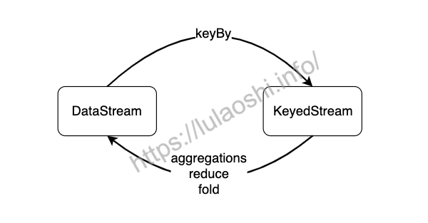
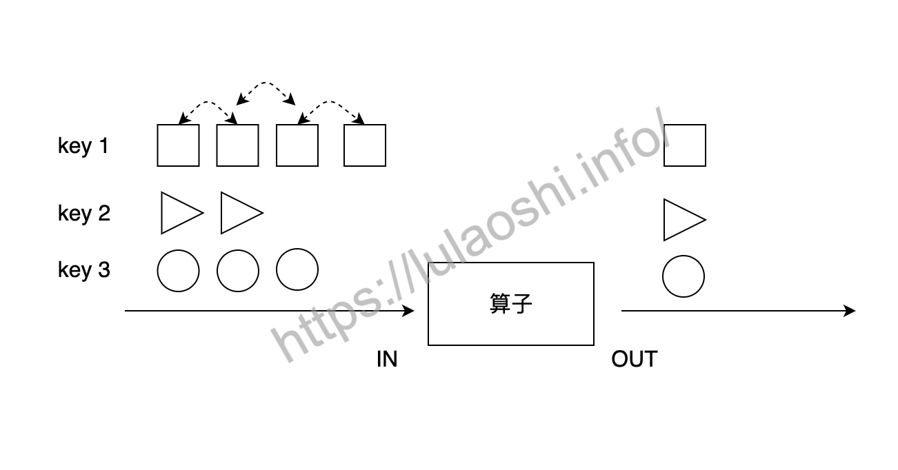
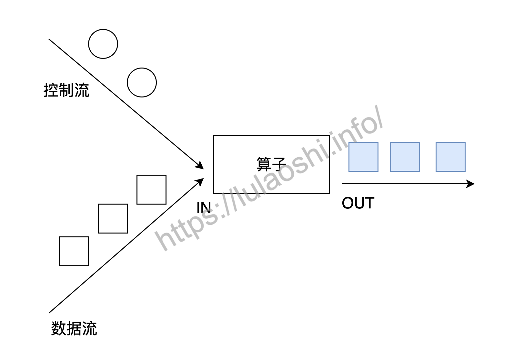
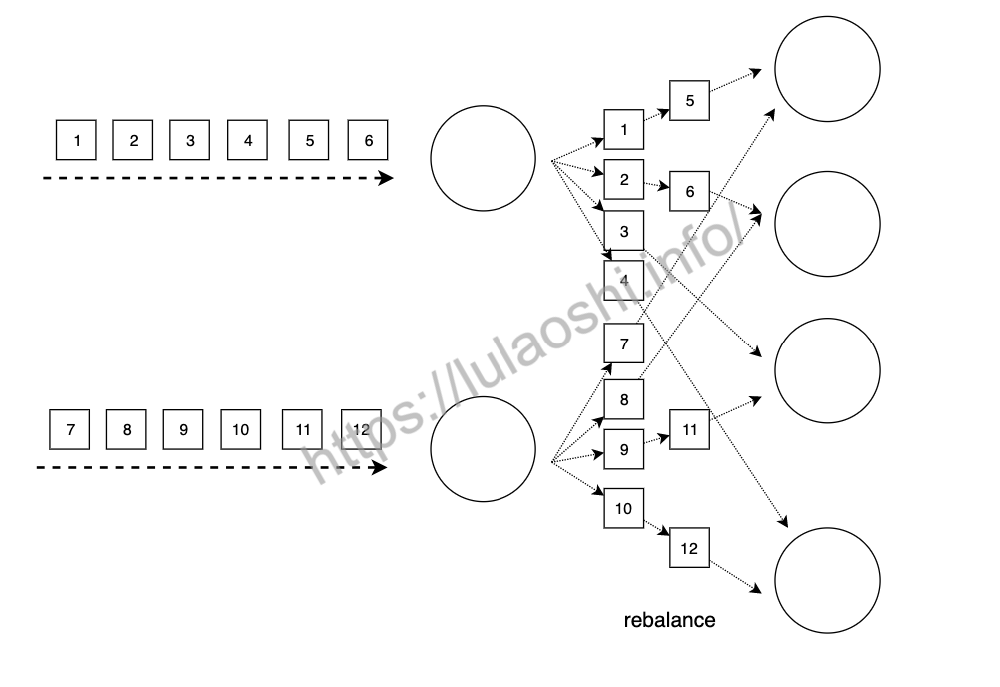
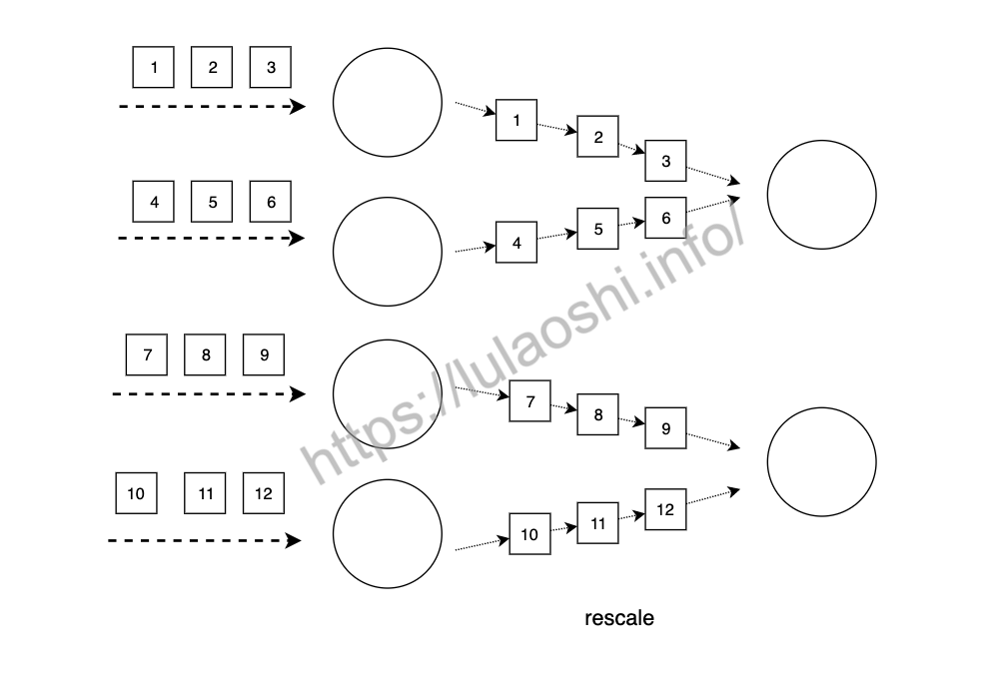

Flink的Transformation转换主要包括四种：单数据流基本转换、基于Key的分组转换、多数据流转换和数据重分布转换。Transformation各算子可以对Flink数据流进行处理和转化，多个Transformation算子共同组成一个数据流图，DataStream Transformation是Flink流处理非常核心的API。下图展示了数据流上的几类操作，本章主要介绍四种Transformation：单数据流转换、基于Key的分组转换、多数据流转换和数据重分布转换，时间窗口部分将在第五章介绍。


Flink的Transformation是对数据流进行操作，其中数据流涉及到的最常用数据结构是`DataStream`，`DataStream`由多个相同的元素组成，每个元素是一个单独的事件。在Java中，我们使用泛型`DataStream<T>`来定义这种组成关系，在Scala中，这种泛型对应的数据结构为`DataStream[T]`，`T`是数据流中每个元素的数据类型。在WordCount的例子中，数据流中每个元素的类型是字符串`String`，整个数据流的数据类型为`DataStream<String>`。

在使用这些算子时，需要在算子上进行用户自定义操作，一般使用Lambda表达式或者继承类并重写函数两种方式完成这个用户自定义的过程。接下来，我们将对Flink Transformation中各算子进行详细介绍，并使用大量例子展示具体使用方法。

## 单数据流转换

单数据流基本转换主要对单个数据流上的各元素进行处理。

### map

`map`算子对一个`DataStream`中的每个元素使用用户自定义的Mapper函数进行处理，每个输入元素对应一个输出元素，最终整个数据流被转换成一个新的`DataStream`。输出的数据流`DataStream<OUT>`类型可能和输入的数据流`DataStream<IN>`不同。


我们可以重写`MapFunction`或`RichMapFunction`来自定义map函数，`MapFunction`在源码的定义为：`MapFunction<T, O>`，其内部有一个`map`虚函数，我们需要对这个虚函数重写。下面的代码重写了`MapFunction`中的`map`函数，将输入结果乘以2，转化为字符串后输出。

```java
// 函数式接口类
// T为输入类型，O为输出类型
@FunctionalInterface
public interface MapFunction<T, O> extends Function, Serializable {
  // 调用这个API就是继承并实现这个虚函数
	O map(T value) throws Exception;
}
```

第二章中我们曾介绍过，对于这样一个虚函数，可以继承接口类并实现虚函数：

```java
// 继承并实现MapFunction
// 第一个泛型是输入类型，第二个泛型是输出类型
public static class DoubleMapFunction implements MapFunction<Integer, String> {
    @Override
    public String map(Integer input) {
      return "function input : " + input + ", output : " + (input * 2);
    }
}
```

然后在主逻辑中调用这个类：

```java
DataStream<String> functionDataStream = dataStream.map(new DoubleMapFunction());
```

这段的代码清单重写了`MapFunction`中的`map`函数，将输入结果乘以2，转化为字符串后输出。我们也可以不用显式定义`DoubleMapFunction`这个类，而是像下面的代码一样使用匿名类：

```java
// 匿名类
DataStream<String> anonymousDataStream = dataStream.map(new MapFunction<Integer, String>() {
    @Override
    public String map(Integer input) throws Exception {
      return "anonymous function input : " + input + ", output : " + (input * 2);
    }
});
```

自定义map函数最简便的操作是使用Lambda表达式。

```java
// 使用Lambda表达式
DataStream<String> lambdaStream = dataStream
		.map(input -> "lambda input : " + input + ", output : " + (input * 2));
```

Scala的API相对更加灵活，可以使用下划线来构造Lambda表达式：

```scala
// 使用 _ 构造Lambda表达式
val lambda2 = dataStream.map { _.toDouble * 2 }
```

{: .notice--info}
使用Scala时，Lambda表达式可以可以放在圆括号()中，也可以使用花括号{}中。使用Java时，只能使用圆括号。

对上面的几种方式比较可见，Lambda表达式更为简洁。重写函数的方式代码更为臃肿，但定义更清晰。

此外，`RichMapFunction`是一种RichFunction，它除了`MapFunction`的基础功能外，还提供了一系列其他方法，包括`open`、`close`、`getRuntimeContext`和`setRuntimeContext`等虚函数方法，重写这些方法可以创建状态数据、对数据进行广播，获取累加器和计数器等，这部分内容将在后面介绍。

### filter

`filter`算子对每个元素进行过滤，过滤的过程使用一个Filter函数进行逻辑判断。对于输入的每个元素，如果filter函数返回True，则保留，如果返回False，则丢弃，如下图所示。


我们可以使用Lambda表达式过滤掉小于等于0的元素：

```java
DataStream<Integer> dataStream = senv.fromElements(1, 2, -3, 0, 5, -9, 8);

// 使用 -> 构造Lambda表达式
DataStream<Integer> lambda = dataStream.filter ( input -> input > 0 );
```

也可以继承`FilterFunction`或`RichFilterFunction`，然后重写`filter`方法，我们还可以将参数传递给继承后的类。如下面的代码所示，`MyFilterFunction`增加一个构造函数参数`limit`，并在`filter`方法中使用这个参数。

```java
public static class MyFilterFunction extends RichFilterFunction<Integer> {

    // limit参数可以从外部传入
    private Integer limit;

    public MyFilterFunction(Integer limit) {
      this.limit = limit;
    }

    @Override
    public boolean filter(Integer input) {
      return input > this.limit;
    }
}

// 继承RichFilterFunction
DataStream<Integer> richFunctionDataStream = dataStream.filter(new MyFilterFunction(2));
```

### flatMap

`flatMap`算子和`map`有些相似，输入都是数据流中的每个元素，与之不同的是，`flatMap`的输出可以是零个、一个或多个元素，当输出元素是一个列表时，`flatMap`会将列表展平。如下图所示，输入是包含圆形或正方形的列表，`flatMap`过滤掉圆形，正方形列表被展平，以单个元素的形式输出。


我们可以用切水果的例子来理解map和flatMap的区别。map会对每个输入元素生成一个对应的输出元素：

```
{苹果，梨，香蕉}.map(去皮) => {去皮苹果, 去皮梨，去皮香蕉}
```

`flatMap`先对每个元素进行相应的操作，生成一个相应的集合，再将集合展平：

```
{苹果，梨，香蕉}.flMap(切碎) 
=> 
{[苹果碎片1, 苹果碎片2], [梨碎片1，梨碎片2, 梨碎片3]，[香蕉碎片1]} 
=>
{苹果碎片1, 苹果碎片2, 梨碎片1，梨碎片2, 梨碎片3，香蕉碎片1}
```

下面的代码对字符串进行切词处理：

```java
DataStream<String> dataStream = 
  senv.fromElements("Hello World", "Hello this is Flink");

// split函数的输入为 "Hello World" 输出为 "Hello" 和 "World" 组成的列表 ["Hello", "World"]
// flatMap将列表中每个元素提取出来
// 最后输出为 ["Hello", "World", "Hello", "this", "is", "Flink"]
DataStream<String> words = dataStream.flatMap (
    (String input, Collector<String> collector) -> {
      for (String word : input.split(" ")) {
        collector.collect(word);
      }
    }).returns(Types.STRING);
```

因为`flatMap`可以输出零到多个元素，我们可以将其看做是`map`和`filter`更一般的形式。如果我们只想对长度大于15的句子进行处理，可以先在程序判断处理，再输出，如下所示。

```java
// 只对字符串数量大于15的句子进行处理
// 使用匿名函数
DataStream<String> longSentenceWords = dataStream.flatMap(new FlatMapFunction<String, String>() {
    @Override
    public void flatMap(String input, Collector<String> collector) throws Exception {
      if (input.length() > 15) {
        for (String word: input.split(" "))
        	collector.collect(word);
      }
    }
});
```

{: .notice--primary}
虽然`flatMap`可以完全替代`map`和`filter`，但Flink仍然保留了这三个API，主要因为`map`和`filter`的语义更明确：`map`可以表示一对一的转换，代码阅读者能够确认对于一个输入，肯定能得到一个输出；`filter`则明确表示发生了过滤操作。更明确的语义有助于提高代码的可读性。

Scala的API相对更简单一些：

```scala
val dataStream: DataStream[String] = 
senv.fromElements("Hello World", "Hello this is Flink")

val words = dataStream.flatMap ( input => input.split(" ") )

val words2 = dataStream.map { _.split(" ") }
```

## 基于Key的分组转换

对数据分组主要是为了进行后续的聚合操作，即对同组数据进行聚合分析。如下图所示，`keyBy`会将一个`DataStream`转化为一个`KeyedStream`，聚合操作会将`KeyedStream`转化为`DataStream`。如果聚合前每个元素数据类型是T，聚合后的数据类型仍为T。



### keyBy

绝大多数情况，我们要根据事件的某种属性或数据的某个字段进行分组，然后对一个分组内的数据进行处理。如下图所示，`keyBy`算子根据元素的形状对数据进行分组，相同形状的元素被分到了一起，可被后续算子统一处理。比如，对股票数据流处理时，可以根据股票代号进行分组，然后对同一支股票统计其价格变动。又如，电商用户行为日志把所有用户的行为都记录了下来，如果要分析某一个用户行为，需要先按用户ID进行分组。

`keyBy`算子将`DataStream`转换成一个`KeyedStream`。`KeyedStream`是一种特殊的`DataStream`，事实上，`KeyedStream`继承了`DataStream`，`DataStream`的各元素随机分布在各算子实例中，`KeyedStream`的各元素按照Key分组，相同Key的数据会被分配到同一算子实例中。我们需要向`keyBy`算子传递一个参数，以告知Flink以什么作为Key进行分组。


我们可以使用数字位置来指定Key：

```java
DataStream<Tuple2<Integer, Double>> dataStream = senv.fromElements(
                Tuple2.of(1, 1.0), Tuple2.of(2, 3.2), Tuple2.of(1, 5.5),
                Tuple2.of(3, 10.0), Tuple2.of(3, 12.5));

// 使用数字位置定义Key 按照第一个字段进行分组
DataStream<Tuple2<Integer, Double>> keyedStream = dataStream.keyBy(0).sum(1);
```

也可以使用字段名来指定Key。比如，我们有一个`Word`类：

```java
public class Word {

    public String word;
    public int count;

    public Word() {}

    public Word(String word, int count) {
        this.word = word;
        this.count = count;
    }

    public static Word of(String word, int count) {
        return new Word(word, count);
    }

    @Override
    public String toString() {
        return this.word + ": " + this.count;
    }
}
```
我们可以直接用`Word`中的字段名`word`来选择Key。
```java
DataStream<Word> fieldNameStream = wordStream.keyBy("word").sum("count");
```

{: .notice--info}
这种方法只适用于[数据类型和序列化](./data-types.html#复合类型)章节中提到的Scala case class或Java POJO类型的数据。

指定Key本质上是实现一个`KeySelector`，在Flink源码中，它是这么定义的：

```java
// IN为数据流元素，KEY为所选择的Key
@FunctionalInterface
public interface KeySelector<IN, KEY> extends Function, Serializable {
		// 选择一个字段作为Key
		KEY getKey(IN value) throws Exception;
}
```

我们可以重写`getKey()`方法，如下所示：

```java
DataStream<Word> wordStream = senv.fromElements(
    Word.of("Hello", 1), Word.of("Flink", 1),
    Word.of("Hello", 2), Word.of("Flink", 2)
);

// 使用KeySelector
DataStream<Word> keySelectorStream = wordStream.keyBy(new KeySelector<Word, String> () {
        @Override
        public String getKey(Word in) {
        	return in.word;
        }
    }).sum("count");
```

一旦按照Key分组后，我们后续可以对每组数据进行时间窗口的处理以及状态的创建和更新。数据流里相同Key的数据都可以访问和修改相同的状态，如何使用时间和状态将在后续章节中分别介绍。

###  Aggregation

常见的聚合操作有`sum`、`max`、`min`等，这些聚合操作统称为聚合（Aggregation)。与批处理不同，这些聚合函数是对流数据进行统计，流数据是依次进入Flink的，聚合操作是对流入的数据进行实时统计，并不断输出到下游。

使用聚合函数时，我们需要一个参数来指定按照哪个字段进行聚合。跟`keyBy`相似，我们可以使用数字位置来指定对哪个字段进行聚合，也可以实现一个`KeySelector`。

`sum`算子对该字段进行加和，并将结果保存在该字段上，它无法确定其他字段的数值，或者说无法保证其他字段的计算结果。下面的例子中，`sum`对第二个字段求和，他只保证了第二个字段的求和结果的正确性，第三个字段是不确定的。

```java
DataStream<Tuple3<Integer, Integer, Integer>> tupleStream = 
  senv.fromElements(
                Tuple3.of(0, 0, 0), Tuple3.of(0, 1, 1), Tuple3.of(0, 2, 2),
                Tuple3.of(1, 0, 6), Tuple3.of(1, 1, 7), Tuple3.of(1, 0, 8));

// 按第一个字段分组，对第二个字段求和，打印出来的结果如下：
//  (0,0,0)
//  (0,1,0)
//  (0,3,0)
//  (1,0,6)
//  (1,1,6)
//  (1,1,6)
DataStream<Tuple3<Integer, Integer, Integer>> sumStream = tupleStream.keyBy(0).sum(1);
```

`max`算子对该字段求最大值，并将结果保存在该字段上。对于其他字段，该操作并不能保证其数值的计算结果。下面的例子对第三个字段求最大值，第二个字段是不确定的。

```java
// 按第一个字段分组，对第三个字段求最大值max，打印出来的结果如下：
//  (0,0,0)
//  (0,0,1)
//  (0,0,2)
//  (1,0,6)
//  (1,0,7)
//  (1,0,8)
DataStream<Tuple3<Integer, Integer, Integer>> maxStream = tupleStream.keyBy(0).max(2);
```

`maxBy`算子对该字段求最大值，`maxBy`与`max`的区别在于，`maxBy`同时保留其他字段的数值，即`maxBy`返回数据流中最大的整个元素，包括其他字段。以下面的输入中Key为1的数据为例，我们要求第三个字段的最大值，Flink首先接收到`(1,0,6)`，当接收到`(1,1,7)`时，最大值发生变化，Flink将`(1,1,7)`这整个元组返回，当`(1,0,8)`到达时，最大值再次发生变化，Flink将`(1,0,8)`这整个元组返回。反观`max`，它只负责所求的字段，其他字段概不负责，无法保证其他字段的结果。因此，`maxBy`保证的是最大值的整个元素，`max`只保证最大值的字段。

```java
// 按第一个字段分组，对第三个字段求最大值maxBy，打印出来的结果如下：
//  (0,0,0)
//  (0,1,1)
//  (0,2,2)
//  (1,0,6)
//  (1,1,7)
//  (1,0,8)
DataStream<Tuple3<Integer, Integer, Integer>> maxByStream = tupleStream.keyBy(0).maxBy(2);
```

同样，`min`和`minBy`的区别在于，`min`算子对某字段求最小值，`minBy`返回具有最小值的整个元素。

其实，这些聚合操作里已经使用了状态数据，比如，`sum`算子内部记录了当前的和，`max`算子内部记录了当前的最大值。算子的计算过程其实就是不断更新状态数据的过程。由于内部使用了状态数据，而且状态数据并不会被清理，因此一定要慎重地在一个无限数据流上使用这些聚合操作。

{: .notice--info}
对于一个`KeyedStream`,一次只能使用一个Aggregation聚合操作，无法链式使用多个。

### reduce

前面几个Aggregation是几个较为常用的操作，对分组数据进行处理更为通用的方法是使用`reduce`算子。



上图展示了`reduce`算子的原理：`reduce`在分组的数据流上生效，它接受两个输入，生成一个输出，即两两合一地进行汇总操作，生成一个同类型的新元素。

例如，我们定义一个学生分数类：

```java
public static class Score {
    public String name;
    public String course;
    public int score;

    public Score(){}

    public Score(String name, String course, int score) {
        this.name = name;
        this.course = course;
        this.score = score;
    }

    public static Score of(String name, String course, int score) {
      	return new Score(name, course, score);
    }

    @Override
    public String toString() {
      	return "(" + this.name + ", " + this.course + ", " + Integer.toString(this.score) + ")";
    }
}
```

在这个类上进行`reduce`：

```java
DataStream<Score> dataStream = senv.fromElements(
      Score.of("Li", "English", 90), Score.of("Wang", "English", 88),
      Score.of("Li", "Math", 85), Score.of("Wang", "Math", 92),
      Score.of("Liu", "Math", 91), Score.of("Liu", "English", 87));

// 实现ReduceFunction
DataStream<Score> sumReduceFunctionStream = dataStream
      .keyBy("name")
      .reduce(new MyReduceFunction());
```

其中`MyReduceFunction`继承并实现了`ReduceFunction`：

```java
public static class MyReduceFunction implements ReduceFunction<Score> {
    @Override
    public Score reduce(Score s1, Score s2) {
      	return Score.of(s1.name, "Sum", s1.score + s2.score);
    }
}
```

使用Lambda表达式更简洁一些：

```java
// 使用 Lambda 表达式
DataStream<Score> sumLambdaStream = dataStream
    	.keyBy("name")
			.reduce((s1, s2) -> Score.of(s1.name, "Sum", s1.score + s2.score));
```

## 多数据流转换

很多情况下，我们需要对多个数据流进行整合处理。

### union

在`DataStream`上使用`union`算子可以合并多个同类型的数据流，或者说，可以将多个`DataStream<T>`合并为一个新的`DataStream<T>`。数据将按照先进先出（First In First Out）的模式合并，且不去重。下图中，`union`对白色和深色两个数据流进行合并，生成一个数据流。


假设股票价格数据流来自不同的交易所，我们将其合并成一个数据流：

```java
DataStream<StockPrice> shenzhenStockStream = ...
DataStream<StockPrice> hongkongStockStream = ...
DataStream<StockPrice> shanghaiStockStream = ...
DataStream<StockPrice> unionStockStream = shenzhenStockStream.union(hongkongStockStream, shanghaiStockStream);
```

### connect

`union`虽然可以合并多个数据流，但有一个限制：多个数据流的数据类型必须相同。`connect`提供了和`union`类似的功能，用来连接两个数据流，它与`union`的区别在于：

1. `connect`只能连接两个数据流，`union`可以连接多个数据流。
2. `connect`所连接的两个数据流的数据类型可以不一致，`union`所连接的两个数据流的数据类型必须一致。
3. 两个`DataStream`经过`connect`之后被转化为`ConnectedStreams`，`ConnectedStreams`会对两个流的数据应用不同的处理方法，且双流之间可以共享状态。

如下图所示，`connect`经常被应用在使用控制流对数据流进行控制处理的场景上。控制流可以是阈值、规则、机器学习模型或其他参数。



两个`DataStream`经过`connect`之后被转化为`ConnectedStreams`。对于`ConnectedStreams`，我们需要重写`CoMapFunction`或`CoFlatMapFunction`。这两个接口都提供了三个泛型，这三个泛型分别对应第一个输入流的数据类型、第二个输入流的数据类型和输出流的数据类型。在重写函数时，对于`CoMapFunction`，`map1`处理第一个流的数据，`map2`处理第二个流的数据；对于`CoFlatMapFunction`，`flatMap1`处理第一个流的数据，`flatMap2`处理第二个流的数据。下面是`CoFlatMapFunction`在源码中的签名。

```java
// IN1为第一个输入流的数据类型
// IN2为第二个输入流的数据类型
// OUT为输出类型
public interface CoFlatMapFunction<IN1, IN2, OUT> extends Function, Serializable {

	// 处理第一个流的数据
	void flatMap1(IN1 value, Collector<OUT> out) throws Exception;

	// 处理第二个流的数据
	void flatMap2(IN2 value, Collector<OUT> out) throws Exception;
}
```

Flink并不能保证两个函数调用顺序，两个函数的调用依赖于两个数据流中数据的流入先后顺序，即第一个数据流有数据到达时，`map1`或`flatMap1`会被调用，第二个数据流有数据到达时，`map2`或`flatMap2`会被调用。下面的代码对一个整数流和一个字符串流进行了`connect`操作。

```java
DataStream<Integer> intStream  = senv.fromElements(1, 0, 9, 2, 3, 6);
DataStream<String> stringStream  = senv.fromElements("LOW", "HIGH", "LOW", "LOW");

ConnectedStreams<Integer, String> connectedStream = intStream.connect(stringStream);
DataStream<String> mapResult = connectedStream.map(new MyCoMapFunction());

// CoMapFunction三个泛型分别对应第一个流的输入、第二个流的输入，map之后的输出
public static class MyCoMapFunction implements CoMapFunction<Integer, String, String> {
    @Override
    public String map1(Integer input1) {
      	return input1.toString();
    }

    @Override
    public String map2(String input2) {
      	return input2;
    }
}
```

两个数据流`connect`之后，可以使用`FlatMapFunction`也可以使用`ProcessFunction`继续处理，可以做到类似SQL中的连接（Join）的效果，我们将在[ProcessFunction](/flink/chapter-time-window/process-function.html)部分讲解如何对两个数据流使用`connect`实现Join效果。Flink也提供了`join`算子，`join`主要作用在时间窗口上，`connect`相比而言更广义一些，关于`join`的介绍将在第五章时间相关章节中介绍。

## 并行度与数据重分布

### 并行度

第二章中我们曾经提到，Flink使用并行度来定义某个算子被切分为多少个算子子任务，或者说多少个算子实例、分区。我们编写的大部分Transformation转换操作能够形成一个逻辑视图，当实际运行时，逻辑视图中的算子会被并行切分为一到多个算子子任务，每个算子子任务处理一部分数据，各个算子并行地在多个子任务上执行。假如算子的并行度为2，那么它有两个子任务。

并行度可以在一个Flink作业的执行环境层面统一设置，这样将影响该作业所有算子并行度，也可以对某个算子单独设置其并行度。如果不进行任何设置，默认情况下，一个作业所有算子的并行度会依赖于这个作业的执行环境。如果一个作业在本地执行，那么并行度默认是本机CPU核心数。当我们将作业提交到Flink集群时，需要使用提交作业的Client，并指定一系列参数，其中一个参数就是并行度。

下面的代码展示了如何获取执行环境的默认并行度，如何更改执行环境的并行度。

```java
StreamExecutionEnvironment senv = 
  StreamExecutionEnvironment.getExecutionEnvironment();

// 获取当前执行环境的默认并行度
int defaultParalleism = senv.getParallelism();

// 设置所有算子的并行度为4，表示所有算子的并行执行的实例数为4
senv.setParallelism(4);
```

也可以对某个算子设置并行度：

```java
dataStream.map(new MyMapper()).setParallelism(defaultParallelism * 2);
```

### 数据重分布

默认情况下，数据是自动分配到多个实例（或者称之为分区）上的。有的时候，我们需要手动在多个实例上进行数据分配，例如，我们知道某个实例上的数据过多，其他实例上的数据稀疏，产生了数据倾斜，这时我们需要将数据均匀分布到各个实例上，以避免部分分区负载过重。数据倾斜问题会导致整个作业的计算时间过长或者内存不足等问题。

本节涉及到的各个数据重分布算子的输入是`DataStream`，输出也是`DataStream`。`keyBy`也有对数据进行分组和数据重分布的功能，但`keyBy`输出的是`KeyedStream`。

#### shuffle

`shuffle`基于正态分布，将数据随机分配到下游各算子实例上。

```java
dataStream.shuffle();
```

#### rebalance与rescale

`rebalance`使用Round-ribon思想将数据均匀分配到各实例上。Round-ribon是负载均衡领域经常使用的均匀分配的方法，上游的数据会轮询式地分配到下游的所有的实例上。如下图所示，上游的算子会将数据依次发送给下游所有算子实例。



```java
dataStream.rebalance();
```

`rescale`与`rebalance`很像，也是将数据均匀分布到各下游各实例上，但它的传输开销更小，因为`rescale`并不是将每个数据轮询地发送给下游每个实例，而是就近发送给下游实例。

```java
dataStream.rescale();
```


如上图所示，当上游有两个实例时，上游第一个实例将数据发送给下游第一个和第二个实例，上游第二个实例将数据发送给下游第三个和第四个实例，相比`rebalance`将数据发送给下游每个实例，`rescale`的传输开销更小。下图则展示了当上游有四个实例，下游有两个实例，上游前两个实例将数据发送给下游第一个实例，上游后两个实例将数据发送给下游第二个实例。



#### broadcast

英文单词"broadcast"翻译过来为广播，在Flink里，数据会被复制并广播发送给下游的所有实例上。

```java
dataStream.broadcast();
```

#### global

`global`会将所有数据发送给下游算子的第一个实例上，使用这个算子时要小心，以免造成严重的性能问题。

```java
dataStream.global();
```

#### partitionCustom

我们也可以在`DataStream`上使用`partitionCustom`来自定义数据重分布逻辑。下面是`partitionCustom`的源码，它有两个参数：第一个参数是自定义的`Partitioner`，我们需要重写里面的`partition`函数；第二个参数是对数据流哪个字段使用`partiton`逻辑。

```java
public class DataStream<T> {
    public <K> DataStream<T> partitionCustom(Partitioner<K> partitioner, int field) {
        ...
    }

    public <K> DataStream<T> partitionCustom(Partitioner<K> partitioner, String field) {
        ...
    }

    public <K> DataStream<T> partitionCustom(Partitioner<K> partitioner, KeySelector<T, K> keySelector) {
        ...
    }
}
```

下面为`Partitioner`的源码，`partition`函数的返回一个整数，表示该元素将被路由到下游第几个实例。

```java
@FunctionalInterface
public interface Partitioner<K> extends java.io.Serializable, Function {

    // 根据key决定该数据分配到下游第几个分区（实例）
    int partition(K key, int numPartitions);
}
```

`Partitioner[K]`中泛型K为根据哪个字段进行分区，比如我们要对一个`Score`数据流重分布，希望按照id均匀分配到下游各实例，那么泛型K就为id的数据类型`Long`。同时，泛型K也是`int partition(K key, int numPartitions)`函数的第一个参数的数据类型。

```java
public class Score {
  	public Long id;
  	public String name;
  	public Double score;
}
```

在调用`partitionCustom(partitioner, field)`时，第一个参数是我们重写的`Partitioner`，第二个参数表示按照id字段进行处理。

`partitionCustom`涉及的类型和函数有点多，使用例子解释更为直观。下面的代码按照数据流中的第二个字段进行数据重分布，当该字段中包含数字时，将被路由到下游算子的前半部分，否则被路由到后半部分。如果设置并行度为4，表示所有算子的实例总数为4，或者说共有4个分区，那么如果字符串包含数字时，该元素将被分配到第0个和第1个实例上，否则被分配到第2个和第3个实例上。

```java
public class PartitionCustomExample {

    public static void main(String[] args) throws Exception {

        StreamExecutionEnvironment senv = StreamExecutionEnvironment.getExecutionEnvironment();

        // 获取当前执行环境的默认并行度
        int defaultParalleism = senv.getParallelism();

        // 设置所有算子的并行度为4，表示所有算子的并行执行的实例数为4
        senv.setParallelism(4);

        DataStream<Tuple2<Integer, String>> dataStream = senv.fromElements(
                Tuple2.of(1, "123"), Tuple2.of(2, "abc"),
                Tuple2.of(3, "256"), Tuple2.of(4, "zyx"),
                Tuple2.of(5, "bcd"), Tuple2.of(6, "666"));

        // 对(Int, String)中的第二个字段使用 MyPartitioner 中的重分布逻辑
        DataStream<Tuple2<Integer, String>> partitioned = dataStream.partitionCustom(new MyPartitioner(), 1);

        partitioned.print();

        senv.execute("partition custom transformation");
    }

    /**
     * Partitioner<T> 其中泛型T为指定的字段类型
     * 重写partiton函数，并根据T字段对数据流中的所有元素进行数据重分配
     * */
    public static class MyPartitioner implements Partitioner<String> {

        private Random rand = new Random();
        private Pattern pattern = Pattern.compile(".*\\d+.*");

        /**
         * key 泛型T 即根据哪个字段进行数据重分配，本例中是Tuple2(Int, String)中的String
         * numPartitons 为当前有多少个并行实例
         * 函数返回值是一个Int 为该元素将被发送给下游第几个实例
         * */
        @Override
        public int partition(String key, int numPartitions) {
            int randomNum = rand.nextInt(numPartitions / 2);

            Matcher m = pattern.matcher(key);
            if (m.matches()) {
                return randomNum;
            } else {
                return randomNum + numPartitions / 2;
            }
        }
    }
}
```