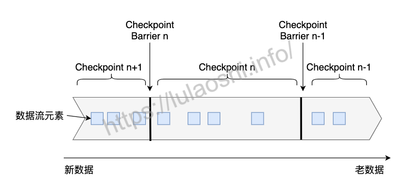
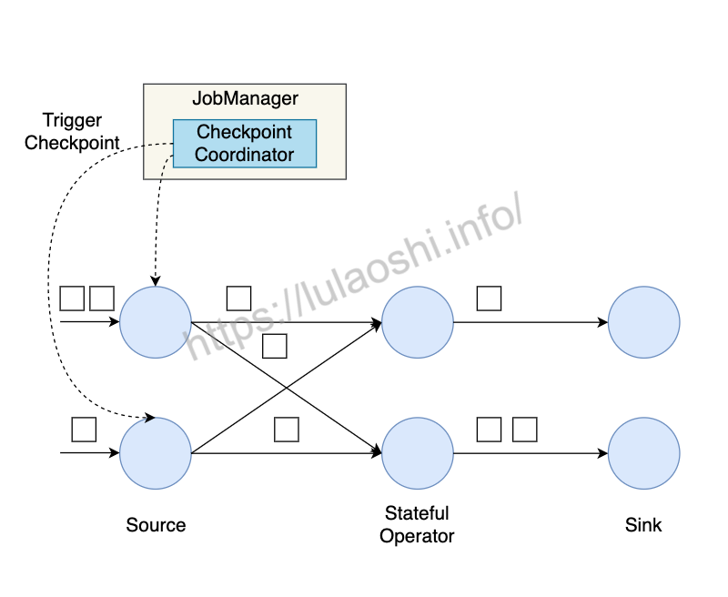
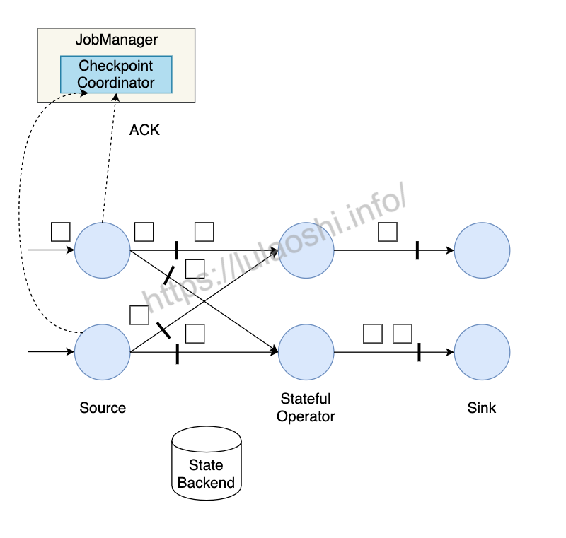

在上一节中，我们介绍了Flink的状态都是基于本地的，而Flink又是一个部署在多节点的分布式系统，分布式系统经常出现进程被杀、节点宕机或网络中断等问题，那么本地的状态在遇到故障时如何保证不丢呢？Flink定期保存状态数据到存储上，故障发生后从之前的备份中恢复，这个过程被称为Checkpoint机制。Checkpoint为Flink提供了Exactly-Once的投递保障。本节将介绍Flink的Checkpoint机制的原理，介绍中会使用多个概念：快照（Snapshot）、分布式快照（Distributed Snapshot）、检查点（Checkpoint）等，这些概念均指的是Flink的Checkpoint机制提供的数据备份过程，读者可以将这些概念等同看待。

## Flink分布式快照流程

首先我们来看一下一个简单的Checkpoint的大致流程：

1. 暂停处理新流入数据，将新数据缓存起来。
2. 将算子子任务的本地状态数据拷贝到一个远程的持久化存储上。
3. 继续处理新流入的数据，包括刚才缓存起来的数据。

Flink是在Chandy–Lamport算法[^1]的基础上实现了一种分布式快照算法。在介绍Flink的快照详细流程前，我们先要了解一下检查点分界线（Checkpoint Barrier）的概念。如下图所示，Checkpoint Barrier被插入到数据流中，它将数据流切分成段。Flink的Checkpoint逻辑是，一段新数据流入导致状态发生了变化，Flink的算子接收到Checpoint Barrier后，对状态进行快照。每个Checkpoint Barrier有一个ID，表示该段数据属于哪次Checkpoint。如下图所示，当ID为n的Checkpoint Barrier到达每个算子后，表示要对n-1和n之间状态更新做快照。Checkpoint Barrier有点像Event Time中的Watermark，它被插入到数据流中，但并不影响数据流原有的处理顺序。



接下来，我们构建一个并行数据流图，用这个并行数据流图来演示Flink的分布式快照机制。这个数据流图的并行度为2，数据流会在这些并行算子上从Source流动到Sink。

首先，Flink的检查点协调器（Checkpoint Coordinator）触发一次Checkpoint（Trigger Checkpoint），这个请求会发送给Source的各个子任务。




各Source算子子任务接收到这个Checkpoint请求之后，会将自己的状态写入到状态后端，生成一次快照，并且会向下游广播Checkpoint Barrier。


Source算子做完快照后，还会给Checkpoint Coodinator发送一个确认，告知自己已经做完了相应的工作。这个确认中包括了一些元数据，其中就包括刚才备份到State Backend的状态句柄，或者说是指向状态的指针。至此，Source完成了一次Checkpoint。跟Watermark的传播一样，一个算子子任务要把Checkpoint Barrier发送给所连接的所有下游子任务。



对于下游算子来说，可能有多个与之相连的上游输入，我们将算子之间的边称为通道。Source要将一个ID为n的Checkpoint Barrier向所有下游算子广播，这也意味着下游算子的多个输入通道里都会收到ID为n的Checkpoint Barrier，而且不同输入通道里Checkpoint Barrier的流入速度不同，ID为n的Checkpoint Barrier到达的时间不同。Checkpoint Barrier传播的过程需要进行对齐（Barrier Alignment），我们从数据流图中截取一小部分，以下图为例，来分析Checkpoint Barrier是如何在算子间传播和对齐的。


如上图所示，对齐分为四步：

1. 算子子任务在某个输入通道中收到第一个ID为n的Checkpoint Barrier，但是其他输入通道中ID为n的Checkpoint Barrier还未到达，该算子子任务开始准备进行对齐。
2. 算子子任务将第一个输入通道的数据缓存下来，同时继续处理其他输入通道的数据，这个过程被称为对齐。
3. 第二个输入通道ID为n的Checkpoint Barrier抵达该算子子任务，所有通道ID为n的Checkpoint Barrier都到达该算子子任务，该算子子任务执行快照，将状态写入State Backend，然后将ID为n的Checkpoint Barrier向下游所有输出通道广播。
4. 对于这个算子子任务，快照执行结束，继续处理各个通道中新流入数据，包括刚才缓存起来的数据。

数据流图中的每个算子子任务都要完成一遍上述的对齐、快照、确认的工作，当最后所有Sink算子确认完成快照之后，说明ID为n的Checkpoint执行结束，Checkpoint Coordinator向State Backend写入一些本次Checkpoint的元数据。


之所以要进行对齐，主要是为了保证一个Flink作业所有算子的状态是一致的，也就是说，一个Flink作业前前后后所有算子写入State Backend的状态都是基于同样的数据。

## 快照性能优化方案

前面和大家介绍了一致性快照的具体流程，这种方式保证了数据的一致性，但有一些潜在的问题：

1. 每次进行Checkpoint前，都需要暂停处理新流入数据，然后开始执行快照，假如状态比较大，一次快照可能长达几秒甚至几分钟。
2. Checkpoint Barrier对齐时，必须等待所有上游通道都处理完，假如某个上游通道处理很慢，这可能造成整个数据流堵塞。

针对这些问题Flink已经有了一些解决方案，并且还在不断优化。

对于第一个问题，Flink提供了异步快照（Asynchronous Snapshot）的机制。当实际执行快照时，Flink可以立即向下广播Checkpoint Barrier，表示自己已经执行完自己部分的快照。同时，Flink启动一个后台线程，它创建本地状态的一份拷贝，这个线程用来将本地状态的拷贝同步到State Backend上，一旦数据同步完成，再给Checkpoint Coordinator发送确认信息。拷贝一份数据肯定占用更多内存，这时可以利用写入时复制（Copy-on-Write）的优化策略。Copy-on-Write指：如果这份内存数据没有任何修改，那没必要生成一份拷贝，只需要有一个指向这份数据的指针，通过指针将本地数据同步到State Backend上；如果这份内存数据有一些更新，那再去申请额外的内存空间并维护两份数据，一份是快照时的数据，一份是更新后的数据。是否开启Asynchronous Snapshot是可以配置的，下一节使用不同的State Backend将介绍如何配置。

对于第二个问题，Flink允许跳过对齐这一步，或者说一个算子子任务不需要等待所有上游通道的Checkpoint Barrier，直接将Checkpoint Barrier广播，执行快照并继续处理后续流入数据。为了保证数据一致性，Flink必须将那些上下游正在传输的数据也作为状态保存到快照中，一旦重启，这些元素会被重新处理一遍。这种不需要对齐的Checkpoint机制被称为Unaligned Checkpoint，我们可以通过`env.getCheckpointConfig().enableUnalignedCheckpoints();`开启Unaligned Checkpoint。

## State Backend

前面已经分享了Flink的快照机制，其中State Backend起到了持久化存储数据的重要功能。Flink将State Backend抽象成了一种插件，并提供了三种State Backend，每种State Backend对数据的保存和恢复方式略有不同。接下来我们开始详细了解一下Flink的State Backend。

### MemoryStateBackend

从名字中可以看出，这种State Backend主要基于内存，它将数据存储在Java的堆区。当进行分布式快照时，所有算子子任务将自己内存上的状态同步到JobManager的堆上。因此，一个作业的所有状态要小于JobManager的内存大小。这种方式显然不能存储过大的状态数据，否则将抛出`OutOfMemoryError`异常。这种方式只适合调试或者实验，不建议在生产环境下使用。下面的代码告知一个Flink作业使用内存作为State Backend，并在参数中指定了状态的最大值，默认情况下，这个最大值是5MB。

```java
env.setStateBackend(new MemoryStateBackend(MAX_MEM_STATE_SIZE));
```

如果不做任何配置，默认情况是使用内存作为State Backend。

### FsStateBackend

这种方式下，数据持久化到文件系统上，文件系统包括本地磁盘、HDFS以及包括Amazon、阿里云在内的云存储服务。使用时，我们要提供文件系统的地址，尤其要写明前缀，比如：`file://`、`hdfs://`或`s3://`。此外，这种方式支持Asynchronous Snapshot，默认情况下这个功能是开启的，可加快数据同步速度。

```java
// 使用HDFS作为State Backend
env.setStateBackend(new FsStateBackend("hdfs://namenode:port/flink-checkpoints/chk-17/"));

// 使用阿里云OSS作为State Backend
env.setStateBackend(new FsStateBackend("oss://<your-bucket>/<object-name>"));

// 使用Amazon作为State Backend
env.setStateBackend(new FsStateBackend("s3://<your-bucket>/<endpoint>"));

// 关闭Asynchronous Snapshot
env.setStateBackend(new FsStateBackend(checkpointPath, false));
```

Flink的本地状态仍然在TaskManager的内存堆区上，直到执行快照时状态数据会写到所配置的文件系统上。因此，这种方式能够享受本地内存的快速读写访问，也能保证大容量状态作业的故障恢复能力。

### RocksDBStateBackend

这种方式下，本地状态存储在本地的RocksDB上。RocksDB是一种嵌入式Key-Value数据库，数据实际保存在本地磁盘上。比起`FsStateBackend`的本地状态存储在内存中，RocksDB利用了磁盘空间，所以可存储的本地状态更大。然而，每次从RocksDB中读写数据都需要进行序列化和反序列化，因此读写本地状态的成本更高。快照执行时，Flink将存储于本地RocksDB的状态同步到远程的存储上，因此使用这种State Backend时，也要配置分布式存储的地址。Asynchronous Snapshot在默认情况也是开启的。

此外，这种State Backend允许增量快照（Incremental Checkpoint），Incremental Checkpoint的核心思想是每次快照时只对发生变化的数据增量写到分布式存储上，而不是将所有的本地状态都拷贝过去。Incremental Checkpoint非常适合超大规模的状态，快照的耗时将明显降低，同时，它的代价是重启恢复的时间更长。默认情况下，Incremental Checkpoint没有开启，需要我们手动开启。

```java
// 开启Incremental Checkpoint
boolean enableIncrementalCheckpointing = true;
env.setStateBackend(new RocksDBStateBackend(checkpointPath, enableIncrementalCheckpointing));
```

相比`FsStateBackend`，`RocksDBStateBackend`能够支持的本地和远程状态都更大，Flink社区已经有TB级的案例。

除了上述三种之外，开发者也可以自行开发State Backend的具体实现。

## 故障重启恢复流程

### 重启恢复基本流程

Flink的重启恢复逻辑相对比较简单：

1. 重启应用，在集群上重新部署数据流图。
2. 从持久化存储上读取最近一次的Checkpoint数据，加载到各算子子任务上。
3. 继续处理新流入的数据。

这样的机制可以保证Flink内部状态的Excatly-Once一致性。至于端到端的Exactly-Once一致性，要根据Source和Sink的具体实现而定，我们还会在第7章端到端Exactly-Once详细讨论。当发生故障时，一部分数据有可能已经流入系统，但还未进行Checkpoint，Source的Checkpoint记录了输入的Offset；当重启时，Flink能把最近一次的Checkpoint恢复到内存中，并根据Offset，让Source从该位置重新发送一遍数据，以保证数据不丢不重。像Kafka等消息队列是提供重发功能的，`socketTextStream`就不具有这种功能，也意味着不能保证端到端的Exactly-Once投递保障。

当一个作业出现故障，进行重启时，势必会暂停一段时间，这段时间上游数据仍然继续发送过来。作业被重新拉起后，肯定需要将刚才未处理的数据消化掉。这个过程可以被理解为，一次跑步比赛，运动员不慎跌倒，爬起来重新向前追击。为了赶上当前最新进度，作业必须以更快的速度处理囤积的数据。所以，在设定资源时，我们必须留出一定的富余量，以保证重启后这段“赶进度”过程中的资源消耗。

### 三种重启策略

一般情况下，一个作业遇到一些异常情况会导致运行异常，潜在的异常情况包括：机器故障、部署环境抖动、流量激增、输入数据异常等。以输入数据异常为例，如果一个作业发生了故障重启，如果触发故障的原因没有根除，那么重启之后仍然会出现故障。因此，在解决根本问题之前，一个作业很可能无限次地故障重启，陷入死循环。为了避免重启死循环，Flink提供了三种重启策略：

* 固定延迟（Fixed Delay）策略：作业每次失败后，按照设定的时间间隔进行重启尝试，重启次数不会超过某个设定值。
* 失败率（Failure Rate）策略：计算一个时间段内作业失败的次数，如果失败次数小于设定值，继续重启，否则不重启。
* 不重启（No Restart）策略：不对作业进行重启。

重启策略的前提是作业进行了Checkpoint，如果作业未设置Checkpoint，则会使用No Restart的策略。重启策略可以在`conf/flink-conf.yaml`中设置，所有使用这个配置文件执行的作业都将采用这样的重启策略；也可以在单个作业的代码中配置重启策略。

#### Fixed Delay

Fixed Delay策略下，作业最多重启次数不会超过某个设定值，两次重启之间有一个可设定的延迟时间。例如，我们在`conf/flink-conf.yaml`中设置为：

```yaml
restart-strategy: fixed-delay
restart-strategy.fixed-delay.attempts: 3
restart-strategy.fixed-delay.delay: 10 s
```

这表示作业最多自动重启3次，两次重启之间有10秒的延迟。超过最多重启次数后，该作业被认定为失败。两次重启之间有延迟，是考虑到一些作业与外部系统有连接，连接一般会设置超时，频繁建立连接对数据准确性和作业运行都不利。如果在程序中用代码配置，可以写为：

```java
StreamExecutionEnvironment env = StreamExecutionEnvironment.getExecutionEnvironment();
// 开启Checkpoint
env.enableCheckpointing(5000L);
env.setRestartStrategy(
  RestartStrategies.fixedDelayRestart(
    3, // 尝试重启次数
    Time.of(10L, TimeUnit.SECONDS) // 两次重启之间的延迟为10秒
  ));
```

如果开启了Checkpoint，但没有设置重启策略，Flink会默认使用这个策略，最大重启次数为`Integer.MAX_VALUE`。

#### Failure Rate

Failure Rate策略下，在设定的时间内，重启失败次数小于设定阈值，该作业继续重启，重启失败次数超出设定阈值，该作业被最终认定为失败。两次重启之间会有一个等待的延迟。例如，我们在`conf/flink-conf.yaml`中设置为：

```yaml
restart-strategy: failure-rate
restart-strategy.failure-rate.max-failures-per-interval: 3
restart-strategy.failure-rate.failure-rate-interval: 5 min
restart-strategy.failure-rate.delay: 10 s
```

这表示在5分钟的时间内，重启次数小于3次时，继续重启，否则认定该作业为失败。两次重启之间的延迟为10秒。在程序中用代码配置，可以写为：

```java
StreamExecutionEnvironment env = StreamExecutionEnvironment.getExecutionEnvironment();
// 开启Checkpoint
env.enableCheckpointing(5000L);
env.setRestartStrategy(RestartStrategies.failureRateRestart(
  3, // 5分钟内最多重启3次
  Time.of(5, TimeUnit.MINUTES), 
  Time.of(10, TimeUnit.SECONDS) // 两次重启之间延迟为10秒
));
```

#### No Restart

No Restart策略下，一个作业遇到异常情况后，直接被判定为失败，不进行重启尝试。在`conf/flink-conf.yaml`中设置为：

```yaml
restart-strategy: none
```

使用代码配置，可以写为：

```java
StreamExecutionEnvironment env = StreamExecutionEnvironment.getExecutionEnvironment();
env.setRestartStrategy(RestartStrategies.noRestart());
```

## Checkpoint相关配置

默认情况下，Checkpoint机制是关闭的，需要调用`env.enableCheckpointing(n)`来开启，每隔n毫秒进行一次Checkpoint。Checkpoint是一种负载较重的任务，如果状态比较大，同时n值又比较小，那可能一次Checkpoint还没完成，下次Checkpoint已经被触发，占用太多本该用于正常数据处理的资源。增大n值意味着一个作业的Checkpoint次数更少，整个作业用于进行Checkpoint的资源更小，可以将更多的资源用于正常的流数据处理。同时，更大的n值意味着重启后，整个作业需要从更长的Offset开始重新处理数据。

此外，还有一些其他参数需要配置，这些参数统一封装在了`CheckpointConfig`里：

```java
CheckpointConfig checkpointCfg = env.getCheckpointConfig();
```

默认的Checkpoint配置是支持Exactly-Once投递的，这样能保证在重启恢复时，所有算子的状态对任一条数据只处理一次。从Checkpoint机制原理角度来看，使用Exactly-Once就是进行了Checkpoint Barrier对齐，因此会有一定的延迟。如果作业延迟小，那么应该使用At-Least-Once投递，不进行对齐，但某些数据会被处理多次。

```java
// 使用At-Least-Once
checkpointCfg.setCheckpointingMode(CheckpointingMode.AT_LEAST_ONCE);
```

如果一次Checkpoint超过一定时间仍未完成，直接将其终止，以免其占用太多资源：

```java
// 超时时间1小时
checkpointCfg.setCheckpointTimeout(3600*1000);
```

如果两次Checkpoint之间的间歇时间太短，那么正常的作业可能获取的资源较少，更多的资源被用在了Checkpoint上。对这个参数进行合理配置能保证数据流的正常处理。比如，设置这个参数为60秒，那么前一次Checkpoint结束后60秒内不会启动新的Checkpoint。这种模式只在整个作业最多允许1个Checkpoint时适用。

```java
// 两次Checkpoint的间隔为60秒
checkpointCfg.setMinPauseBetweenCheckpoints(60*1000);
```

默认情况下一个作业只允许1个Checkpoint执行，如果某个Checkpoint正在进行，另外一个Checkpoint被启动，新的Checkpoint需要挂起等待。

```java
// 最多同时进行3个Checkpoint
checkpointCfg.setMaxConcurrentCheckpoints(3);
```

如果这个参数大于1，将与前面提到的最短间隔相冲突。

Checkpoint的初衷是用来进行故障恢复，如果作业是因为异常而失败，Flink会保存远程存储上的数据；如果开发者自己取消了作业，远程存储上的数据都会被删除。如果开发者希望通过Checkpoint数据进行调试，自己取消了作业，同时希望将远程数据保存下来，需要设置为：

```java
// 作业取消后仍然保存Checkpoint
checkpointCfg.enableExternalizedCheckpoints(ExternalizedCheckpointCleanup.RETAIN_ON_CANCELLATION);
```

`RETAIN_ON_CANCELLATION`模式下，用户需要自己手动删除远程存储上的Checkpoint数据。

默认情况下，如果Checkpoint过程失败，会导致整个应用重启，我们可以关闭这个功能，这样Checkpoint失败不影响作业的运行。

```java
checkpointCfg.setFailOnCheckpointingErrors(false);
```

[1]:  Leslie Lamport, K. Mani Chandy: Distributed Snapshots: Determining Global States of a Distributed System. In: *ACM Transactions on Computer Systems 3*. Nr. 1, Februar 1985. 