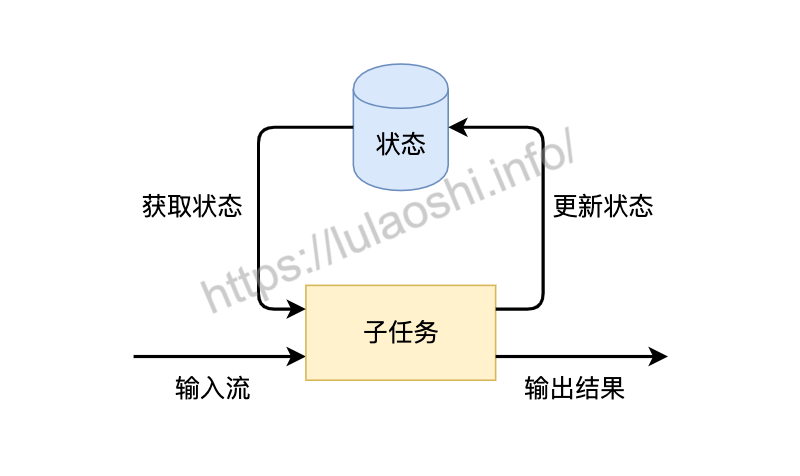
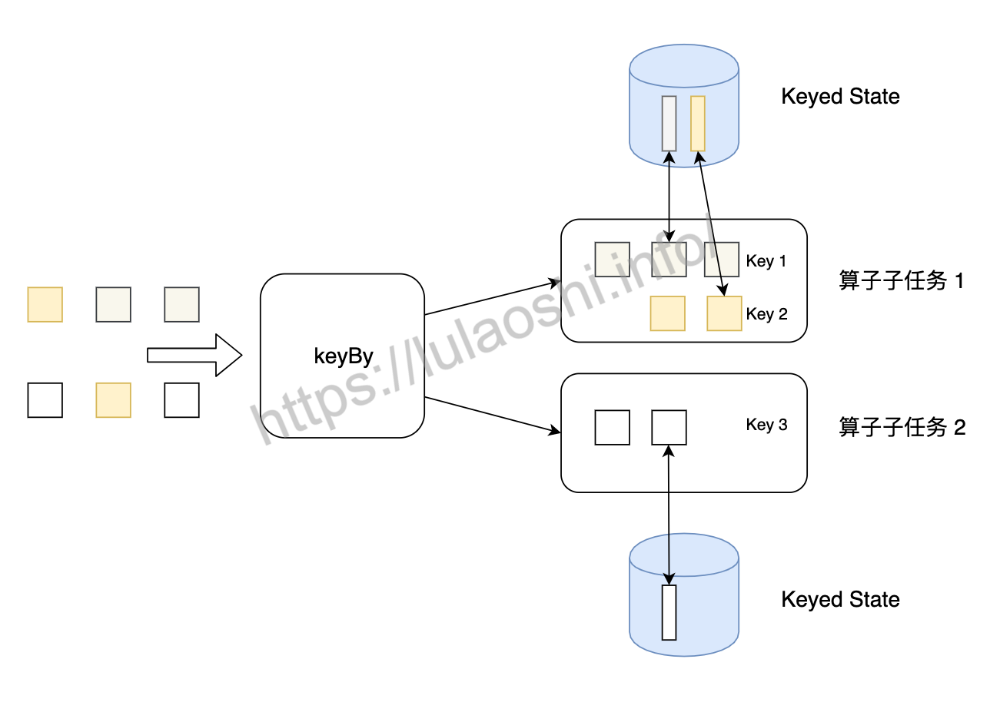
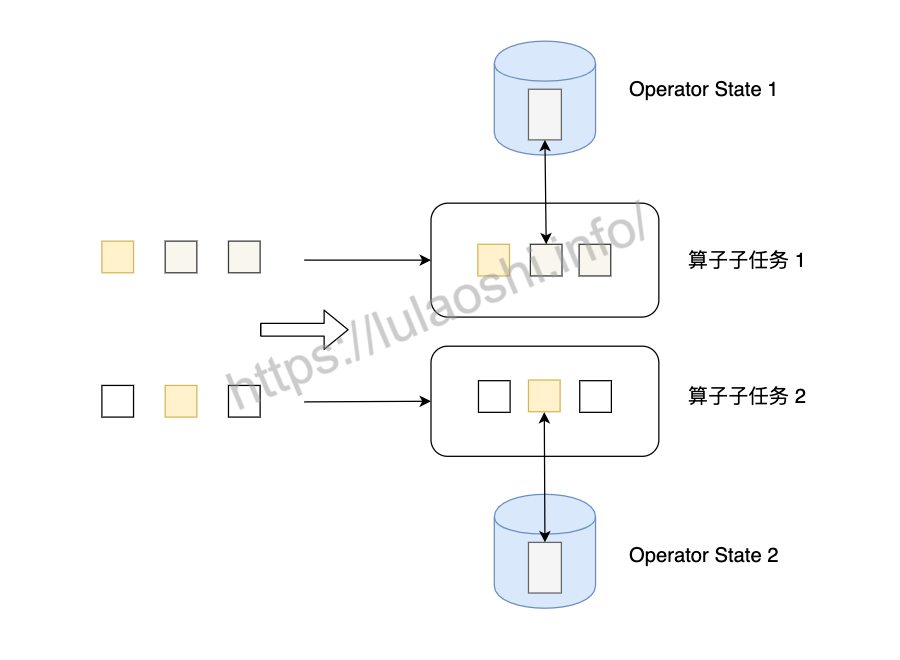
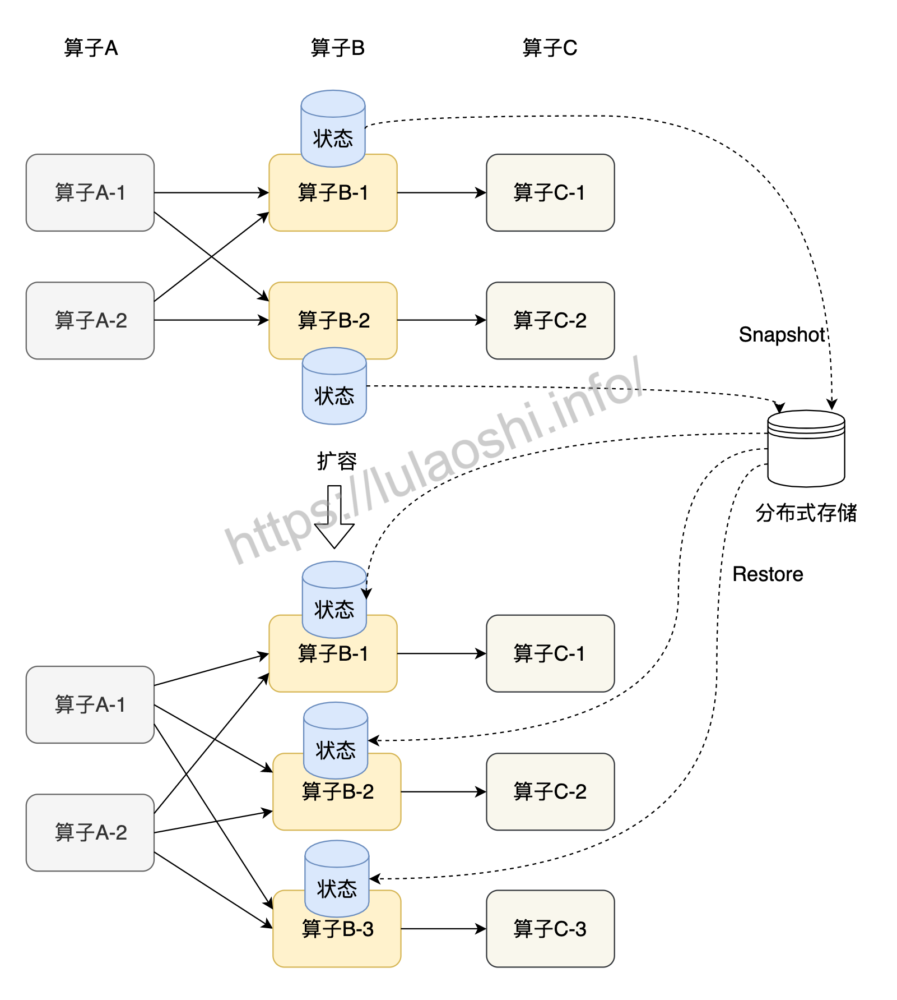
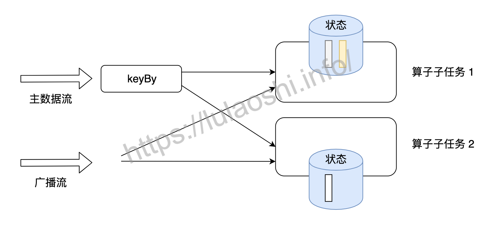

## 为什么要管理状态

有状态的计算是流处理框架要实现的重要功能，因为复杂的流处理场景都需要记录状态，然后在新流入数据的基础上不断更新状态。下面罗列了几个有状态计算的潜在场景：

* 数据流中的数据有重复，我们想对重复数据去重，需要记录哪些数据已经流入过应用，当新数据流入时，根据已流入数据来判断去重。

* 检查输入流是否符合某个特定的模式，需要将之前流入的元素以状态的形式缓存下来。比如，判断一个温度传感器数据流中的温度是否在持续上升。
* 对一个时间窗口内的数据进行聚合分析，分析一个小时内某项指标的75分位或99分位的数值。
* 在线机器学习场景下，需要根据新流入数据不断更新机器学习的模型参数。

我们知道，Flink的一个算子有多个子任务，每个子任务分布在不同实例上，我们可以把状态理解为某个算子子任务在其当前实例上的一个变量，变量记录了数据流的历史信息。当新数据流入时，我们可以结合历史信息来进行计算。实际上，Flink的状态是由算子的子任务来创建和管理的。一个状态更新和获取的流程如下图所示，一个算子子任务接收输入流，获取对应的状态，根据新的计算结果更新状态。一个简单的例子是对一个时间窗口内输入流的某个整数字段求和，那么当算子子任务接收到新元素时，会获取已经存储在状态中的数值，然后将新元素加到状态上，并将状态数据更新。



获取和更新状态的逻辑其实并不复杂，但流处理框架还需要解决以下几类问题：

* 数据的产出要保证实时性，延迟不能太高。
* 需要保证数据不丢不重，恰好计算一次，尤其是当状态数据非常大或者应用出现故障需要恢复时，要保证状态不出任何错误。
* 一般流处理任务都是7*24小时运行的，程序的可靠性非常高。

基于上述要求，我们不能将状态直接交由内存管理，因为内存的容量是有限制的，当状态数据稍微大一些时，就会出现内存不够的问题。假如我们使用一个持久化的备份系统，不断将内存中的状态备份起来，当流处理作业出现故障时，需要考虑如何从备份中恢复。而且，大数据应用一般是横向分布在多个节点上，流处理框架需要保证横向的伸缩扩展性。可见，状态的管理并不那么容易。

作为一个计算框架，Flink提供了有状态的计算，封装了一些底层的实现，比如状态的高效存储、Checkpoint和Savepoint持久化备份机制、计算资源扩缩容等问题。因为Flink接管了这些问题，开发者只需调用Flink API，这样可以更加专注于业务逻辑。

## Flink的几种状态类型

### Managed State和Raw State

Flink有两种基本类型的状态：托管状态（Managed State）和原生状态（Raw State）。从名称中也能读出两者的区别：Managed State是由Flink管理的，Flink帮忙存储、恢复和优化，Raw State是开发者自己管理的，需要自己序列化。

|              | Managed State                                    | Raw State        |
| :----------: | ------------------------------------------------ | ---------------- |
| 状态管理方式 | Flink Runtime托管，自动存储、自动恢复、自动伸缩  | 用户自己管理     |
| 状态数据结构 | Flink提供的常用数据结构，如ListState、MapState等 | 字节数组：byte[] |
|   使用场景   | 绝大多数Flink算子                                | 用户自定义算子   |

上表展示了两者的区别，主要包括：

* 从状态管理的方式上来说，Managed State由Flink Runtime托管，状态是自动存储、自动恢复的，Flink在存储管理和持久化上做了一些优化。当我们横向伸缩，或者说我们修改Flink应用的并行度时，状态也能自动重新分布到多个并行实例上。Raw State是用户自定义的状态。
* 从状态的数据结构上来说，Managed State支持了一系列常见的数据结构，如ValueState、ListState、MapState等。Raw State只支持字节，任何上层数据结构需要序列化为字节数组。使用时，需要用户自己序列化，以非常底层的字节数组形式存储，Flink并不知道存储的是什么样的数据结构。
* 从具体使用场景来说，绝大多数的算子都可以通过继承RichFunction函数类或其他提供好的接口类，在里面使用Managed State。Raw State是在已有算子和Managed State不够用时，用户自定义算子时使用。

下面将重点介绍Managed State。

### Keyed State和Operator State

对Managed State继续细分，它又有两种类型：Keyed State和Operator State。这里先简单对比两种状态，后续还将展示具体的使用方法。

Keyed State是`KeyedStream`上的状态。假如输入流按照id为Key进行了`keyBy`分组，形成一个`KeyedStream`，数据流中所有id为1的数据共享一个状态，可以访问和更新这个状态，以此类推，每个Key对应一个自己的状态。下图展示了Keyed State，因为一个算子子任务可以处理一到多个Key，算子子任务1处理了两种Key，两种Key分别对应自己的状态。



Operator State可以用在所有算子上，每个算子子任务或者说每个算子实例共享一个状态，流入这个算子子任务的所有数据都可以访问和更新这个状态。下图展示了Operator State，算子子任务1上的所有数据可以共享第一个Operator State，以此类推，每个算子子任务上的数据共享自己的状态。



无论是Keyed State还是Operator State，Flink的状态都是基于本地的，即每个算子子任务维护着自身的状态，不能访问其他算子子任务的状态。

在之前各算子的介绍中曾提到，为了自定义Flink的算子，我们可以重写RichFunction函数类，比如`RichFlatMapFunction`。使用Keyed State时，我们也可以通过重写RichFunction函数类，在里面创建和访问状态。对于Operator State，我们还需进一步实现`CheckpointedFunction`接口。

|                | Keyed State                                     | Operator State                   |
| -------------- | ----------------------------------------------- | -------------------------------- |
| 适用算子类型   | 只适用于`KeyedStream`上的算子                   | 可以用于所有算子                 |
| 状态分配       | 每个Key对应一个状态                             | 一个算子子任务对应一个状态       |
| 创建和访问方式 | 重写Rich Function，通过里面的RuntimeContext访问 | 实现`CheckpointedFunction`等接口 |
| 横向扩展       | 状态随着Key自动在多个算子子任务上迁移           | 有多种状态重新分配的方式         |
| 支持的数据结构 | ValueState、ListState、MapState等               | ListState、BroadcastState等      |

上表总结了Keyed State和Operator State的区别。

## 横向扩展问题

状态的横向扩展问题主要是指修改Flink应用的并行度，每个算子的并行实例数或算子子任务数发生了变化，应用需要关停或启动一些算子子任务，某份在原来某个算子子任务上的状态数据需要平滑更新到新的算子子任务上。Flink的Checkpoint可以辅助迁移状态数据。算子的本地状态将数据生成快照（Snapshot），保存到分布式存储（如HDFS）上。横向伸缩后，算子子任务个数变化，子任务重启，相应的状态从分布式存储上重建（Restore）。下图展示了一个算子扩容的状态迁移过程。



对于Keyed State和Operator State这两种状态，他们的横向伸缩机制不太相同。由于每个Keyed State总是与某个Key相对应，当横向伸缩时，Key总会被自动分配到某个算子子任务上，因此Keyed State会自动在多个并行子任务之间迁移。对于一个非`KeyedStream`，流入算子子任务的数据可能会随着并行度的改变而改变。如上图所示，假如一个应用的并行度原来为2，那么数据会被分成两份并行地流入两个算子子任务，每个算子子任务有一份自己的状态，当并行度改为3时，数据流被拆成3支，此时状态的存储也相应发生了变化。对于横向伸缩问题，Operator State有两种状态分配方式：一种是均匀分配，另一种是将所有状态合并，再分发给每个实例上。

## Keyed State的使用方法

### Keyed State简介

对于Keyed State，Flink提供了几种现成的数据结构供我们使用，包括`ValueState`、`ListState`等，他们的继承关系如下图所示。首先，`State`主要有三种实现，分别为`ValueState`、`MapState`和`AppendingState`，`AppendingState`又可以细分为`ListState`、`ReducingState`和`AggregatingState`。


这几个状态的具体区别在于：

* `ValueState<T>`是单一变量的状态，T是某种具体的数据类型，比如`Double`、`String`，或我们自己定义的复杂数据结构。我们可以使用`T value()`方法获取状态，使用`void update(T value)`更新状态。
* `MapState<UK, UV>`存储一个Key-Value Map，其功能与Java的`Map`几乎相同。`UV get(UK key)`可以获取某个Key下的Value值，`void put(UK key, UV value)`可以对某个Key设置Value，`boolean contains(UK key)`判断某个Key是否存在，`void remove(UK key)`删除某个Key以及对应的Value，`Iterable<Map.Entry<UK, UV>> entries()`返回`MapState`中所有的元素，`Iterator<Map.Entry<UK, UV>> iterator()`返回状态的迭代器。需要注意的是，`MapState`中的Key和Keyed State的Key不是同一个Key。
* `ListState<T>`存储了一个由T类型数据组成的列表。我们可以使用`void add(T value)`或`void addAll(List<T> values)`向状态中添加元素，使用`Iterable<T> get()`获取整个列表，使用`void update(List<T> values)`来更新列表，新的列表将替换旧的列表。
* `ReducingState<T>`和`AggregatingState<IN, OUT>`与`ListState<T>`同属于`MergingState<IN, OUT>`。与`ListState<T>`不同的是，`ReducingState<T>`只有一个元素，而不是一个列表。它的原理是：新元素通过`void add(T value)`加入后，与已有的状态元素使用`ReduceFunction`合并为一个元素，并更新到状态里。`AggregatingState<IN, OUT>`与`ReducingState<T>`类似，也只有一个元素，只不过`AggregatingState<IN, OUT>`的输入和输出类型可以不一样。`ReducingState<T>`和`AggregatingState<IN, OUT>`与窗口上进行`ReduceFunction`和`AggregateFunction`很像，都是将新元素与已有元素做聚合。

{: .notice--info}
Flink的核心代码目前使用Java实现的，而Java的很多类型与Scala的类型不太相同，比如`List`和`Map`。这里不再详细解释Java和Scala的数据类型的异同，但是开发者在使用Scala调用这些接口，比如状态的接口，需要注意两种语言间的转换。对于`List`和`Map`的转换，只需要引用`import scala.collection.JavaConversions._`，并在必要的地方添加后缀`asScala`或`asJava`来进行转换。此外，Scala和Java的空对象使用习惯不太相同，Java一般使用`null`表示空，Scala一般使用`None`。

### Keyed State的使用方法

之前的文章中其实已经多次使用过状态，这里基于电商用户行为分析场景来演示如何使用状态，我们采用了阿里巴巴提供的一个淘宝用户行为数据集，为了精简需要，只节选了部分数据。电商平台会将用户与商品的交互行为收集记录下来，行为数据主要包括几个字段：userId、itemId、categoryId、behavior和timestamp。其中userId和itemId分别代表用户和商品的唯一ID，categoryId为商品类目ID，behavior表示用户的行为类型，包括点击(pv)、购买(buy)、加购物车(cart)、喜欢(fav)等，timestamp记录行为发生时间。我们定义相应的数据结构为：

```java
public class UserBehavior {
    public long userId;
    public long itemId;
    public int categoryId;
    public String behavior;
    public long timestamp;

    public UserBehavior() {}

    public UserBehavior(long userId, long itemId, int categoryId, String behavior, long timestamp) {
        this.userId = userId;
        this.itemId = itemId;
        this.categoryId = categoryId;
        this.behavior = behavior;
        this.timestamp = timestamp;
    }

    public static UserBehavior of(long userId, long itemId, int categoryId, String behavior, long timestamp) {
        return new UserBehavior(userId, itemId, categoryId, behavior, timestamp);
    }

    @Override
    public String toString() {
        return "(" + userId + "," + itemId + "," + categoryId + "," +
                behavior + "," + timestamp + ")";
    }
}
```

我们先在主逻辑中读取数据流，生成一个按照用户ID分组的`KeyedStream`，在这之上使用`RichFlatMapFunction`。

```java
env.setStreamTimeCharacteristic(TimeCharacteristic.EventTime);
DataStream<UserBehavior> userBehaviorStream = ...
 
// 生成一个KeyedStream
KeyedStream<UserBehavior, Long> keyedStream = 
  userBehaviorStream.keyBy(user -> user.userId);

// 在KeyedStream上进行flatMap
DataStream<Tuple3<Long, String, Integer>> behaviorCountStream = 
  keyedStream.flatMap(new MapStateFunction());
```


下面的代码演示了继承`RichFlatMapFunction`，这里使用`MapState<String, Integer>`来记录某个用户某种行为出现的次数。

```scala
/**
  * MapStateFunction继承并实现RichFlatMapFunction
  * 两个泛型分别为输入数据类型和输出数据类型
  */
public static class MapStateFunction extends RichFlatMapFunction<UserBehavior, Tuple3<Long, String, Integer>> {

    // 指向MapState的句柄
    private MapState<String, Integer> behaviorMapState;

    @Override
    public void open(Configuration configuration) {
        // 创建StateDescriptor
        MapStateDescriptor<String, Integer> behaviorMapStateDescriptor = new MapStateDescriptor<String, Integer>("behaviorMap", Types.STRING, Types.INT);
        // 通过StateDescriptor获取运行时上下文中的状态
        behaviorMapState = getRuntimeContext().getMapState(behaviorMapStateDescriptor);
    }

    @Override
    public void flatMap(UserBehavior input, Collector<Tuple3<Long, String, Integer>> out) throws Exception {
        int behaviorCnt = 1;
        // behavior有可能为pv、cart、fav、buy等
        // 判断状态中是否有该behavior
        if (behaviorMapState.contains(input.behavior)) {
          	behaviorCnt = behaviorMapState.get(input.behavior) + 1;
        }
        // 更新状态
        behaviorMapState.put(input.behavior, behaviorCnt);
        out.collect(Tuple3.of(input.userId, input.behavior, behaviorCnt));
    }
}
```

Keyed State是针对`KeyedStream`的状态，在主逻辑中，必须先对一个`DataStream`进行`keyBy`操作。在本例中，我们对用户ID进行了`keyBy`，那么用户ID为1的数据共享同一状态数据，以此类推，每个用户ID的行为数据共享自己的状态数据。

之后，我们需要实现RichFunction函数类，比如`RichFlatMapFunction`，或者`KeyedProcessFunction`等函数类。这些算子函数类都是`RichFunction`的一种实现，他们都有运行时上下文`RuntimeContext`，从`RuntimeContext`中可以获取状态。
在实现这些算子函数类时，一般是在`open`方法中声明状态。`open`是算子的初始化方法，它在算子实际处理数据之前调用。具体到状态的使用，我们首先要注册一个`StateDescriptor`。从名字中可以看出，`StateDescriptor`是状态的一种描述，它描述了状态的名字和状态的数据结构。状态的名字可以用来区分不同的状态，一个算子内可以有多个不同的状态，每个状态在`StateDescriptor`中设置对应的名字。同时，我们也需要指定状态的具体数据结构，指定具体的数据结构非常重要，因为Flink要对其进行序列化和反序列化，以便进行Checkpoint和必要的恢复，相关内容可以参考[数据类型和序列化机制](/flink/chapter-datastream-api/data-types.html)部分。每种类型的状态都有对应的`StateDescriptor`，比如`MapStateDescriptor`对应`MapState`，`ValueStateDescriptor`对应`ValueState`。

在本例中，我们使用下面的代码注册了一个`MapStateStateDescriptor`，Key为某种行为，如pv、buy等，数据类型为`String`，Value为该行为出现的次数，数据类型为`Integer`。
```java
// 创建StateDescriptor
MapStateDescriptor<String, Integer> behaviorMapStateDescriptor = new MapStateDescriptor<String, Integer>("behaviorMap", Types.STRING, Types.INT);
```
接着我们通过`StateDescriptor`向`RuntimeContext`中获取状态句柄。状态句柄并不存储状态，它只是Flink提供的一种访问状态的接口，状态数据实际存储在State Backend中。本例中对应的代码为：
```java
// 通过StateDescriptor获取运行时上下文中的状态
behaviorMapState = getRuntimeContext().getMapState(behaviorMapStateDescriptor);
```

使用和更新状态发生在实际的处理函数上，比如`RichFlatMapFunction`中的`flatMap`方法。在实现自己的业务逻辑时需要访问和修改状态，比如我们可以通过`MapState.get`方法获取状态，通过`MapState.put`方法更新状态中的数据。

其他类型的状态使用方法与本例中所展示的大致相同。`ReducingState`和`AggregatingState`在注册`StateDescriptor`时，还需要实现一个`ReduceFunction`或`AggregationFunction`。下面的代码注册`ReducingStateDescriptor`时实现一个`ReduceFunction`。

```java
/**
  * ReducingStateFlatMap继承并实现了了RichFlatMapFunction
  * 第一个泛型Tuple2是输入类型
  * 第二个泛型Integer是输出类型
  */
private static class ReducingStateFlatMap extends RichFlatMapFunction<Tuple2<Integer, Integer>, Integer> {

		private transient ReducingState<Integer> state;

		@Override
		public void open(Configuration parameters) throws Exception {
      // 创建StateDescriptor
      // 除了名字和数据类型，还要实现一个ReduceFunction
			ReducingStateDescriptor<Integer> stateDescriptor =
					new ReducingStateDescriptor<>(
							"reducing-state",
							new ReduceSum(),
							Types.INT);

			this.state = getRuntimeContext().getReducingState(stateDescriptor);
		}

		@Override
		public void flatMap(Tuple2<Integer, Integer> value, Collector<Integer> out) throws Exception {
			state.add(value.f1);
		}

    // ReduceSum继承并实现ReduceFunction
		private static class ReduceSum implements ReduceFunction<Integer> {

			@Override
			public Integer reduce(Integer value1, Integer value2) throws Exception {
				return value1 + value2;
			}
		}
}
```

可以看到，使用`ReducingState`时，除了名字和数据类型，还增加了一个函数，这个函数可以是Lambda表达式，也可以继承并实现函数类`ReduceFunction`。

使用`ReducingState`时，我们可以通过`void add(T value)`方法向状态里增加一个元素，新元素和状态中已有数据通过`ReduceFunction`两两聚合。`AggregatingState`的使用方法与之类似。

综上，Keyed State的使用方法可以被归纳为：

1. 创建一个`StateDescriptor`，在里面注册状态的名字和数据类型等。
2. 从`RuntimeContext`中获取状态句柄。
3. 使用状态句柄获取和更新状态数据，比如`ValueState.value`、`ValueState.update`、`MapState.get`、`MapState.put`。

此外，必要时候，我们还需要调用Keyed State中的`void clear()`方法来清除状态中的数据，以免发生内存问题。

## Operator List State的使用方法

状态从本质上来说，是Flink算子子任务的一种本地数据，为了保证数据可恢复性，使用Checkpoint机制来将状态数据持久化输出到存储空间上。状态相关的主要逻辑有两项：

1. 将算子子任务本地内存数据在Checkpoint时写入存储，这步被称为备份（Snapshot）；
2. 初始化或重启应用时，以一定的逻辑从存储中读出并变为算子子任务的本地内存数据，这步被称为重建（Restore）。

Keyed State对这两项内容做了更完善的封装，开发者可以开箱即用。对于Operator State来说，每个算子子任务管理自己的Operator State，或者说每个算子子任务上的数据流共享同一个状态，可以访问和修改该状态。Flink的算子子任务上的数据在程序重启、横向伸缩等场景下不能保证百分百的一致性。换句话说，重启Flink作业后，某个数据流元素不一定流入重启前的算子子任务上。因此，使用Operator State时，我们需要根据自己的业务场景来设计Snapshot和Restore的逻辑。为了实现这两个步骤，Flink提供了最为基础的`CheckpointedFunction`接口类。

```java
public interface CheckpointedFunction {
  
  // Checkpoint时会调用这个方法，我们要实现具体的snapshot逻辑，比如将哪些本地状态持久化
	void snapshotState(FunctionSnapshotContext context) throws Exception;

  // 初始化时会调用这个方法，向本地状态中填充数据
	void initializeState(FunctionInitializationContext context) throws Exception;

}
```

在Flink的Checkpoint机制下，当一次Snapshot触发后，`snapshotState`会被调用，将本地状态持久化到存储空间上。这里我们可以先不用关心Snapshot是如何被触发的，暂时理解成Snapshot是自动触发的，我们将在[Checkpoint](./checkpoint.html)部分介绍它的触发机制。

`initializeState`在算子子任务初始化时被调用，初始化包括两种场景：

1. 整个Flink作业第一次执行，状态数据被初始化为一个默认值；
2. Flink作业重启，之前的作业已经将状态输出到存储，通过`initializeState`方法将存储上的状态读出并填充到本地状态里。

目前Operator State主要有三种，其中ListState和UnionListState在数据结构上都是一种`ListState`，还有一种BroadcastState。这里我们主要介绍`ListState`这种列表形式的状态。

`ListState`这种状态以一个列表的形式序列化并存储，以适应横向扩展时状态重分布的问题。每个算子子任务有零到多个状态S，组成一个列表`ListState[S]`。各个算子子任务Snapshot时将自己状态列表的写入存储，整个状态逻辑上可以理解成是将这些列表连接到一起，组成了一个包含所有状态的大列表。当作业重启或横向扩展时，我们需要将这个包含所有状态的列表重新分布到各个算子子任务上。ListState和UnionListState的区别在于：ListState是将整个状态列表按照Round-Ribon的模式均匀分布到各个算子子任务上，每个算子子任务得到的是整个列表的子集；UnionListState按照广播的模式，将整个列表发送给每个算子子任务。

Operator State的实际应用场景不如Keyed State多，它经常被用在Source或Sink等算子上，用来保存流入数据的偏移量或对输出数据做缓存，以保证Flink作业的端到端的Exactly-Once语义。这里我们来看一个Flink官方提供的Sink案例以了解`CheckpointedFunction`的工作原理。

```scala
// BufferingSink需要实现SinkFunction接口类以实现其Sink功能，同时也要实现CheckpointedFunction接口类
public class BufferingSink
        implements SinkFunction<Tuple2<String, Integer>>,
                   CheckpointedFunction {

    private final int threshold;

    // Operator List State句柄
    private transient ListState<Tuple2<String, Integer>> checkpointedState;

    // 本地缓存
    private List<Tuple2<String, Integer>> bufferedElements;

    public BufferingSink(int threshold) {
        this.threshold = threshold;
        this.bufferedElements = new ArrayList<>();
    }

    // Sink的核心处理逻辑，将上游数据value输出到外部系统
    @Override
    public void invoke(Tuple2<String, Integer> value, Context contex) throws Exception {
        // 先将上游数据缓存到本地的缓存
        bufferedElements.add(value);
        // 当本地缓存大小到达阈值时，将本地缓存输出到外部系统
        if (bufferedElements.size() == threshold) {
            for (Tuple2<String, Integer> element: bufferedElements) {
                // 输出到外部系统
            }
            // 清空本地缓存
            bufferedElements.clear();
        }
    }

    // 重写CheckpointedFunction中的snapshotState
  	// 将本地缓存Snapshot到存储上
    @Override
    public void snapshotState(FunctionSnapshotContext context) throws Exception {
        // 将之前的Checkpoint清理
        checkpointedState.clear();
        for (Tuple2<String, Integer> element : bufferedElements) {
            // 将最新的数据写到状态中
            checkpointedState.add(element);
        }
    }

    // 重写CheckpointedFunction中的initializeState
    // 初始化状态
    @Override
    public void initializeState(FunctionInitializationContext context) throws Exception {
        // 注册ListStateDescriptor
        ListStateDescriptor<Tuple2<String, Integer>> descriptor =
            new ListStateDescriptor<>(
                "buffered-elements",
                TypeInformation.of(new TypeHint<Tuple2<String, Integer>>() {}));

        // 从FunctionInitializationContext中获取OperatorStateStore，进而获取ListState
        checkpointedState = context.getOperatorStateStore().getListState(descriptor);

        // 如果是作业重启，读取存储中的状态数据并填充到本地缓存中
        if (context.isRestored()) {
            for (Tuple2<String, Integer> element : checkpointedState.get()) {
                bufferedElements.add(element);
            }
        }
    }
}
```

上面的代码中，在输出到Sink之前，程序先将数据放在本地缓存中，并定期进行Snapshot，这实现了批量输出的功能，批量输出能够减少网络等开销。同时，程序能够保证数据一定会输出外部系统，因为即使程序崩溃，状态中存储着还未输出的数据，下次启动后还会将这些未输出数据读取到内存，继续输出到外部系统。

注册和使用Operator State的代码和Keyed State相似，也是先注册一个`StateDescriptor`，并指定状态名字和数据类型，然后从`FunctionInitializationContext`中获取`OperatorStateStore`，进而获取ListState。

```java
ListStateDescriptor<Tuple2<String, Integer>> descriptor =
            new ListStateDescriptor<>(
                "buffered-elements",
                TypeInformation.of(new TypeHint<Tuple2<String, Integer>>() {}));

checkpointedState = context.getOperatorStateStore().getListState(descriptor);
```

如果是UnionListState，那么代码改为：`context.getOperatorStateStore().getUnionListState()`。

在之前代码的`initializeState`方法里，我们进行了状态的初始化逻辑，我们用`context.isRestored()`来判断是否为重启作业，然后从之前的Checkpoint中恢复并写到本地缓存中。

{: .notice--info}
`CheckpointedFunction`接口类的`initializeState`方法的参数为`FunctionInitializationContext`，基于这个上下文对象我们不仅可以通过`getOperatorStateStore`获取`OperatorStateStore`，也可以通过`getKeyedStateStore`来获取`KeyedStateStore`，进而通过`getState`、`getMapState`等方法获取Keyed State，比如：`context.getKeyedStateStore().getState(stateDescriptor)`。这与在RichFunction函数类中使用Keyed State的方式并不矛盾，因为`CheckpointedFunction`是Flink有状态计算的最底层接口，它提供了最丰富的状态接口。

`ListCheckpointed`接口类是`CheckpointedFunction`接口类的一种简写，`ListCheckpointed`提供的功能有限，只支持均匀分布的ListState，不支持全量广播的UnionListState。

```java
public interface ListCheckpointed<T extends Serializable> {

	// Checkpoint时会调用这个方法，我们要实现具体的snapshot逻辑，比如将哪些本地状态持久化
	List<T> snapshotState(long checkpointId, long timestamp) throws Exception;

  // 从上次Checkpoint中恢复数据到本地内存
	void restoreState(List<T> state) throws Exception;
}
```

跟`CheckpointedFunction`中的`snapshotState`方法一样，这里的`snapshotState`也是在做备份，但这里的参数列表更加精简，其中`checkpointId`是一个单调递增的数字，用来表示某次Checkpoint，`timestamp`是Checkpoint发生的实际时间，这个方法以列表形式返回需要写入存储的状态，Flink会将返回值`List<T>`写入存储。`restoreState`方法用来初始化状态，包括作业第一次启动或者作业失败重启。参数`state`是一个列表形式的状态，是从存储中读取出来的、需要均匀分布给这个算子子任务的状态数据。启动时，Flink会读取存储中的数据，传入参数`state`中，开发者根据业务需求决定如何恢复这些数据。

## BroadcastState的使用方法

BroadcastState是Flink 1.5引入的功能，本节将跟大家分享BroadcastState的潜在使用场景，并继续使用电商用户行为分析的案例来演示BroadcastState的使用方法。

### BroadcastState使用场景

无论是分布式批处理还是流处理，将部分数据同步到所有实例上是一个十分常见的需求。例如，我们需要依赖一个不断变化的控制规则来处理主数据流的数据，主数据流数据量比较大，只能分散到多个算子实例上，控制规则数据相对比较小，可以分发到所有的算子实例上。BroadcastState与直接在时间窗口进行两个数据流的Join的不同点在于，控制规则数据量较小，可以直接放到每个算子实例里，这样可以大大提高主数据流的处理速度。下图为BroadcastState工作原理示意图。



我们继续使用电商平台用户行为分析为例，不同类型的用户往往有特定的行为模式，有些用户购买欲望强烈，有些用户反复犹豫才下单，有些用户频繁爬取数据，有盗刷数据的嫌疑，电商平台运营人员为了提升商品的购买转化率，保证平台的使用体验，经常会进行一些用户行为模式分析。基于这个场景，我们可以构建一个Flink作业，实时监控识别不同模式的用户。为了避免每次更新规则模式后重启部署，我们可以将规则模式作为一个数据流与用户行为数据流`connect`在一起，并将规则模式以BroadcastState的形式广播到每个算子实例上。

### 电商用户行为识别案例

下面开始具体构建一个实例程序。我们定义一些必要的数据结构来描述这个业务场景，包括之前已经定义的用户行为和下面定义的规则模式两个数据结构。

```java
/**
 * 行为模式
 * 整个模式简化为两个行为
 * */
public class BehaviorPattern {

    public String firstBehavior;
    public String secondBehavior;

    public BehaviorPattern() {}

    public BehaviorPattern(String firstBehavior, String secondBehavior) {
        this.firstBehavior = firstBehavior;
        this.secondBehavior = secondBehavior;
    }

    @Override
    public String toString() {
        return "first: " + firstBehavior + ", second: " + secondBehavior;
    }
}
```

然后我们在主逻辑中读取两个数据流：

```java
// 主数据流
DataStream<UserBehavior> userBehaviorStream = ...
// BehaviorPattern数据流
DataStream<BehaviorPattern> patternStream = ...
```

目前BroadcastState只支持使用Key-Value形式，需要使用`MapStateDescriptor`来描述。这里我们使用一个比较简单的行为模式，因此Key是一个空类型。当然我们也可以根据业务场景，构造复杂的Key-Value。然后，我们将模式流使用`broadcast`方法广播到所有算子子任务上。

```java
// BroadcastState只能使用 Key->Value 结构，基于MapStateDescriptor
MapStateDescriptor<Void, BehaviorPattern> broadcastStateDescriptor = 
  new MapStateDescriptor<>("behaviorPattern", Types.VOID, Types.POJO(BehaviorPattern.class));

BroadcastStream<BehaviorPattern> broadcastStream = 
  patternStream.broadcast(broadcastStateDescriptor);
```

用户行为模式流先按照用户ID进行`keyBy`，然后与广播流合并：

```scala
// 生成一个KeyedStream
KeyedStream<UserBehavior, Long> keyedStream = userBehaviorStream.keyBy(user -> user.userId);

// 在KeyedStream上进行connect和process
DataStream<Tuple2<Long, BehaviorPattern>> matchedStream = keyedStream
    .connect(broadcastStream)
    .process(new BroadcastPatternFunction());
```

下面的代码展示了BroadcastState完整的使用方法。`BroadcastPatternFunction`是`KeyedBroadcastProcessFunction`的具体实现，它基于BroadcastState处理主数据流，输出`(Long, BehaviorPattern)`，分别表示用户ID和行为模式。

```java
/**
     * 四个泛型分别为：
     * 1. KeyedStream中Key的数据类型
     * 2. 主数据流的数据类型
     * 3. 广播流的数据类型
     * 4. 输出类型
     * */
public static class BroadcastPatternFunction
extends KeyedBroadcastProcessFunction<Long, UserBehavior, BehaviorPattern, Tuple2<Long, BehaviorPattern>> {

    // 用户上次行为状态句柄，每个用户存储一个状态
    private ValueState<String> lastBehaviorState;
    // BroadcastState Descriptor
    private MapStateDescriptor<Void, BehaviorPattern> bcPatternDesc;

    @Override
    public void open(Configuration configuration) {
        lastBehaviorState = getRuntimeContext().getState(
          new ValueStateDescriptor<String>("lastBehaviorState", Types.STRING));
        bcPatternDesc = new MapStateDescriptor<Void, BehaviorPattern>("behaviorPattern", Types.VOID, Types.POJO(BehaviorPattern.class));
    }

    @Override
    public void processBroadcastElement(BehaviorPattern pattern,
                                        Context context,
                                        Collector<Tuple2<Long, BehaviorPattern>> collector) throws Exception {
        BroadcastState<Void, BehaviorPattern> bcPatternState = context.getBroadcastState(bcPatternDesc);
        // 将新数据更新至BroadcastState，这里使用一个null作为Key
        // 在本场景中所有数据都共享一个Pattern，因此这里伪造了一个Key
        bcPatternState.put(null, pattern);
    }

    @Override
    public void processElement(UserBehavior userBehavior,
                               ReadOnlyContext context,
                               Collector<Tuple2<Long, BehaviorPattern>> collector) throws Exception {

        // 获取最新的BroadcastState
        BehaviorPattern pattern = context.getBroadcastState(bcPatternDesc).get(null);
        String lastBehavior = lastBehaviorState.value();
        if (pattern != null && lastBehavior != null) {
              // 用户之前有过行为，检查是否符合给定的模式
              if (pattern.firstBehavior.equals(lastBehavior) &&
                        pattern.secondBehavior.equals(userBehavior.behavior)) {
                    // 当前用户行为符合模式
                    collector.collect(Tuple2.of(userBehavior.userId, pattern));
              }
        }
        lastBehaviorState.update(userBehavior.behavior);
    }
}
```

对上面的所有流程总结下来，使用BroadcastState需要进行三步：

1. 接收一个普通数据流，并使用`broadcast`方法将其转换为`BroadcastStream`，因为BroadcastState目前只支持Key-Value结构，需要使用`MapStateDescriptor`描述它的数据结构。
2. 将`BroadcastStream`与一个`DataStream`或`KeyedStream`使用`connect`方法连接到一起。
3. 实现一个`ProcessFunction`，如果主流（非Broadcast流）是`DataStream`，则需要实现`BroadcastProcessFunction`；如果主流是`KeyedStream`，则需要实现`KeyedBroadcastProcessFunction`。这两种函数都提供了时间和状态的访问方法。

在`KeyedBroadcastProcessFunction`函数类中，有两个方法需要实现：

* `processElement`：处理主流中的每条元素，输出零到多个数据。`ReadOnlyContext` 可以获取时间和状态，但是只能以只读的形式读取BroadcastState，不能修改，以保证每个算子实例上的BroadcastState都是相同的。
* `processBroadcastElement`：处理广播流的数据，可以输出零到多个数据，一般用来更新Broadcast State。

此外，`KeyedBroadcastProcessFunction`属于[ProcessFunction系列函数](/flink/chapter-time-window/process-function.html)，可以注册Timer，并在`onTimer`方法中实现回调逻辑。本例中为了保持代码简洁，没有使用，Timer一般用来清空状态，避免状态无限增长下去。