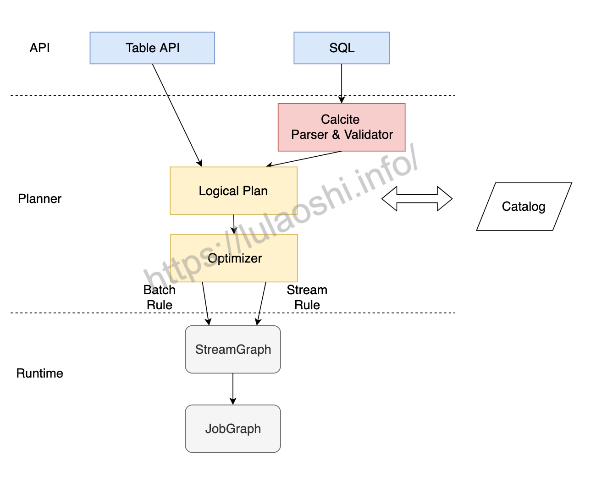

Table API和SQL两者结合非常紧密，它们的API与关系型数据库中查询非常相似，本质上它们都依赖于一个像数据表的结构：`Table`。

在具体执行层面，Flink将Table API或SQL语句使用一个名为执行计划器（Planner）的组件将关系型查询转换为可执行的Flink作业，并对作业进行一些优化。在本书写作期间出现了阿里巴巴的Blink版本的Planner（或者称为Blink Planner）和Flink社区版本的老Planner（或者称为Flink Planner、Old Planner）并存的现象，Flink社区正在进行这方面的迭代和融合。从名称中可以看出，Blink Planner未来将逐步取代Flink Planner，读者可以根据需求来确定使用哪种Planner。同时，Table API & SQL的迭代速度较快，读者可以根据Flink官方文档查询最新的使用方法。

本节主要介绍Table API & SQL程序的骨架结构以及如何连接外部系统。

## Table API & SQL程序骨架结构

下面的代码展示了Table API & SQL的骨架结构：

```java
// 基于StreamExecutionEnvironment创建TableEnvironment
StreamExecutionEnvironment env = StreamExecutionEnvironment.getExecutionEnvironment();
StreamTableEnvironment tEnv = StreamTableEnvironment.create(env);

// 读取数据源，创建数据表Table
tableEnv.connect(...).createTemporaryTable("user_behavior");
// 注册输出数据表Table
tableEnv.connect(...).createTemporaryTable("output_table");

// 使用Table API查询user_behavior
Table tabApiResult = tableEnv.from("user_behavior").select(...);
// 使用SQL查询table1
Table sqlResult  = tableEnv.sqlQuery("SELECT ... FROM user_behavior ... ");

// 将查询结果输出到outputTable
tabApiResult.insertInto("output_table");
sqlResult.insertInto("output_table");

// execute
tableEnv.execute("table");
```

从程序骨架结构上来看，目前的Table API & SQL要与DataStream/DataSet API相结合来使用，主要需要以下步骤：

1. 创建执行环境（ExecutionEnvironment）和表环境（TableEnvironment）
2. 获取数据表`Table`
3. 使用Table API或SQL在`Table`上做查询等操作
4. 将结果输出到外部系统
5. 调用`execute()`，执行作业

在真正编写一个作业之前，我们还需要在Maven中添加相应的依赖。根据用户选择Java还是Scala，需要引用`flink-table-api-*-bridge`项目，这个项目是Table API与DataStream/DataSet API之间的桥梁。

```
<!-- Java -->
<dependency>
  <groupId>org.apache.flink</groupId>
  <artifactId>flink-table-api-java-bridge_${scala.binary.version}</artifactId>
  <version>${flink.version}</version>
  <scope>provided</scope>
</dependency>
<!-- Scala -->
<dependency>
  <groupId>org.apache.flink</groupId>
  <artifactId>flink-table-api-scala-bridge_${scala.binary.version}</artifactId>
  <version>${flink.version}</version>
  <scope>provided</scope>
</dependency>
```

此外，还需要添加Planner相关依赖：

```
<!-- Flink 1.9之前均采用开源社区版的Planner -->
<dependency>
  <groupId>org.apache.flink</groupId>
  <artifactId>flink-table-planner_${scala.binary.version}</artifactId>
  <version>${flink.version}</version>
  <scope>provided</scope>
</dependency>
<!-- Blink版的Planner -->
<dependency>
  <groupId>org.apache.flink</groupId>
  <artifactId>flink-table-planner-blink_${scala.binary.version}</artifactId>
  <version>${flink.version}</version>
  <scope>provided</scope>
</dependency>
```

其中，`${scala.binary.version}`是你所在环境中Scala的版本号，可以是2.11或2.12，`{flink.version}`是所采用的Flink版本号。Maven的配置和参数可以参考本书提供的样例程序中的`pom.xml`文件。

## 创建TableEnvironment

`TableEnvironment`是Table API & SQL编程中最基础的类，也是整个程序的入口，它包含了程序的核心上下文信息。`TableEnvironment`的核心功能包括：

* 连接外部系统
* 向目录（Catalog）中注册`Table`或者从中获取`Table`
* 执行Table API或SQL操作
* 注册用户自定义函数
* 提供一些其他配置功能

在Flink社区对未来的规划中，`TableEnvironment`将统一流批处理，兼容Java和Scala两种语言。我们在第四章Flink的骨架结构中曾提到，在Flink 1.10中，针对流处理和批处理分别使用了`StreamExecutionEnvironment`和`ExecutionEnvironment`两套执行环境，底层有些逻辑还没完全统一，加上Java和Scala两种语言的区别，仅执行环境就四种之多。在Table API & SQL中，`TableEnvironment`也没有完全将上述问题统一，再加上Blink Planner与原有老Planner的区别，读者在编程时一定要注意如何初始化的`TableEnvironment`。

{: .align-center}

从上图中可以看到，Flink 1.10保留了5个`TableEnvironment`。其中，`TableEnvironment`是最顶级的接口，`StreamTableEnvironment`和`BatchTableEnvironment`都提供了Java和Scala两个实现：

* `org.apache.flink.table.api.TableEnvironment`：兼容Java和Scala，统一流批处理，适用于整个作业都使用 Table API & SQL 编写程序的场景。
* `org.apache.flink.table.api.java.StreamTableEnvironment`和`org.apache.flink.table.api.scala.StreamTableEnvironment`：分别用于Java和Scala的流处理场景，提供了`DataStream`和`Table`之间相互转换的接口。如果作业除了基于Table API & SQL外，还有和`DataStream`之间的转化，则需要使用`StreamTableEnvironment`。
* `org.apache.flink.table.api.java.BatchTableEnvironment`和`org.apache.flink.table.api.scala.BatchTableEnvironment`：分别用于Java和Scala的批处理场景，提供了`DataSet`和`Table`之间相互转换的接口。如果作业除了基于Table API & SQL外，还有和`DataSet`之间的转化，则使用`BatchTableEnvironment`。

下面的代码使用Java语言进行流处理，它基于老Planner创建`TableEnvironment`。

```java
// 使用Java和老Planner进行流处理
import org.apache.flink.streaming.api.environment.StreamExecutionEnvironment;
import org.apache.flink.table.api.EnvironmentSettings;
import org.apache.flink.table.api.java.StreamTableEnvironment;

// 使用老Planner注意相应的Planner包要加入到Maven中
EnvironmentSettings fsSettings = EnvironmentSettings.newInstance().useOldPlanner().inStreamingMode().build();
// 基于StreamExecutionEnvironment创建StreamTableEnvironment
StreamExecutionEnvironment fsEnv = StreamExecutionEnvironment.getExecutionEnvironment();
StreamTableEnvironment fsTableEnv = StreamTableEnvironment.create(fsEnv, fsSettings);
// 或者基于TableEnvironment
TableEnvironment fsTableEnv = TableEnvironment.create(fsSettings);
```

如果想基于Blink Planner进行流处理，那么需要改为：

```java
// 使用Java和Blink Planner进行流处理
import org.apache.flink.streaming.api.environment.StreamExecutionEnvironment;
import org.apache.flink.table.api.EnvironmentSettings;
import org.apache.flink.table.api.java.StreamTableEnvironment;

// 使用Blink Planner注意相应的Planner包要加入到Maven中
EnvironmentSettings bsSettings = 
EnvironmentSettings.newInstance().useBlinkPlanner().inStreamingMode().build();
// 基于StreamExecutionEnvironment创建StreamTableEnvironment
StreamExecutionEnvironment bsEnv = StreamExecutionEnvironment.getExecutionEnvironment();
StreamTableEnvironment bsTableEnv = StreamTableEnvironment.create(bsEnv, bsSettings);
// 或者基于TableEnvironment
TableEnvironment bsTableEnv = TableEnvironment.create(bsSettings);
```

如果想基于老Planner进行批处理：

```java
// 使用Java和老Planner进行批处理
import org.apache.flink.api.java.ExecutionEnvironment;
import org.apache.flink.table.api.java.BatchTableEnvironment;

ExecutionEnvironment fbEnv = ExecutionEnvironment.getExecutionEnvironment();
BatchTableEnvironment fbTableEnv = BatchTableEnvironment.create(fbEnv);
```

基于Blink Planner进行批处理：

```java
// 使用Java和Blink Planner进行批处理
import org.apache.flink.table.api.EnvironmentSettings;
import org.apache.flink.table.api.TableEnvironment;

EnvironmentSettings bbSettings = EnvironmentSettings.newInstance().useBlinkPlanner().inBatchMode().build();
TableEnvironment bbTableEnv = TableEnvironment.create(bbSettings);
```

总结下来，使用Table API & SQL之前，要确定使用何种编程语言（Java/Scala），进行批处理还是流处理以及使用哪种Planner。

## 获取Table

在关系型数据库中，表是描述数据的基本单元。数据库表一般由行和列组成，如果以电商用户行为数据为例，我们可以将这张表理解为一个Excel表格，每一列代表一种属性，比如`user_id`、`behavior`等，每一行表示一个用户的一次行为，比如某个用户在哪个时间对哪些商品产生了哪些行为。我们一般用表模式（Schema）来描述一个表中有哪些列，这些列的数据类型。例如，我们定义电商用户行为的Schema为：

```java
Schema schema = new Schema()
                .field("user_id", DataTypes.BIGINT())
                .field("item_id", DataTypes.BIGINT())
                .field("category", DataTypes.BIGINT())
                .field("behavior", DataTypes.STRING())
                .field("ts", DataTypes.TIMESTAMP(3));
```

在传统的关系型数据库中，数据库表一般由开发者定义好，在后续对外地提供服务过程中，表是常驻数据库的，开发者不断在表上进行增删查改。在数据分析领域，表的概念被拓展，表不仅包括了关系型数据库中传统意义上的表，也包括了存储数据的文件，可以传输数据的消息队列等。Flink是一个计算引擎，它不提供数据存储的功能，但是可以通过Connector去连接不同的外部系统。为了基于外部数据进行Table API & SQL计算，Flink使用`Table`的概念表示广义上的表。它包括物理上确实存在的表，也包括基于物理表经过一些计算而生成的虚拟表，虚拟表又被称为视图（View）。

可见，如果想在Flink中使用`Table`来查询数据，最重要的一步是将数据（数据库、文件或消息队列）读取并转化成一个`Table`。我们可以在一个Flink作业运行时注册一个新的`Table`，也可以获取已创建好的常驻集群的`Table`。在每个Flink作业启动后临时创建的表是临时表（Temporary Table），随着这个Flink作业的结束，这种表也被销毁，它只能在一个Flink Session中使用。在骨架程序中`tableEnv.connect(...).createTemporaryTable("user_behavior");`就是创建了一个Temporary Table。但是更多的情况下，我们想跟传统的数据库那样提前创建好表，这些表后续可以为整个集群上的所有用户和所有作业提供服务，这种表被称为常驻表（Permanent Table）。Permanent Table可以在多个Flink Session中使用。

为了管理多个Permanent Table，Flink使用Catalog来维护多个Permanent Table的名字、类型（文件、消息队列或数据库）、数据存储位置等元数据（Metadata）信息。一个Flink作业可以连接某个Catalog，这样就可以直接读取其中的各个表，生成`Table`。有了Catalog功能，数据管理团队对数据源更了解，他们可以提前在Catalog中创建Permanent Table，注册好该表的Schema、注明该表使用何种底层技术、写明数据存储位置等；数据分析团队可以完全不用关心这些元数据信息，无需了解这个表到底是存储在Kafka还是HDFS，直接在这个表上进行查询。

本节后续部分将介绍注册表的几种常见方式。

## 在Table上执行语句

### Table API

基于`Table`，我们可以调用Table API或者SQL来查询其中的数据。Table API和编程语言结合更紧密，我们可以在`Table`类上使用链式调用，调用`Table`类中的各种方法，执行各类关系型操作。下面的代码在`user_behavior`表上进行`groupBy`和`select`操作。

```java
StreamTableEnvironment tEnv = ...
// 创建一个TemporaryTable：user_behavior
tEnv.connect(new FileSystem().path("..."))
        .withFormat(new Csv())
        .withSchema(schema)
        .createTemporaryTable("user_behavior");
Table userBehaviorTable = tEnv.from("user_behavior");

// 在Table上使用Table API执行关系型操作
Table groupByUserId = userBehaviorTable.groupBy("user_id").select("user_id, COUNT(behavior) as cnt");
```

### SQL

我们也可以直接在`Table`执行SQL语句。SQL标准中定义了一系列语法和关键字，开发者可以基于SQL标准来编写SQL语句。与Table API中函数调用的方式不同，SQL语句是纯文本形式的。Flink SQL基于Apache Calcite（以下简称Calcite），将SQL语句转换为Flink可执行程序。Calcite支持SQL标准，因此Flink SQL也支持SQL标准。

下面的代码展示了如何使用Flink SQL对一个`Table`做查询：

```java
StreamTableEnvironment tEnv = ...
// 创建一个TemporaryTable：user_behavior
tEnv.connect(new FileSystem().path("..."))
        .withFormat(new Csv())
        .withSchema(schema)
        .createTemporaryTable("user_behavior");

// 在Table上使用SQL执行关系型操作
Table groupByUserId = tEnv.sqlQuery("SELECT user_id, COUNT(behavior) FROM user_behavior GROUP BY user_id");
```

由于Table API和SQL都基于`Table`类，我们可以使用Table API，生成一个`Table`，再在此之上进行SQL查询，也可以先进行SQL查询得到一个`Table`，再在此之上调用Table API。由此可见，Table API和SQL的结合非常紧密。本书后半部分将主要介绍Flink SQL。

## 将Table结果输出

我们可以将查询结果通过`TableSink`输出到外部系统。`TableSink`和之前提到的Sink很像，它是一个数据输出的统一接口，可以将数据以CSV、Parquet、Avro等格式序列化，并将数据发送到关系型数据库、KV数据库、消息队列或文件系统上。`TableSink`与Catalog、Schema等概念紧密相关。下面的代码展示了如何将查询结果输出到文件系统。

```java
StreamTableEnvironment tEnv = ...
tEnv.connect(new FileSystem().path("..."))
    .withFormat(new Csv().fieldDelimiter('|'))
    .withSchema(schema)
    .createTemporaryTable("CsvSinkTable");

// 执行查询操作，得到一个名为result的Table
Table result = ...
// 将result发送到名为CsvSinkTable的TableSink
result.insertInto("CsvSinkTable");
```

## 执行作业

以上部分是一个Table API & SQL作业的核心代码编写阶段，但千万不要忘记调用`execute`方法来执行这个作业，否则作业无法被真正执行。

{: .align-center}

上图为Table API & SQL从调用到执行的大致流程。一个Table API或者SQL调用经过Planner最终转化为一个`JobGraph`，Planner在中间起到一个转换和优化的作用。对于流作业和批作业，Blink Planner分别有相应的优化规则。

我们可以使用`TableEnvironment.explain(table)`来将查询转化为物理执行计划。

```java
// 声明一个SQL查询
Table groupByUserId = tEnv.sqlQuery(...)
  
String explanation = tEnv.explain(groupByUserId);
System.out.println(explanation);
```

我们可以得到相应的语法树（未优化的逻辑执行计划）、优化后的逻辑执行计划以及最终的物理执行计划，如下所示：

```
== Abstract Syntax Tree ==
LogicalAggregate(group=[{0}], behavior_cnt=[COUNT($1)])
+- LogicalProject(user_id=[$0], behavior=[$3])
   ...

== Optimized Logical Plan ==
GroupAggregate(groupBy=[user_id], select=[user_id, COUNT(behavior) AS behavior_cnt])
+- Exchange(distribution=[hash[user_id]])
   +- Calc(select=[user_id, behavior])
      ...

== Physical Execution Plan ==
Stage 1 : Data Source
	content : Source: KafkaTableSource(user_id, item_id, category_id, behavior, ts)

	Stage 2 : Operator
		content : SourceConversion(table=[default_catalog.default_database.user_behavior, source: [KafkaTableSource(user_id, item_id, category_id, behavior, ts)]], fields=[user_id, item_id, category_id, behavior, ts])
		ship_strategy : FORWARD
				...
```

综上，Table API & SQL使用Planner将作业转化为具体可执行的程序。

Flink社区试图保证流批处理从使用体验到内部执行上的一致性。我们曾提到，Flink 1.10版本存在着DataStream API和DataSet API并存的现象，即DataStream API处理无界数据流，DataSet API处理有界数据集；也存在着Flink Planner和Blink Planner并存的现象。开源社区版的Flink Planner需要适配DataStream API和DataSet API，而Blink Planner的核心思想是将流批统一，它认为批处理是流处理的一个子集，是对有界数据流进行处理。因此，这两种Planner在具体实现上有一些区别。从名字中也看出，Flink社区决定逐渐将老的Flink Planner废弃，并不断推动流批一体化。因此，读者在使用时最好根据最新文档来选择合适的Planner。

## 获取表的具体方式

在Flink 1.10中，Table API & SQL与外部系统交互主要有两大类方式：

1. 在程序中使用代码编程配置
2. 使用声明式的语言，如SQL的数据库定义语言（Data Definition Language，DDL）或YAML文件。

无论哪类方式，都需要配置外部系统的必要参数、序列化方式和Schema。

### 代码配置方式

在程序中使用代码配置的方式又具体分为：

1. 使用`connect`方法连接外部系统
2. 将`DataStream`或`DataSet`转换为`Table`

其中，第一种支持的外部系统有限，目前可以支持文件系统、Kafka、Elasticsearch和HBase。第二种方式和第七章所提到的Flink Connector使用方法相似，以流处理为例，我们需要首先获取一个`DataStream`，再进一步将其转化为`Table`。

我们先看`connect`方法，下面的代码展示了一个比较详细的例子，它从一个Kafka数据流中获取`Table`，数据使用JSON序列化，最终创建一个名为`user_behavior`的表。

```java
tEnv
  // 使用connect函数连接外部系统
  .connect(
    new Kafka()
    .version("universal")     // 必填，Kafka版本，合法的参数有"0.8", "0.9", "0.10", "0.11"或"universal"
    .topic("user_behavior")   // 必填，Topic名
    .startFromLatest()        // 首次消费时数据读取的位置
    .property("zookeeper.connect", "localhost:2181")  // Kafka连接参数
    .property("bootstrap.servers", "localhost:9092")
	)
  // 序列化方式 可以是JSON、Avro等
  .withFormat(new Json())
  // 数据的Schema
  .withSchema(
    new Schema()
    .field("user_id", DataTypes.BIGINT())
    .field("item_id", DataTypes.BIGINT())
    .field("category_id", DataTypes.BIGINT())
    .field("behavior", DataTypes.STRING())
    .field("ts", DataTypes.TIMESTAMP(3))
	)
  // 临时表的表名，后续可以在SQL语句中使用这个表名
  .createTemporaryTable("user_behavior");
```

关于`connect`以及各个外部系统的具体连接方法，本书将不逐一覆盖，读者可以根据Flink官网的最新文档来学习使用。

`connect`方法可以直接连接外部数据并创建表，此外，我们也可以依托DataStream API，将一个`DataStream`转换为`Table`：

```java
DataStream<UserBehavior> userBehaviorDataStream = ...
// 将数据流转换为一个视图，使用UserBehavior这个POJO类各字段名作为user_behavior表的字段名
tEnv.createTemporaryView("user_behavior", userBehaviorDataStream);
```

{: .notice--primary}
Flink 1.10的`TableEnvironment`不支持将`DataStream`或`DataSet`转换为`Table`，使用此功能需要使用`StreamTableEnvironment`或者`BatchTableEnvironment`。

### 声明式方式

另一种获取表的方式是使用SQL DDL或YAML等声明式方式来配置外部系统。

很多系统用YAML文件来配置参数，不过目前YAML只能和SQL Client配合，而1.10版本的SQL Client暂时是一个测试功能，还不能用于生产环境，这里暂不介绍，感兴趣的读者可以通过官网文档了解。SQL DDL是很多熟悉SQL的朋友经常使用的功能，比如`CREATE TABLE`、`DROP TABLE`等，是很多SQL用户经常使用的语句。同样的一个Kafka数据流，使用SQL DDL可以这样定义：

```sql
CREATE TABLE user_behavior (
    -- 表的Schema
    user_id BIGINT,
    item_id BIGINT,
    category_id BIGINT,
    behavior STRING,
    ts TIMESTAMP(3),
    WATERMARK FOR ts as ts - INTERVAL '5' SECOND  -- 定义Watermark ts为EventTime
) WITH (
    -- 外部系统连接参数
    'connector.type' = 'kafka',
    'connector.version' = 'universal',  -- Kafka版本
    'connector.topic' = 'user_behavior',  -- Kafka Topic
    'connector.startup-mode' = 'latest-offset',  -- 从最近的offset开始读取数据
    'connector.properties.zookeeper.connect' = 'localhost:2181',  -- Kafka连接参数
    'connector.properties.bootstrap.servers' = 'localhost:9092', 
     -- 序列化方式
  	'format.type' = 'json'  -- 数据源格式为 json
);
```

将上面的SQL语句粘贴到`tEnv.sqlUpdate("CREATE TABLE ...")`中，放在主逻辑中执行即可。我们将在[SQL DDL](sql-ddl.html)部分详细介绍如何使用这些语句创建表。