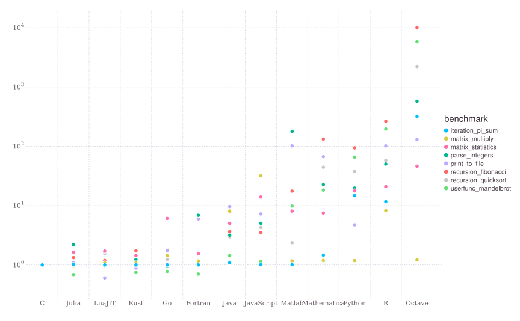

在[计算机体系结构回顾](/gpu/gpu-basic/computer-arch.html)中，我们提到计算机只能执行二进制的机器码，C、C++等编译型语言依靠编译器将源代码转化为可执行文件后才能运行，Python、Java等解释型语言使用解释器将源代码翻译后在虚拟机上执行。对于Python，由于解释器的存在，其执行效率比C语言慢几倍甚至几十倍。

{: .align-center}
*以C语言为基准，不同编程语言性能测试比较*

*图Python解释器工作原理*比较了当前流行的各大编程语言在几个不同任务上的计算速度。C语言经过几十年的发展，优化已经达到了极致。以C语言为基准，大多数解释语言，如Python、R会慢十倍甚至一百倍。Julia这个解释语言是个“奇葩”，因为它采用了JIT编译技术。

解决Python执行效率低的问题，一种解决办法是使用C/C++语言重写Python函数，但是这要求程序员对C/C++语言熟悉，且调试速度慢，不适合绝大多数Python程序员。另外一种非常方便快捷的解决办法就是使用Just-In-Time（JIT）技术，本文将解释JIT技术的原理，并提供几个案例，让你十分钟内学会JIT技术。

## Python解释器工作原理

Python是一门解释语言，Python为我们提供了基于硬件和操作系统的一个虚拟机，并使用解释器将源代码转化为虚拟机可执行的字节码。字节码在虚拟机上执行，得到结果。

{: .align-center}
*Python解释器工作原理*

我们使用`python example.py`来执行一份源代码时，Python解释器会在后台启动一个字节码编译器（Bytecode Compiler），将源代码转换为字节码。字节码是一种只能运行在虚拟机上的文件，Python的字节码默认后缀为`.pyc`，Python生成`.pyc`后一般放在内存中继续使用，并不是每次都将`.pyc`文件保存到磁盘上。有时候我们会看到自己Python代码文件夹里有很多`.pyc`文件与`.py`文件同名，但也有很多时候看不到`.pyc`文件。pyc字节码通过Python虚拟机与硬件交互。虚拟机的出现导致程序和硬件之间增加了中间层，运行效率大打折扣。相信使用过虚拟机软件的朋友深有体会:在原生的系统上安装一个虚拟机软件，在虚拟机上再运行一个其他系统，经常感觉速度下降，体验变差，这与Python虚拟机导致程序运行慢是一个原理。

Just-In-Time（JIT）技术为解释语言提供了一种优化，它能克服上述效率问题，极大提升代码执行速度，同时保留Python语言的易用性。使用JIT技术时，JIT编译器将Python源代码编译成机器直接可以执行的机器语言，并可以直接在CPU等硬件上运行。这样就跳过了原来的虚拟机，执行速度几乎与用C语言编程速度并无二致。

## 十分钟入门Python Numba

Numba是一个针对Python的开源JIT编译器，由Anaconda公司主导开发，可以对Python原生代码进行CPU和GPU加速。Numba对NumPy数组和函数非常友好。

使用Numba非常方便，只需要在Python原生函数上增加一个装饰器（Decorator）。Numba会将这些函数使用即时编译JIT方式编译成机器码，这些代码将以近乎机器码的速度运行。

目前，Numba对以下环境进行了支持：

* 操作系统：Windows（32位和64位），macOS，Linux（32位和64位）
* CPU微架构：x86，x86_64，ppc64，armv7l和armv8l
* GPU：NVIDIA CUDA和AMD ROCm
* CPython
* NumPy 1.15以后的版本

### 安装方法

使用`conda`安装Numba：

```bash
$ conda install numba
```

或者使用`pip`安装：

```bash
$ pip install numba
```

### 使用方法

使用时，只需要在原来的函数上添加一行"注释"：

```python
from numba import jit
import numpy as np

SIZE = 2000
x = np.random.random((SIZE, SIZE))

"""
给定n*n矩阵，对矩阵每个元素计算tanh值，然后求和。
因为要循环矩阵中的每个元素，计算复杂度为 n*n。
"""
@jit
def jit_tan_sum(a):   # 函数在被调用时编译成机器语言
    tan_sum = 0
    for i in range(SIZE):   # Numba 支持循环
        for j in range(SIZE):
            tan_sum += np.tanh(a[i, j])   # Numba 支持绝大多数NumPy函数
    return tan_sum

print(jit_tan_sum(x))
```

我们只需要在原来的代码上添加一行`@jit`，即可将一个函数编译成机器码，其他地方都不需要更改。`@`符号装饰了原来的代码，所以称类似写法为**装饰器**。

在我的Core i5处理器上，添加`@jit`装饰器后，上面的代码执行速度提升了23倍！而且随着数据和计算量的增大，Numba的性能提升可能会更大！很多朋友的代码可能需要执行十几个小时甚至一天，进行加速，完全有可能把一天的计算量缩短到几个小时！

## Numba的使用场景

Numba简单到只需要在函数上加一个装饰就能加速程序，但也有缺点。目前Numba只支持了Python原生函数和部分NumPy函数，其他一些场景可能不适用。比如Numba官方给出这样的例子：

```python
from numba import jit
import pandas as pd

x = {'a': [1, 2, 3], 'b': [20, 30, 40]}

@jit
def use_pandas(a): # Numba对这个函数支持不好
    df = pd.DataFrame.from_dict(a) # Numba 不知道 pd.DataFrame 在做什么
    df += 1                        # Numba 也无法优化这个操作
    return df.cov()                

print(use_pandas(x))
```

pandas是更高层次的封装，Numba其实不能理解它里面做了什么，所以无法对其加速。一些大家经常用的机器学习框架，如`scikit-learn`，`tensorflow`，`pytorch`等，已经做了大量的优化，不适合再使用Numba做加速。

此外，Numba不支持：

* `try...except` 异常处理
* `with` 语句
* 类定义`class`
* `yield from` 

*注 Numba当前支持的功能： http://numba.pydata.org/numba-doc/latest/reference/pysupported.html*

那如何决定是否使用Numba呢？

Numba的`@jit`装饰器就像自动驾驶，用户不需要关注到底是如何优化的，Numba去尝试进行优化，如果发现不支持，那么Numba会继续用Python原来的方法去执行该函数，即*图 Python解释器工作原理*中左侧部分。这种模式被称为`object`模式。前文提到的pandas的例子，Numba发现无法理解里面的内容，于是自动进入了`object`模式。`object`模式还是和原生的Python一样慢，还有可能比原来更慢。

Numba真正牛逼之处在于其`nopython`模式。将装饰器改为`@jit(nopython=True)`或者`@njit`，Numba会假设你已经对所加速的函数非常了解，强制使用加速的方式，不会进入`object`模式，如编译不成功，则直接抛出异常。`nopython`的名字会有点歧义，我们可以理解为不使用很慢的Python，强制进入*图 Python解释器工作原理*中右侧部分。

实践上，一般推荐将代码中计算密集的部分作为单独的函数提出来，并使用`nopython`方式优化，这样可以保证我们能使用到Numba的加速功能。其余部分还是使用Python原生代码，在计算加速的前提下，避免过长的编译时间。Numba可以与NumPy紧密结合，两者一起，常常能够得到近乎C语言的速度。尽管Numba不能直接优化pandas，但是我们可以将pandas中处理数据的`for`循环作为单独的函数提出来，再使用Numba加速。

## 编译开销

编译源代码需要一定的时间。C/C++等编译型语言要提前把整个程序先编译好，再执行可执行文件。Numba库提供的是一种懒编译（Lazy Compilation）技术，即在运行过程中第一次发现代码中有`@jit`，才将该代码块编译。用到的时候才编译，看起来比较懒，所以叫懒编译。使用Numba时，总时间 = 编译时间 + 运行时间。相比所能节省的计算时间，编译的时间开销很小，所以物有所值。对于一个需要多次调用的Numba函数，只需要编译一次，后面再调用时就不需要编译了。

```python
from numba import jit
import numpy as np
import time

SIZE = 2000
x = np.random.random((SIZE, SIZE))

"""
给定n*n矩阵，对矩阵每个元素计算tanh值，然后求和。
因为要循环矩阵中的每个元素，计算复杂度为 n*n。
"""
@jit
def jit_tan_sum(a):   # 函数在被调用时编译成机器语言
    tan_sum = 0
    for i in range(SIZE):   # Numba 支持循环
        for j in range(SIZE):
            tan_sum += np.tanh(a[i, j])   # Numba 支持绝大多数NumPy函数
    return tan_sum

# 总时间 = 编译时间 + 运行时间
start = time.time()
jit_tan_sum(x)
end = time.time()
print("Elapsed (with compilation) = %s" % (end - start))

# Numba将加速的代码缓存下来
# 总时间 = 运行时间
start = time.time()
jit_tan_sum(x)
end = time.time()
print("Elapsed (after compilation) = %s" % (end - start))
```

代码中两次调用Numba优化函数，第一次执行时需要编译，第二次使用缓存的代码，运行时间将大大缩短：

```
Elapsed (with compilation) = 0.49199914932250977
Elapsed (after compilation) = 0.0364077091217041
```

原生Python速度慢的另一个重要原因是变量类型不确定。声明一个变量的语法很简单，如`a = 1`，但没有指定`a`到底是一个整数和一个浮点小数。Python解释器要进行大量的类型推断，会非常耗时。同样，引入Numba后，Numba也要推断输入输出的类型，才能转化为机器码。针对这个问题，Numba给出了名为Eager Compilation的优化方式。

```python
from numba import jit, int32

@jit("int32(int32, int32)", nopython=True)
def f2(x, y):
    return x + y
```

`@jit(int32(int32, int32))`告知Numba你的函数在使用什么样的输入和输出，括号内是输入，括号左侧是输出。这样不会加快执行速度，但是会加快编译速度，可以更快将函数编译到机器码上。

## Numba到底有多快

网上有很多对Numba进行性能评测的文章，在一些计算任务上，Numba结合NumPy，可得到接近C语言的速度。

{: .align-center}

## Numba的更多功能

除了上面介绍的加速功能，Numba还有很多其他功能。`@vectorize`装饰器可以将一个函数向量化，变成类似NumPy函数一样，直接处理矩阵和张量。R语言用户可能非常喜欢这个功能。

本系列重点讲解GPU编程，而Numba对NVIDIA的CUDA和AMD的ROCm都有所支持。后文将使用Numba演示如何进行Python上的GPU编程。

## Numba的原理

{: .align-center}
*Numba编译过程*

Numba使用了LLVM和NVVM技术。LLVM技术可以将Python、Julia这样的解释语言直接翻译成CPU可执行的机器码。NVVM主要是基于LLVM在GPU上的编译器技术。
