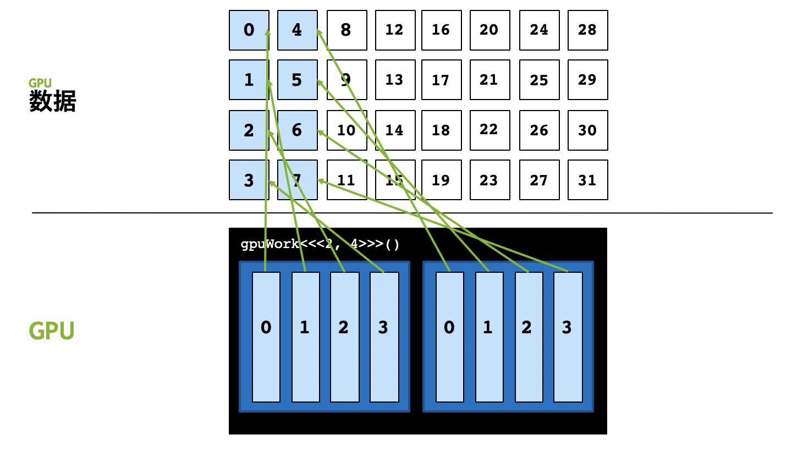
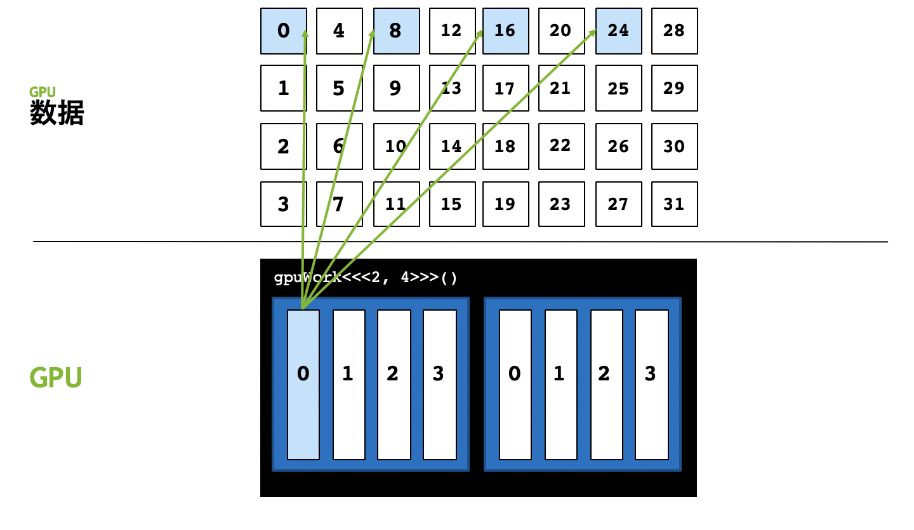

在[初识GPU编程](./cuda-intro.html#block大小设置)中，我曾提到，CUDA的执行配置：`[gridDim, blockDim]`中的`blockDim`最大只能是1024，但是并没提到`gridDim`的最大限制。英伟达给出的官方回复是gridDim最大为一个32位整数的最大值，也就是2,147,483,648，大约二十亿。这个数字已经非常大了，足以应付绝大多数的计算，但是如果对并行计算的维度有更高需求呢？答案是网格跨步，它能提供更优的并行计算效率。


*假如我们需要并行度为32，但只有8个Thread，并行度大于线程数*

这里仍然以`[2, 4]`的执行配置为例，该执行配置中整个grid只能并行启动8个线程，假如我们要并行计算的数据是32，会发现后面8号至31号数据共计24个数据无法被计算。


*使用网格跨步解决上述问题，0号线程执行第0、8、16、24号数据*

我们可以在0号线程中，处理第0、8、16、24号数据，这样就能解决数据远大于执行配置中的线程总数的问题，用程序表示，就是在核函数里再写个for循环。以打印为例，代码如下：

```python
from numba import cuda

@cuda.jit
def gpu_print(N):
    idxWithinGrid = cuda.threadIdx.x + cuda.blockIdx.x * cuda.blockDim.x 
    gridStride = cuda.gridDim.x * cuda.blockDim.x
    # 从 idxWithinGrid 开始
    # 每次以整个网格线程总数为跨步数
    for i in range(idxWithinGrid, N, gridStride):
        print(i)

def main():
    gpu_print[2, 4](32)
    cuda.synchronize()

if __name__ == "__main__":
    main()
```

{: .note}
跨步大小为网格中线程总数，用`gridDim.x * blockDim.x`来计算。`for`循环的步长是网格中线程总数，这也是为什么将这种方式称为**网格跨步**。如果网格总线程数为1024，那么0号线程将计算第0、1024、2048...号的数据。这里我们也不用再明确使用`if (idx < N) `来判断是否越界，因为`for`循环也有这个判断。

使用网格跨步的优势主要有：

1. 扩展性：可以解决数据量比线程数大的问题
2. 线程复用：CUDA线程启动和销毁都有开销，主要是线程内存空间初始化的开销；不使用网格跨步，CUDA需要启动大于计算数的线程，每个线程内只做一件事情，做完就要被销毁；使用网格跨步，线程内有`for`循环，每个线程可以干更多事情，所有线程的启动销毁开销更少。
3. 方便调试：我们可以把核函数的执行配置写为`[1, 1]`，如下所示，那么核函数的跨步大小就成为了1，核函数里的`for`循环与CPU函数中顺序执行的`for`循环的逻辑一样，非常方便验证CUDA并行计算与原来的CPU函数计算逻辑是否一致。

```python
kernel_function[1,1](...)
```