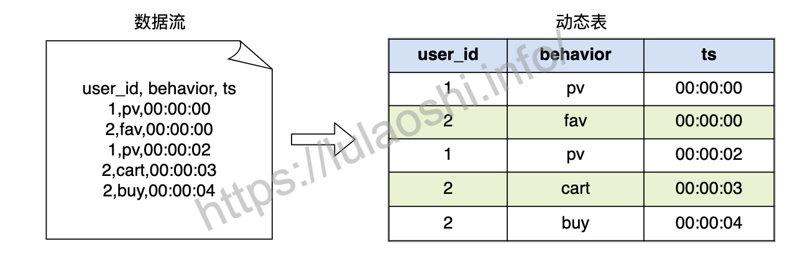
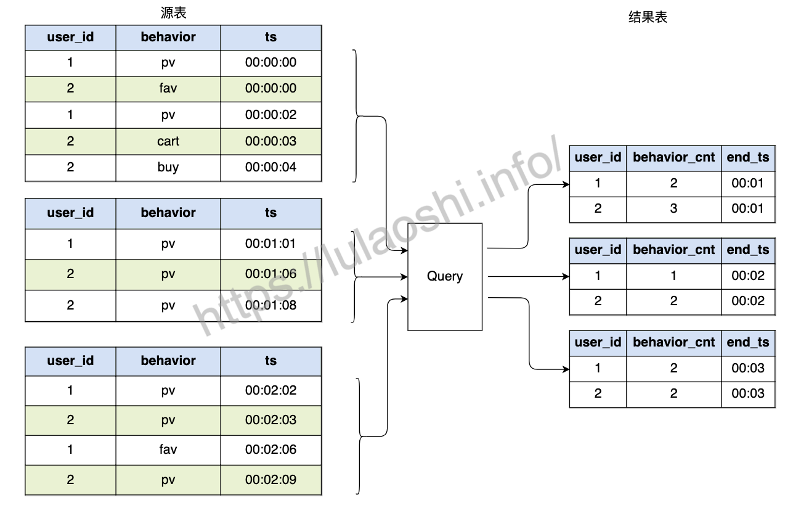
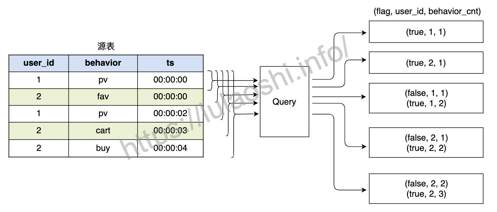

::: tip

本教程已出版为《Flink原理与实践》，感兴趣的读者请在各大电商平台购买！

<a href="https://item.jd.com/13154364.html">  </a>
<a href="https://github.com/luweizheng/flink-tutorials">

</a>

:::

在上一节中，我们已经了解了Table API & SQL的基本使用方法，本节主要探讨一些与流处理上进行关系查询所需注意的一些问题。

## 动态表和持续查询

首先我们需要了解一下在数据流上进行关系型查询的基本原理。

关系型数据库起源于上世纪70年代，距今已经有五十年的历史。关系型数据库主要基于Edgar Codd所提出的关系代数（Relational Algebra），SQL是基于关系代数的查询语言。如今，关系型数据库以及SQL已经成为数据查询领域的标准，特别是SQL因其标准性和易用性，已经不仅仅局限在关系型数据库上做查询，它正在被广泛应用在各类数据分析场景。不过，关系代数模型在其创立和发展过程中并不是为流处理而设计的，更适合进行批处理。

### 批处理关系型查询与流处理的区别与联系

下面这张表对传统批处理关系型查询和流处理做了比较，传统的关系型查询和流处理在输入数据、执行过程和查询结果等方面存在着一定的区别。

|          |                    批处理关系型查询 / SQL                    |                            流处理                            |
| -------- | :----------------------------------------------------------: | :----------------------------------------------------------: |
| 输入数据 |            数据是有界的，在有限的数据上进行查询。            |        数据流是无界的，在源源不断的数据流上进行查询。        |
| 执行过程 | 一次查询是在一个批次的数据上进行查询，所查询的数据是静态确定的。 | 一次查询启动后需要等待数据不断流入，所查询的数据在未来源源不断地到达。 |
| 查询结果 |             一次查询完成后即结束。结果是确定的。             |            一次查询会根据新流入数据不断更新结果。            |

从表中可以看到，在数据流上应用关系型查询是非常有挑战性的：数据流是无界的，一次查询启动后，需要持续对数据流做处理，查询结果根据新流入数据而不断更新。虽然流处理有其难度，但也并不是无解的，这里就涉及到了物化视图的概念。

在传统关系型查询中有物理表和虚拟视图的概念：物理表是真实存在的；虚拟视图是在物理表上基于一个查询生成的虚拟的表，视图有表结构Schema，但并不实现数据存储。我们可以像使用一个物理表一样在一个视图上进行查询，但由于视图没有存储数据，它要先执行定义这个视图的查询。在这两个概念的基础上，一些人提出了物化视图的概念，即将视图里所需要的数据物理化地缓存起来，它提前缓存了数据，因此比起虚拟的视图来说执行速度更快。当物化视图所依赖的物理表发生变化时，在物化视图中的缓存也必须随之变化。流处理上的关系型查询借鉴了物化视图的实现思路，将外部系统中的数据缓存起来，每当数据流入，物化视图随之更新。

### 动态表上的持续查询

从上面的对比看到，流处理中没有静态的物理表，Flink提出了动态表（Dynamic Table）的概念，旨在解决如何在数据流上进行关系型查询。Dynamic Table用来表示不断流入的数据表，数据流是源源不断流入的，Dynamic Table也是随着新数据的流入而不断更新的。在Dynamic Table上进行查询，被称为持续查询（Continuous Query），因为底层的计算是持续不断的。一个Continuous Query的结果也是一个Dynamic Table，它会根据新流入的数据不断更新结果。在Dynamic Table上进行Continuous Query与物化视图不断更新缓存中的数据非常相似。


上面这张图展示了数据流、Dynamic Table和Continuous Query之间的关系：

1. 数据流被转换为Dynamic Table
2. 在这个Dynamic Table上执行Continuous Query生成一个新的Dynamic Table
3. 将生成的Continuous Query转化为一个数据流

我们继续以电商用户行为分析为例来看看数据流和动态表之间的转换。



如图中左侧所示，一个数据流包含用户行为，可以转化成图中右侧的一个动态表，实际上这个动态表是不断更新的。我们在这个动态表上进行下面的查询：

```sql
SELECT 
	user_id, 
	COUNT(behavior) AS behavior_cnt 
FROM user_behavior 
GROUP BY user_id
```

这个SQL语句对`user_id`字段分组，统计每个`user_id`所产生的行为。在批处理时，这样的一个SQL查询会在一个静态的数据集上生成一个确定的结果。但对于流处理来说，每当新数据流入时，查询的结果也要随之更新，下图展示了动态表查询的一个过程。


当第一条数据`(1, pv, 00:00:00)`插入到源表时，整个源表只有这一条数据，生成的结果为`(1, 1)`。当第二条数据`(2, fav, 00:00:00)`进入源表时，SQL引擎在结果表中插入结果`(2, 1)`。接着，ID为1的用户再次产生了行为，新数据插入会导致原来的统计结果`(1, 1)`发生变化，变成了`(1, 2)`。这里不再是往结果表中插入新数据，而是更改原来的结果数据。

这个数据流是源源不断流入的，还会有下一分钟、下一小时的数据继续流入，我们可以在时间维度上对数据分组，这里以一分钟为一组，编写下面的SQL：

```sql
SELECT 
	user_id, 
	COUNT(behavior) AS behavior_cnt, 
	TUMBLE_END(ts, INTERVAL '1' MINUTE) AS end_ts 
FROM user_behavior
GROUP BY user_id, TUMBLE(ts, INTERVAL '1' MINUTE)
```

这个查询与第一个查询非常相似，只不过数据是按照滚动时间窗口来分组的。下图展示了这个查询的执行过程，相当于数据按照时间进行了切分，在这个时间窗口内进行用户行为的统计。我们将在本章[窗口](window.md)部分详细介绍时间窗口的分组方法。



我们以第一个时间窗口为例，数据在00:00:00和00:00:59之间有5条数据，对这5条数据统计得到一个结果，结果表的最后一列`end_ts`为窗口结束时间戳。下一个一分钟数据到达后，对00:01:00和00:01:59之间的数据进行统计，由于`end_ts`字段发生了变化，新结果并不是直接在老结果上做的更新，而是在结果表中插入新数据。

根据前面的两个SQL语句以及执行结果，我们看到流处理上进行关系型查询一般有两种生成结果的方式：

1. 第二个查询语句只追加结果，或者说只在结果表上进行`INSERT`操作。
2. 第一个查询语句追加结果的同时，也对结果不断更新，或者说即进行`INSERT`操作又进行`UPDATE`操作或`DELETE`操作。

在批处理中，结果生成是确定的，但在流处理中，这两种方式会对计算结果的输出产生影响。

### 动态表的两种输出模式

前面提到，计算结果的输出会有两种形式。一种是在结果末尾追加，我们称这种模式为追加（Append-only）模式；一种是既在结果末尾追加，又对已有数据更新，这种被称为Update模式。对数据更新又细分为两种方式，可以先将老数据撤回，再添加新数据，这种形式被取名为撤回（Retract）模式；或者直接在老数据上做更新，被称为更新（Upsert）模式。

下面的代码将一个`Table`转换为`DataStream`，使用了Append-only模式。这种模式相对比较简单，这里不再仔细分析。

```java
StreamTableEnvironment tEnv = ...
Table table = ...

// 将table转换为DataStream
// Append-only模式
DataStream<Row> dsRow = tEnv.toAppendStream(table, Row.class);
```

我们仍然以第一个查询为例，讨论一下Retract和Upsert两种模式。如果使用Retract模式，除了原有的结果，还需要增加一个类型`Boolean`的标志位列，这个标志位列用来确定当前这行数据是新加入的，还是需要撤回的。



如上图所示，结果共有三列：`(flag, user_id, behavior_cnt)`，其中第一列为标志位，表示本行数据是加入还是撤回，后两行是查询结果。对于前两行输入，数据经过SQL引擎后，生成的结果追加到结尾，因此，标志位都为`true`。第三行输入进入，我们需要对结果进行更新，这时SQL引擎先将原来的老数据置为`false`：`(false, 1, 1)`，然后将新数据追加进来：`(true, 1, 2)`。

```java
// 将table转换为DataStream
// Retract模式，Boolean为标志位
DataStream<Tuple2<Boolean, Row>> retractStream = tableEnv.toRetractStream(table, Row.class);
```

另一种模式为Upsert模式，即对结果中已存在的数据使用SQL中的`UPDATE`操作或`DELETE`操作，更新或删除该行数据。Upsert模式的前提是，输出结果中有一个唯一的ID，可以根据唯一ID更新结果中。在这个例子中，用户ID可以被用来作为唯一ID，因为用户ID一般不会重复。Upsert模式相比Retract模式的成本稍低。Upsert模式也要和特定的`TableSink`紧密结合，比如Key-Value数据库更适合进行Upsert操作。

### 流处理的限制

至此，我们已经了解了流式关系型型查询的基本原理，但目前Flink的流处理并不能支持所有的SQL语句，因为流处理的本质是使用状态来缓存数据，包括表和中间计算过程都是Flink中的状态。因此，我们写的SQL查询不能占用太多的状态资源。

仍然以前面所提到的两个SQL语句为例，目前这两个SQL都是可执行的。第一个SQL语句转化为DataStream API实现的话，整个作业所需保存的状态数据为`(user_id, behavior_cnt)`这样一个二元对。当新数据流入时，如果是状态中已存在的`user_id`，直接更新状态，如果是新`user_id`，则在状态中添加一条数据。除非用户量极大，否则这个状态数据是可维护的。但是如果这个作业源源不断有新用户流入，作业长时间运行，已有状态不进行清理，状态有可能突破内存限制，导致作业崩溃。对于第二个SQL语句，我们建立了滚动时间窗口，在第五章窗口算子的介绍中，我们提到了增量计算的概念，这可以有效避免大量数据缓存在状态中，相对来说内存风险较小。

另一个难点是数据的更新。前文已经提到，如果源数据更新，有可能导致整个数据表重新进行一次计算。比如，我们对一个元数据中的某个字段执行`RANK`，或`ORDER BY`，那么每新增加一个数据，都会导致整个表重新进行一次排序，这对流处理引擎的性能要求极高。目前，Flink在这方面的功能正在不断完善。

## 状态过期时间

通过前面的讨论，我们看到Flink通过状态来保存一些中间数据。但是状态不能无限增加，否则会突破内存限制。Flink提供了一个配置，帮助我们清理一些空闲状态数据：

```java
tEnv.getConfig.setIdleStateRetentionTime(Time.hours(1), Time.hours(2));
```

空闲状态数据是指该数据长时间没有更新，仍然保留在状态中。上面的方法有两个参数：`minTime`和`maxTime`，空闲状态至少会保留`minTime`的时间，这个时间内数据不会被清理；超过`maxTime`的时间后，空闲状态会被清除。一旦这个数据被清除，那意味着后续数据流入，会被认为是一个新数据重新添加到状态中。基于这样的数据，得到的计算结果是近似准确的。可见，这是一个在结果准确度和计算性能之间的平衡。

:::tip
如果将`minTime`和`maxTime`设置为0，表示不作过期时间设置，状态永远不会清除。`maxTime`至少要比`minTime`大5分钟。
:::
