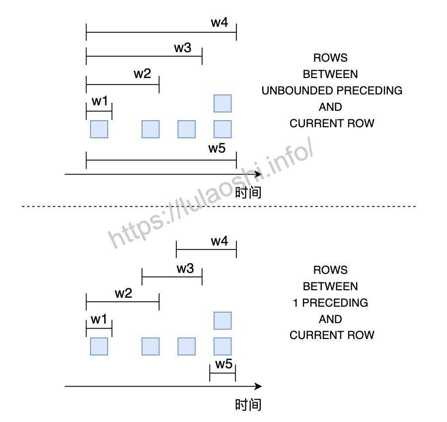
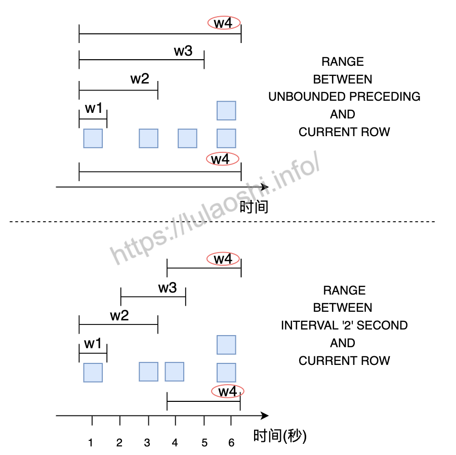

::: tip

本教程已出版为《Flink原理与实践》，感兴趣的读者请在各大电商平台购买！

<a href="https://item.jd.com/13154364.html">  </a>
<a href="https://github.com/luweizheng/flink-tutorials">

</a>

:::

本节主要讨论如何在Flink SQL上使用窗口。

## 时间属性

Table API & SQL支持时间维度上的处理。时间属性（Time Attribute）用一个`TIMESTAMP(int precision)`数据类型来表示，这个类型与SQL标准中的时间戳类型相对应，是Table API& SQL中专门用来表征时间属性的数据类型。`precision`为精度，表示秒以下保留几位小数点，可以是0到9的一个数字。具体而言，时间的格式为：

```
year-month-day hour:minute:second[.fractional]
```

假如我们想要使用一个纳秒精度的时间，应该声明类型为`TIMESTAMP(9)`，套用上面的时间格式的话，可以表征从`0000-01-01 00:00:00.000000000`到`9999-12-31 23:59:59.999999999`。绝大多数情况下，我们使用毫秒精度即可，即`TIMESTAMP(3)`。

当涉及到时间窗口，往往就要涉及到窗口的长度单位，现有的时间单位有`MILLISECOND`、`SECOND`、`MINUTE`、`HOUR`、`DAY`、`MONTH`和`YEAR`。

在第五章中，我们曾介绍，Flink提供了三种时间语义：Processing Time、Ingestion Time和Event Time。Processing Time是数据被机器处理时的系统时间，Ingestion Time是数据流入Flink的时间，Event Time是数据实际发生的时间。我们在之前章节曾详细探讨这几种时间语义的使用方法，这里我们主要介绍一下在Table API & SQL中Processing Time和Event Time两种时间语义的使用方法。

如果想在Table API & SQL中使用时间相关的计算，我们必须在Java或Scala代码中设置使用哪种时间语义：

```java
StreamExecutionEnvironment env = StreamExecutionEnvironment.getExecutionEnvironment();

// 默认使用Processing Time
env.setStreamTimeCharacteristic(TimeCharacteristic.ProcessingTime);

// 使用IngestionTime
env.setStreamTimeCharacteristic(TimeCharacteristic.IngestionTime);

// 使用EventTime
env.setStreamTimeCharacteristic(TimeCharacteristic.EventTime);
```

同时，我们必须要在Schema中指定一个字段为时间属性，否则Flink无法知道具体哪个字段与时间相关。

指定时间属性时可以有下面几种方式：使用SQL DDL或者由`DataStream`转为`Table`时定义一个时间属性。

### Processing Time

#### SQL DDL

Processing Time使用当机器的系统时间作为时间，在Table API & SQL中这个字段被称为`proctime`。它不需要配置Watermark。使用时，我们在原本的Schema上添加一个虚拟的时间戳列，时间戳列由`PROCTIME()`函数计算产生。

```sql
CREATE TABLE user_behavior (
    user_id BIGINT,
    item_id BIGINT,
    category_id BIGINT,
    behavior STRING,
    ts TIMESTAMP(3),
    -- 在原有Schema基础上添加一列proctime
    proctime as PROCTIME()   
) WITH (
    ...
);
```

后续过程中，我们可以在`proctime`这个时间属性上进行相关计算：

```sql
SELECT 
	user_id, 
	COUNT(behavior) AS behavior_cnt, 
	TUMBLE_END(proctime, INTERVAL '1' MINUTE) AS end_ts 
FROM user_behavior
GROUP BY user_id, TUMBLE(proctime, INTERVAL '1' MINUTE)
```

#### 由DataStream转化

将`DataStream`转为`Table`：

```java
DataStream<UserBehavior> userBehaviorDataStream = ...

// 定义了Schema中各字段的名字，其中proctime使用了.proctime属性，这个属性帮我们生成一个Processing Time
tEnv.createTemporaryView("user_behavior", userBehaviorDataStream, 
                "userId as user_id, itemId as item_id, categoryId as category_id, behavior, proctime.proctime");
```

可以看到，`proctime`这个属性追加到了其他字段之后，是在原有Schema基础上增加的一个字段。Flink帮我们自动生成了Processing Time的时间属性。

### Event Time

Event Time时间语义使用一条数据实际发生的时间作为时间属性，在Table API & SQL中这个字段通常被称为`rowtime`。这种模式下多次重复计算时，计算结果是确定的。这意味着，Event Time时间语义可以保证流处理和批处理的统一。Event Time时间语义下，我们需要设置每条数据发生时的时间戳，并提供一个Watermark。Watermark表示迟于该时间的数据都作为迟到数据对待。

#### SQL DDL

我们需要在SQL DDL中使用`WATERMARK`关键字，用来表明某个字段是Event Time时间属性，并且设置一个Watermark等待策略。

```sql
CREATE TABLE user_behavior (
    user_id BIGINT,
    item_id BIGINT,
    category_id BIGINT,
    behavior STRING,
    ts TIMESTAMP(3),
    -- 定义ts字段为Event Time时间戳，Watermark比监测到的最晚时间还晚5秒
    WATERMARK FOR ts as ts - INTERVAL '5' SECOND
) WITH (
    ...
);
```

在上面的DDL中，`WATERMARK`起到了定义Event Time时间属性的作用，它的基本语法规则为：`WATERMARK FOR rowtime_column AS watermark_strategy_expression`。

`rowtime_column`为时间戳字段，可以是数据中的自带字段，也可以是类似`PROCTIME()`函数计算出的虚拟时间戳字段，这个字段必须是`TIMESTAMP(3)`类型。

`watermark_strategy_expression`定义了Watermark的生成策略，返回值必须是`TIMESTAMP(3)`类型。Flink提供了几种常用的策略：

* 数据自身的时间戳严格按照单调递增的形式出现，即晚到达的时间戳总比早到达的时间戳大，可以使用`WATERMARK FOR rowtime_column AS rowtime_column`或`WATERMARK FOR rowtime_column AS rowtime_column - INTERVAL '0.001' SECOND`生成Watermark。这个策略的原理是：监测所有数据时间戳，并记录时间戳最大值，在最大值基础上添加一个1毫秒的延迟作为Watermark时间。

* 数据本身是乱序到达的，Watermark在时间戳最大值的基础上延迟一定时间间隔，如果数据仍比这个时间还晚，则被定为迟到数据。我们可以使用`WATERMARK FOR rowtime_column AS rowtime_column - INTERVAL 'duration' timeUnit`生成Watermark。例如，`WATERMARK FOR ts as ts - INTERVAL '5' SECOND`定义的Watermark比时间戳最大值还延迟了5秒。这里`timeUnit`可以是`SECOND`、`MINUTE`或`HOUR`等时间单位。

#### 由DataStream转化

如果由`DataStream`转化为一个`Table`，那么需要在`DataStream`上设置好时间戳和Watermark。我们曾在第五章中讲解如何对数据流设置时间戳和Watermark。设置好后，再将`DataStream`转为`Table`：

```java
env.setStreamTimeCharacteristic(TimeCharacteristic.EventTime);

DataStream<UserBehavior> userBehaviorDataStream = env
                .addSource(...)
                // 在DataStream里设置时间戳和Watermark
                .assignTimestampsAndWatermarks(...);

// 创建一个user_behavior表 
// ts.rowtime表示该列使用EventTime Timestamp
tEnv.createTemporaryView("user_behavior", userBehaviorDataStream, "userId as user_id, itemId as item_id, categoryId as category_id, behavior, ts.rowtime");
```

## 窗口聚合

基于上述的时间属性，我们可以在时间维度上进行一些分组和聚合操作。SQL用户经常使用聚合操作，比如`GROUP BY`和`OVER WINDOW`，目前Flink已经在流处理中支持了这两种SQL语法。

### GROUP BY

`GROUP BY`是很多SQL用户经常使用的窗口聚合函数，在流处理的一个时间窗口上进行`GROUP BY`与批处理中的非常相似，在之前的例子中我们已经开始使用了`GROUP BY`。以`GROUP BY field1, time_attr_window`语句为例，所有含有相同`field1 + time_attr_window`的行会被分到一组中，再对这组数据中的其他字段`field2`进行聚合操作，常见的聚合操作有`COUNT`、`SUM`、`AVG`、`MAX`等。可见，时间窗口`time_attr_window`被作当做整个表的一个字段，用来做分组，下图展示了这个过程。


下面的SQL语句是我们之前使用的例子：

```sql
SELECT 
	user_id, 
	COUNT(behavior) AS behavior_cnt, 
	TUMBLE_END(proctime, INTERVAL '1' MINUTE) AS end_ts 
FROM user_behavior
GROUP BY user_id, TUMBLE(proctime, INTERVAL '1' MINUTE)
```

这里再次对这个SQL语句进行分析解释。我们定义一个1分钟的滚动窗口，滚动窗口函数定义为：`TUMBLE(proctime, INTERVAL '1' MINUTE)`，窗口以`proctime`这个Processing Time为时间属性。这里我们使用了一个窗口分组函数，这是一个滚动窗口，它形如：`TUMBLE(time_attr, interval)`，它将某个时间段内的数据都分到一组上。我们可以在`SELECT`中添加字段`TUMBLE_START(proctime, INTERVAL '1' MINUTE)`查看窗口的的起始时间。接下来我们将介绍几种常见的窗口分组函数。

#### 三种窗口分组函数

我们在第5章中曾详细分析几种窗口的区别，下表展示了Flink SQL中窗口分组函数和相对应的使用方法。

|                 窗口分组函数                  |                           使用介绍                           |
| :-------------------------------------------: | :----------------------------------------------------------: |
|          TUMBLE(time_attr, interval)          | 定义一个滚动窗口，窗口是定长的，长度为interval，窗口之间互不重叠，滚动向前。比如我们刚才定义了一个1分钟的滚动窗口，所有属于该分钟的数据都会被归到该窗口中。 |
| HOP(time_attr, slide_interval, size_interval) | 定义一个滑动窗口，窗口长度是定长的，长度为size_interval，窗口以slide_interval的速度向前滑动。如果slide_interval比size_interval小，那么窗口之间会重叠。这意味着一条数据可能被划分到多个窗口中。比如，窗口长度size_interval为3分钟，滑动速度slide_interval为1分钟，那么每1分钟都产生一个窗口，一条数据应该会被分到3个窗口中。如果slide_interval等于size_interval，这就是一个滚动窗口。如果slide_interval大于size_interval，那么窗口之间有间隙。 |
|         SESSION(time_attr, interval)          | 定义一个会话窗口，窗口长度是变长的，当两条数据之间的Session Gap超过了interval，这两条数据被分到两个窗口上。或者说，一个窗口等待超过interval后仍无数据进入，该窗口关闭。比如，我们定义Session Gap为3分钟，一个窗口最后一条数据之后的三分钟内没有新数据出现，则该窗口关闭，再之后的数据被归为下一个窗口。 |

在这些函数中，时间间隔应该按照`INTERVAL 'duration' timeUnit`的格式来写。比如，1分钟可以写为：`INTERVAL '1' MINUTE`。

Flink的流处理和批处理都支持上述三种窗口函数的。批处理没有时间语义之说，直接使用数据集中的时间字段；流处理中，如上一小节所示，时间语义可以选择为Event Time或Processing Time。当然，时间窗口必须基于上一节所提到的时间属性。

#### 窗口的起始结束时间

如果想查看窗口的起始结束时间，需要使用一个起始时间函数或结束时间函数。如下表所示，我们以滚动窗口为例，列出常用的函数：

|                   函数                    |                           使用介绍                           |
| :---------------------------------------: | :----------------------------------------------------------: |
|     TUMBLE_START(time_attr, interval)     | 返回当前窗口的起始时间（包含边界），如`[00:10, 00:20) `的窗口，返回 `00:10` 。 |
|      TUMBLE_END(time_attr, interval)      | 返回当前窗口的结束时间（包含边界），如`[00:00, 00:20)` 的窗口，返回 `00:20`。 |
|    TUMBLE_ROWTIME(time_attr, interval)    | 返回窗口的结束时间（不包含边界）。如 `[00:00, 00:20]` 的窗口，返回 `00:19:59.999` 。返回值是一个rowtime，可以基于该字段做时间属性的操作，如内联视图子查询或时间窗口上的JOIN。只能用在Event Time时间语义的作业上。 |
| TUMBLE_PROCTIME(time-attr, size-interval) | 返回窗口的结束时间（不包含边界）。如 `[00:00, 00:20]` 的窗口，返回 `00:19:59.999` 。返回值是一个proctime，可以基于该字段做时间属性的操作，如内联视图子查询或时间窗口上的JOIN。 只能用在Processing Time时间语义的作业上。 |

:::note
同一个SQL查询中，`TUMBLE(time_attr, interval)`函数中的`interval`和`TUMBLE_START(time_attr, interval)`函数中的`interval`要保持一致。确切地说，`INTERVAL 'duration' timeUnit`中的`duration`时间长度和`timeUnit`时间单位都要前后保持一致。
:::

我们已经在前面的例子中展示了`TUMBLE_END`的例子，这里不再过多解释。`TUMBLE_START`或`TUMBLE_END`返回的是展示的结果，已经不再是一个时间属性，无法被后续其他查询用来作为时间属性做进一步查询。假如我们想基于窗口时间戳做进一步的查询，比如内联视图子查询或Join等操作，我们需要使用`TUMBLE_ROWTIME`和`TUMBLE_PROCTIME`。比如下面的例子：

```java
SELECT 
  TUMBLE_END(rowtime, INTERVAL '20' MINUTE),
	user_id,
	SUM(cnt) 
FROM (
    SELECT 
    	user_id, 
    	COUNT(behavior) AS cnt, 
    	TUMBLE_ROWTIME(ts, INTERVAL '10' SECOND) AS rowtime 
    FROM user_behavior
    GROUP BY user_id, TUMBLE(ts, INTERVAL '10' SECOND)
  )
GROUP BY TUMBLE(rowtime, INTERVAL '20' MINUTE), user_id
```

这是一个嵌套的内联视图查询，我们先做一个10秒钟的视图，再在此基础上进行20分钟的聚合。子查询使用了`TUMBLE_ROWTIME`，这个字段仍然是一个时间属性，后续其他操作可以在此基础上继续使用各种时间相关计算。

前面详细分析了滚动窗口的各个函数，对于滑动窗口，Flink提供有`HOP_START()`、`HOP_END()`、`HOP_ROWTIME()`、`HOP_PROCTIME()`这些函数；对于会话窗口，有`SESSION_START()`、`SESSION_END()`、`SESSION_ROWTIME()`和`SESSION_PROCTIME()`。这些函数的使用方法比较相似，这里不再赘述。

综上，`GROUP BY`将多行数据分到一组，然后对一组的数据进行聚合，聚合结果为一行数据。或者说，`GROUP BY`一般是多行变一行。

### OVER WINDOW

传统SQL中专门进行窗口处理的函数为`OVER WINDOW`。`OVER WINDOW`与`GROUP BY`有些不同，它对每一行数据都生成窗口，在窗口上进行聚合，聚合的结果会生成一个新字段。或者说，`OVER WINDOW`一般是一行变一行。


上图展示了`OVER WINDOW`的工作示意图，窗口确定的方式为：先对`field1`做分组，相同`field1`的数据被分到一起，按照时间属性排序，即上图中的`PARTITION BY`和`ORDER BY`部分；然后每行数据都建立一个窗口，窗口起始点是`field1`分组的第一行数据，结束点是当前行；窗口划分好后，再对窗口内的`field2`字段做各类聚合操作，生成`field2_agg`的新字段，常见的聚合操作有`COUNT`、`SUM`、`AVG`或`MAX`等。从图中可以看出，每一行都有一个窗口，当前行是这个窗口的最后一行，窗口的聚合结果生成一个新的字段。具体的实现逻辑上，Flink为每一个元素维护一个窗口，为每一个元素执行一次窗口计算，完成计算后会清除过期数据。

Flink SQL中对`OVER WINDOW`的定义遵循了标准的SQL语法，我们先来看一下`OVER WINDOW`的语法结构：

```sql
SELECT
    AGG_FUNCTION(field2) OVER (windowDefinition2) AS field2_agg,
    ...
    AGG_FUNCTION(fieldN) OVER (windowDefinitionN) AS fieldN_agg
FROM tab1
```

其中，`windowDefinition2`是定义窗口的规则，包括根据哪些字段进行`PARTITION BY`等，在定义好的窗口上，我们使用`AGG_FUNCTION(field2)`对`field2`字段进行聚合计算。或者我们可以使用别名来定义窗口`WINDOW w AS ...`：

```sql
SELECT
    AGG_FUNCTION(field2) OVER w AS field2_agg,
    ...
FROM tab1
WINDOW w AS (windowDefinition)
```

那么具体应该如何划分窗口，如何写`windowDefinition`呢？上图中只演示了一种窗口划分的方式，常用的窗口划分方式可以基于行，也可以基于时间段，接下来我们通过一些例子来展示窗口的划分。

#### ROWS OVER WINDOW

我们首先演示基于行来划分窗口，这里仍然以用户行为数据流来演示：

```sql
SELECT 
    user_id, 
    behavior,
    COUNT(*) OVER w AS behavior_count,
    ts
FROM user_behavior
WINDOW w AS (
    PARTITION BY user_id 
    ORDER BY ts 
    ROWS BETWEEN UNBOUNDED PRECEDING AND CURRENT ROW
)
```

上面的SQL语句中，`WINDOW w AS (...)`定义了一个名为`w`的窗口，它根据用户的`user_id`来分组，并按照`ts`来排序。原始数据并不是基于用户ID来分组的，`PARTITION BY user_id`起到了分组的作用，相同`user_id`的用户被分到了一组，组内按照时间戳`ts`来排序。这里完成了上图中最左侧表到中间表的转化。

`ROWS BETWEEN UNBOUNDED PRECEDING AND CURRENT ROW`定义了窗口的起始和结束，窗口的起始点为`UNBOUNDED PRECEDING`，这两个SQL关键词组合在一起表示窗口起始点是数据流的最开始的行，`CURRENT ROW`表示结束点是当前行。`ROWS BETWEEN ... AND ...`这样的语句定义了窗口的起始和结束。结合分组和排序策略，这就意味着，这个窗口从数据流的第一行开始到当前行结束，按照`user_id`分组，按照`ts`排序。

:::note
目前`OVER WINDOW`上，Flink只支持基于时间属性的`ORDER BY`排序，无法基于其他字段进行排序。
:::



上图展示了按行划分窗口的基本原理，图中上半部分使用`UNBOUNDED PRECEDING`表示起始位置，那么窗口是从数据流的第一个元素开始一直到当前元素；下半部分使用`1 PRECEDING`表示起始位置，窗口的起始点是本元素的前一个元素，我们可以把1换成其他我们想要的数字。

:::note
图中最后两行数据从时间上虽然同时到达，但由于窗口是按行划分的，这两行数据被划分为两个窗口，这与后文提到的按时间段划分有所区别。
:::

如果输入数据流如下表：

| user_id | pv_count |         ts          |
| :-----: | :------: | :-----------------: |
|    1    |    pv    | 2017-12-01 00:00:00 |
|    2    |   fav    | 2017-12-01 00:00:00 |
|    1    |    pv    | 2017-12-01 00:00:02 |
|    2    |   cart   | 2017-12-01 00:00:03 |

那么对于之前的SQL语句，一个查询的结果将产生下面的数据：

| user_id | behavior | behavior_cnt |         ts          |
| :-----: | :------: | :----------: | :-----------------: |
|    1    |    pv    |      1       | 2017-12-01 00:00:00 |
|    2    |   fav    |      1       | 2017-12-01 00:00:00 |
|    1    |    pv    |      2       | 2017-12-01 00:00:02 |
|    2    |   cart   |      2       | 2017-12-01 00:00:03 |

可以看到，对于输入的每一行数据，都有一行输出。

总结下来，`ROWS OVER WINDOW`的模式应该按照下面的模式来编写SQL：

```sql
SELECT 
    field1,
    AGG_FUNCTION(field2) OVER (
     [PARTITION BY (value_expression1,..., value_expressionN)] 
     ORDER BY timeAttr
     ROWS 
     BETWEEN (UNBOUNDED | rowCount) PRECEDING AND CURRENT ROW) AS fieldName
FROM tab1

-- 使用AS
SELECT 
    field1,
    AGG_FUNCTION(field2) OVER w AS fieldName
FROM tab1
WINDOW w AS (
     [PARTITION BY (value_expression1,..., value_expressionN)] 
     ORDER BY timeAttr
     ROWS 
     BETWEEN (UNBOUNDED | rowCount) PRECEDING AND CURRENT ROW
) 
```

需要注意：

* `PARTITION BY`是可选的，可以根据一到多个字段来对数据进行分组。
* `ORDER BY`之后必须是一个时间属性，用于对数据进行排序。
* `ROWS BETWEEN ... AND ...`用来界定窗口的起始结束点。`UNBOUNDED PRECEDING`表示整个数据流的开始作为起始点，也可以使用`rowCount PRECEDING`来表示当前行之前的某个元素作为起始点，`rowCount`是一个数字；`CURRENT ROW`表示当前行作为结束点。

#### RANGES OVER WINDOW

第二种划分的方式是按照时间段来划分窗口，SQL中关键字为`RANGE`。这种窗口的结束点也是当前行，起始点是当前行之前的某个时间点。我们仍然以用户行为为例，SQL语句改为：

```sql
SELECT 
    user_id, 
    COUNT(*) OVER w AS behavior_count,
    ts
FROM user_behavior
WINDOW w AS (
    PARTITION BY user_id 
    ORDER BY ts 
    RANGE BETWEEN INTERVAL '2' SECOND PRECEDING AND CURRENT ROW
)
```

可以看到，与`ROWS`的区别在于，`RANGE`后面使用的是一个时间段，根据当前行的时间减去这个时间段，可以得到起始时间。



上图展示了按时间段划分窗口的基本原理，图中上半部分使用`UNBOUNDED PRECEDING`表示起始位置，与`ROWS`按行划分不同的是，最后两个元素虽然同时到达，但是他们被划分为一个窗口（图上半部分中的w4）；下半部分使用`INTERVAL '2' SECOND`表示起始位置，窗口的起始点是当前元素减去2秒，最后两个元素也被划分到了一个窗口（图下半部分中的w4）。

总结下来，`RANGE OVER WINDOW`的格式应该按照下面的模式来编写SQL：

```sql
SELECT 
    field1,
    AGG_FUNCTION(field2) OVER (
     [PARTITION BY (value_expression1,..., value_expressionN)] 
     ORDER BY timeAttr
     RANGE
     BETWEEN (UNBOUNDED | timeInterval) PRECEDING AND CURRENT ROW) AS fieldName
FROM tab1

-- 使用AS
SELECT 
    field1,
    AGG_FUNCTION(field2) OVER w AS fieldName
FROM tab1
WINDOW w AS (
     [PARTITION BY (value_expression1,..., value_expressionN)] 
     ORDER BY timeAttr
     RANGE
     BETWEEN (UNBOUNDED | timeInterval) PRECEDING AND CURRENT ROW
) 
```

需要注意：

* `PARTITION BY`是可选的，可以根据一个一到多个字段来对数据进行分组。
* `ORDER BY`之后必须是一个时间属性，用于对数据进行排序。
* `RANGE BETWEEN ... AND ...`用来界定窗口的起始结束点。我们可以使用`UNBOUNDED PRECEDING`表示数据流的开始作为起始点，也可以使用一个`timeInterval PRECEDING`来表示当前行之前的某个时间点作为起始点。

综上，`OVER WINDOW`下，每行数据都生成一个窗口，窗口内的数据聚合后生成一个新字段。窗口的划分可以按行`ROWS`，也可以按时间段`RANGE`。