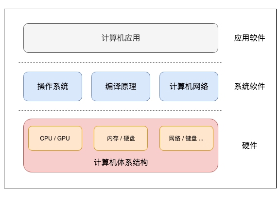
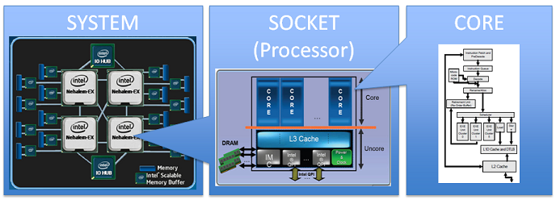
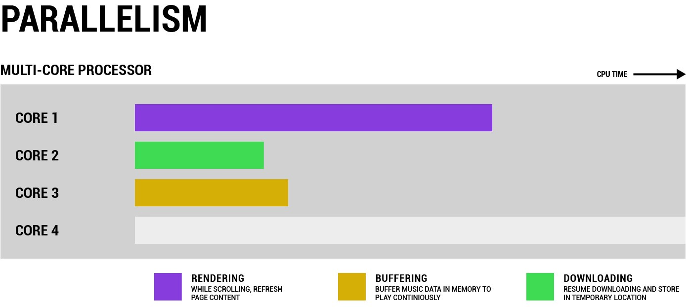
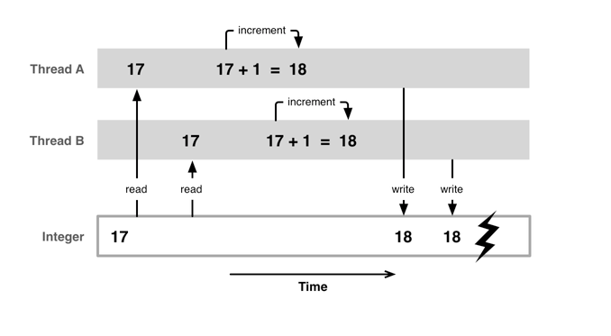

要想了解GPU的工作原理，我们可能需要重温一下现代计算机的工作原理。计算机最底层是各类硬件，包括CPU和GPU这样负责计算的芯片，内存和硬盘这样负责存储的介质，和外部通信的网络、键盘等设备。



## 冯·诺依曼架构


1945年，天才科学家冯·诺依曼提出了一种计算机设计实现架构，奠定了现代计算机的理论基础。冯·诺依曼架构主要有几大部分：

 * 包含控制单元和逻辑运算单元的CPU
 * 存储指令和数据的内存
 * 输入和输出设备

下文将简单描述CPU，指令、控制单元等概念。除了冯·诺依曼架构，哈佛架构也是一种计算机的实现方式。现代计算机经过了几十年的飞速发展，集百家之长，很难界定现代计算机到底是冯·诺依曼架构还是哈佛架构，这里暂不赘述。

## CPU工作原理

CPU（Central Processing Unit），中文翻译为中央处理器，负责执行用户和操作系统下发的指令。CPU是计算机中最为核心的部分，经常被比作计算机的大脑。CPU只能接受01二进制语言，0和1用来控制高低电位。比如，一个加法运算，在x86处理器上的的二进制代码为：

```
01001000 00000001 11000011
```

这样一行代码被称为**机器码**，它执行了加法操作。除了这样的加法，CPU的电路还要实现很多其他指令，如存取内存数据，进行逻辑判断等。不同厂商的电路设计不同，在电路上所能进行的二进制码不同。某类CPU能支持一种指令集（instruction set architecture）。指令集相当于一种设计图纸，规定了一种CPU架构实现哪些指令。参照指令集，硬件开发人员只需要关心如何设计电路，软件开发人员只关心如何用01机器码实现软件功能。比较常见的指令集有x86、ARM、MIPS、SPARC、Power等。x86和ARM被广泛应用在我们身边的电子产品上，相对比较知名，此外，龙芯实现了MIPS，IBM小型机则采用Power指令集。


一个单核CPU的架构包括：

* Control Unit（CU）起协调管理功能。
* Arithmetic Logic Unit（ALU）接受控制单元的命令，负责进行加减乘与或非运算。所有数据都存放在寄存器（Register）里。
* 寄存器以极高的速度与CU和ALU交互，通常小于1纳秒。从寄存器的名字可以看出来，里面的数据是临时寄存的，这些数据和指令会被ALU和CU拿来立即进行计算。如果寄存器没有CPU想要的数据，CPU会去内存或硬盘中读取。
* CPU通过Bus（总线）读取内存或其他设备的数据。计算机中有多条总线。

我们以一个加法运算来解释上面这些概念。对于一个`2 + 2`的加法，人类可以直接说出答案，但是换成`13234 + 87912`，就不得不拿出纸和笔来算一下了。计算机对这两次计算速度没有差别，其本质为半导体电路对两个数字执行加法操作。但与人类不同的是，计算机需要知道两个问题：

1. 本次所执行的是哪个指令。
2. 该指令的执行对象是什么。


因此，控制单元先取指令 Fetch，然后指令译码 Decode解析出要执行什么指令，并确认指令是对哪些数据（操作数 Operand）进行操作，并将操作数从主存加载到寄存器中。ALU执行指令 Execute后结果写回 Store。

## 存储金字塔

随着技术的发展，计算机的速度瓶颈已经变成了超高速的CPU运算速度与落后的数据读取速度之间的矛盾。CPU计算速度在纳秒级别，但是CPU读取主存的速度竟有百纳秒，CPU进行完计算后，要闲置几十倍的时间，实在是巨大的浪费。从计算本身来说，某个程序一般不需要把硬盘或主存中的所有数据都拿来进行计算，绝大多数时间只需要处理部分热点数据，因此，把热点数据加载到缓存中能解决绝大多数问题。综合计算速度、技术水平、生产成本，设计人员给CPU增加了很多中间的缓存Cache。


CPU的寄存器存取速度极快，但是造价成本太高，发热量大，不能被大量采用。通常，CPU的寄存器只有几KB。L1 Cache和L2 Cache一般设计在CPU上，访问延迟在几纳秒至几十纳秒内，主存的访问延迟在百纳秒内。速度越快，意味着成本越高。所以硬件设计是在现有技术水平、期望计算速度、成本、散热等因素之间所做的trade-off。

## 多核

当单个CPU主频超过一定值后，CPU成本和散热成了很大的问题，主频很难突破10GHz。为了获得更快的计算速度和更好的性能，芯片设计者决定绕过主频，采用人海战术，在一块CPU中增加多个核心（Core）。

一个核心是一个可以运行指令的独立单元，它包含了前面所提到的ALU和寄存器，并配备L1和L2 Cache。多个核心共享L3 Cache。


上图中是一个多核处理器的电路图，每个Core旁边的黑色圆圈分别为L1和L2 Cache。可以看到CPU中，各类Cache占用了很大的空间。



高性能服务器通常可以支持多个处理器，提供更多计算核心。支持单个CPU的服务器被称为单路服务器，支持两个CPU的服务器被称为双路服务器，支持四个CPU的服务器被称为四路服务器。上图展示了Intel的四路架构，系统支持四个CPU，假如每块CPU内有8个核心，系统可对外提供32核计算能力。

## 线程与进程

前面都是计算机硬件知识，而线程和进程则是操作系统控制这些硬件而创造的软件概念。


进程（Process）具有单独的计算资源，如内存空间。

线程（Thread）是进程的一个子集，一个进程默认启动一个线程，也可以通过多线程编程，启动多个线程，多个线程共享进程的资源。

在多核架构出现之前，CPU在某个特定时刻只能执行某个程序，无法并行。就像人在某个时刻只能做一件事情，不可能“吃着火锅还唱着歌”，因为两项活动都要占用嘴。如果要干另一件事，就必须把其中一件事停下来。


但前文提到，CPU处理速度是纳秒级，速度非常快，所以在单核时代，为了同时处理多项任务，CPU先“吃会火锅”，再“唱歌”，以这种形式实现多线程，看起来像是“边吃边唱”，吃火锅和唱歌像是同时进行的。单个CPU每次切换不同的线程任务，会产生一些资源开销。吃饭和唱歌之间，总要让人稍微歇歇嘛！在CPU上快速在多个任务间切换，对于使用者来说，就像并发（Concurrent）地执行了多个任务一样。

以网页浏览器为例，浏览器打开一个网页时通常需要下载网页中素材，同时也要把数据渲染成画面。在单核场景下，时间被切成了不同的片段，某段时间只能用来做渲染、缓存或下载中的某一项任务。每个任务都有优先级，CPU优先执行高优先级的任务。比如，浏览器打开一个新网页时，要第一时间把网页展示出来，背景音乐下载比较慢，可以等网站渲染好后再下载，所以有时候背景音乐会比网页晚半分钟。



多核架构提供给用户多个可以独立计算的核心，这也意味着计算机可以同时并行执行多项任务，即**并行计算（Parallel Computing）**。那么一个网页浏览器使用一个核渲染网页，另一个核缓存其他素材，第三个核下载背景音乐。


上图是我的macOS性能监控的一个软件`htop`，Windows上类似的软件是任务管理器。图片绿色横条上方展示了当前8个CPU核的及内存利用率，绿色横条下方是我启动的多个进程，其中标蓝色的是我的Chrome浏览器的进程，我还启动了Photoshop等软件。

当多个核心都处理相同任务，极有可能使用同一块数据，就有可能出现数据读写的问题。



例如，进行`i = i + 1`操作，如果线程A和线程B短时间内都对变量`i`加一，线程A在前，变量应该被加了两次。由于两个线程相隔时间太短，加上前面所说的缓存机制，计算的过程和临时结果还在寄存器和L1缓存，没来得及写到主存上。线程B读到还是较老的数据，这样就出现了数据不一致的情况。这种问题被称为线程安全问题。一般需要使用**锁**来处理线程安全问题。

## 小结

现代CPU一般使用缓存（Cache）来解决CPU读写主存慢的问题；使用多核来并行计算以加速程序运行。并行计算一般需要多线程技术，如何操作多线程对编程人员提出了挑战。